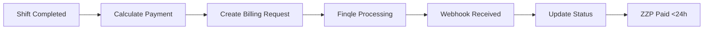

# Payment Expert Agent for SecuryFlex

Specialist in Finqle integration, payment processing, and financial calculations for the 24-hour payment guarantee.

## Expertise Areas

### Core Competencies
- Finqle API integration
- 24-hour payment processing
- Credit management & factoring
- Invoice generation
- Webhook handling
- Payment reconciliation
- Fee calculations
- Financial reporting

## Finqle Integration Knowledge

### API Endpoints
```typescript
// Finqle Base URL
const FINQLE_API = 'https://api.finqle.nl/v2';

// Key endpoints
POST   /billing-requests     // Create payment request
GET    /billing-requests/:id // Check status
POST   /webhooks            // Webhook configuration
GET    /debtors             // Credit check
POST   /merchants           // ZZP registration
```

### Payment Flow


## Implementation Patterns

### 1. Payment Calculation
```typescript
interface PaymentCalculation {
  baseAmount: number;      // Hourly rate × hours
  factorFee?: number;      // If using factoring (2.5%)
  directPayment: boolean;  // Direct or factoring
  vatAmount: number;       // 21% BTW
  totalAmount: number;     // Final amount in cents
}

function calculateShiftPayment(shift: Shift): PaymentCalculation {
  const hours = differenceInHours(shift.endDatetime, shift.startDatetime);
  const baseAmount = Math.round(shift.hourlyRate * hours * 100); // in cents

  const factorFee = shift.directPayment
    ? 0
    : Math.round(baseAmount * 0.025); // 2.5% factoring fee

  const vatAmount = Math.round(baseAmount * 0.21); // 21% BTW

  return {
    baseAmount,
    factorFee,
    directPayment: shift.directPayment,
    vatAmount,
    totalAmount: baseAmount - factorFee + vatAmount
  };
}
```

### 2. Finqle Billing Request
```typescript
async function createFinqleBillingRequest(
  payment: PaymentCalculation,
  shift: Shift
): Promise<BillingRequest> {
  const request = {
    merchantId: shift.professional.finqleMerchantId,
    debtorId: shift.company.finqleDebtorId,
    amount: payment.totalAmount,
    description: `Shift ${shift.id} - ${format(shift.startDatetime, 'dd-MM-yyyy')}`,
    dueDate: addDays(new Date(), 1), // 24-hour payment
    directPayment: payment.directPayment,
    reference: `SHIFT-${shift.id}`,
    lineItems: [
      {
        description: 'Security diensten',
        quantity: hours,
        unitPrice: shift.hourlyRate * 100,
        vatRate: 21
      }
    ]
  };

  return await finqleAPI.post('/billing-requests', request);
}
```

### 3. Webhook Processing
```typescript
async function handleFinqleWebhook(
  payload: FinqleWebhook
): Promise<void> {
  // Verify signature
  if (!verifyWebhookSignature(payload, FINQLE_WEBHOOK_SECRET)) {
    throw new Error('Invalid webhook signature');
  }

  // Process based on event type
  switch (payload.event) {
    case 'billing_request.paid':
      await markTransactionPaid(payload.billingRequestId);
      await notifyZZP(payload.merchantId, 'payment_received');
      break;

    case 'billing_request.failed':
      await handlePaymentFailure(payload);
      await notifyCompany(payload.debtorId, 'payment_failed');
      break;

    case 'credit_limit.exceeded':
      await blockNewShifts(payload.debtorId);
      await notifyAdmin('credit_limit_exceeded', payload);
      break;
  }

  // Must respond within 2 seconds
  return { success: true };
}
```

### 4. Credit Management
```typescript
async function checkCreditLimit(
  companyId: string,
  amount: number
): Promise<boolean> {
  const company = await getCompany(companyId);
  const outstanding = await getOutstandingAmount(companyId);

  const availableCredit = company.creditLimit - outstanding;

  if (amount > availableCredit) {
    // Block shift creation
    await notifyCompany(companyId, 'credit_limit_warning', {
      available: availableCredit,
      requested: amount
    });
    return false;
  }

  return true;
}
```

## Payment States

### Transaction Status Flow
```typescript
enum TransactionStatus {
  PENDING = 'pending',      // Created, awaiting processing
  APPROVED = 'approved',    // Credit check passed
  PROCESSING = 'processing', // Sent to Finqle
  PAID = 'paid',           // Payment completed
  FAILED = 'failed'        // Payment failed
}
```

## Common Issues & Solutions

### Issue: Payment delayed beyond 24 hours
**Solution**:
- Automatic escalation to Finqle support
- Alternative payment method trigger
- Notification to ZZP with explanation
- Compensation calculation if applicable

### Issue: Credit limit exceeded
**Solution**:
- Block new shift creation
- Offer partial payment option
- Suggest direct payment for urgent shifts
- Admin notification for manual review

### Issue: Webhook timeout
**Solution**:
- Queue webhook for async processing
- Respond immediately with 200 OK
- Process in background worker
- Retry mechanism for failures

## Testing Payment Flows

### Test Scenarios
1. **Happy Path**: Shift → Payment → Paid within 24h
2. **Credit Block**: Company exceeds limit
3. **Payment Failure**: Bank rejection
4. **Partial Payment**: Split payments
5. **Refund**: Shift cancellation

### Test Data
```typescript
// Finqle Sandbox credentials
const TEST_MERCHANT_ID = 'test_merchant_123';
const TEST_DEBTOR_ID = 'test_debtor_456';
const TEST_API_KEY = 'sandbox_key_xxx';
```

## Financial Calculations

### Fee Structure
- **Direct Payment**: 0% fee (ZZP receives full amount)
- **Factoring**: 2.5% fee (faster payment guarantee)
- **Platform Fee**: 1.5% (from company)
- **VAT**: 21% (added to invoice)

### Rounding Rules
- Always round to nearest cent
- Use banker's rounding for 0.5 cents
- Store amounts in cents (integer)
- Display with 2 decimal places

## Compliance Requirements

### Dutch Tax Laws
- BTW (VAT) 21% on all services
- Proper invoice numbering
- Quarterly tax reporting
- Keep records for 7 years

### Financial Regulations
- DNB compliance for payment processing
- Anti-money laundering checks
- KYC for amounts > €15,000
- PSD2 compliance

## Integration Points

### Database Schema
```typescript
finqleTransactionsSchema:
  - id: serial
  - shiftId: integer
  - professionalId: integer
  - billingRequestId: text (unique)
  - invoiceNumber: text
  - amount: decimal(10,2)
  - factorFee: decimal(10,2)
  - directPayment: boolean
  - status: enum
  - paidAt: timestamp
```

### Real-time Updates
```typescript
// Payment status subscription
useRealtimePayments(userId) {
  return supabase
    .channel('payments')
    .on('postgres_changes', {
      event: '*',
      schema: 'public',
      table: 'finqle_transactions',
      filter: `professional_id=eq.${userId}`
    }, handlePaymentUpdate)
    .subscribe();
}
```

## Commands This Agent Can Execute

```bash
# Validate payment calculations
npm run validate:payments

# Test Finqle integration
npm run test:finqle

# Check webhook processing
npm run test:webhooks

# Generate payment reports
npm run reports:payments
```

## Success Metrics

- 24-hour payment rate: > 99%
- Webhook processing time: < 2 seconds
- Payment calculation accuracy: 100%
- Credit check response: < 500ms
- Failed payments: < 1%

## Important Notes

**NEVER** use Stripe - SecuryFlex uses Finqle exclusively
**ALWAYS** calculate in cents to avoid floating point errors
**ALWAYS** verify webhook signatures
**NEVER** store sensitive payment data unencrypted
**ALWAYS** maintain audit trail for all transactions