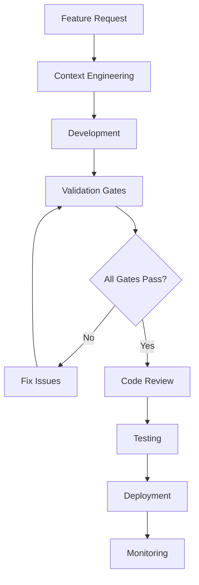

# SecuryFlex Development Workflow

Comprehensive development workflow for SecuryFlex platform ensuring quality, performance, and compliance at every stage.

## Workflow Overview



## Phase 1: Context Engineering

### 1.1 Feature Planning
```bash
# Start with specialized agent for feature area
/securyflex-feature [type] "[description]"

# Example:
/securyflex-feature gps "Real-time location tracking with battery optimization"
```

### 1.2 Pattern Recognition
- Check existing PRPs in `.claude/PRPs/`
- Review relevant subagent configurations
- Identify reusable patterns and components

### 1.3 Architecture Review
- Use `architect-review` agent for system design
- Validate against existing patterns
- Consider scalability and performance impact

## Phase 2: Development

### 2.1 Setup Development Environment
```bash
# Start development server with monitoring
npm run dev

# Open Drizzle Studio for database work
npm run db:studio

# Start Storybook for component development
npm run storybook
```

### 2.2 Mobile-First Development
- Always start with 375px mobile viewport
- Use `mobile-optimizer` agent for performance
- Implement touch-friendly interfaces (44px min)
- Test GPS functionality early

### 2.3 Component Development
```typescript
// Pattern: Use existing shadcn/ui components
import { Button } from '@/components/ui/button';
import { Card } from '@/components/ui/card';

// Pattern: Mobile-first responsive design
const ShiftCard = ({ shift }: { shift: Shift }) => {
  return (
    <Card className="p-4 hover:shadow-md transition-shadow">
      <div className="flex items-center justify-between">
        <h3 className="text-lg font-semibold text-[#1e3a8a]">
          {shift.location_name}
        </h3>
        <Badge variant={getBadgeVariant(shift.status)}>
          {shift.status}
        </Badge>
      </div>
      {/* GPS check-in button for mobile */}
      <Button
        size="lg"
        className="w-full h-16 mt-4 bg-[#10b981] hover:bg-[#059669]"
        onClick={() => handleGPSCheckIn(shift.id)}
      >
        <Camera className="mr-2 h-5 w-5" />
        GPS Check-in
      </Button>
    </Card>
  );
};
```

### 2.4 Database Changes
```bash
# Update schema
# Edit src/models/Schema.ts

# Generate migration
npm run db:generate

# Apply migration (auto-applies on next DB interaction)
```

## Phase 3: Validation Gates

### 3.1 GPS Accuracy Gate
```bash
# Test GPS implementation
/test-gps-accuracy checkin

# Validate:
# ✅ Accuracy < 50 meters
# ✅ Photo capture required
# ✅ Offline capability
# ✅ Battery optimization
```

### 3.2 Performance Gate
```bash
# Mobile performance audit
/mobile-pwa-audit performance

# Validate:
# ✅ FCP < 1.8s
# ✅ TTI < 3.5s
# ✅ GPS lock < 5s
# ✅ Touch targets 44px+
```

### 3.3 Payment SLA Gate
```bash
# Test Finqle integration
/finqle-webhook-test sla

# Validate:
# ✅ Webhook processing < 2s
# ✅ 24-hour payment guarantee
# ✅ Idempotency handling
# ✅ Retry logic working
```

### 3.4 Security Gate
```bash
# Security compliance check
/dutch-compliance-check security

# Validate:
# ✅ GDPR/AVG compliance
# ✅ WPBR requirements
# ✅ Data encryption
# ✅ Zero critical vulnerabilities
```

### 3.5 Dutch Language Gate
```bash
# Language compliance
/dutch-compliance-check language

# Validate:
# ✅ 100% UI translation
# ✅ Legal terminology
# ✅ Error messages in Dutch
# ✅ Email templates
```

## Phase 4: Code Quality

### 4.1 Automated Quality Checks
```bash
# Run all quality checks
npm run lint
npm run check-types
npm run test
npm run test:e2e

# Build verification
npm run build
```

### 4.2 Design System Compliance
```bash
# Use ui-visual-validator agent
# Verify:
# ✅ Exact hex colors (#1e3a8a, #3b82f6, #10b981)
# ✅ Component patterns followed
# ✅ Mobile-first responsive
# ✅ Accessibility compliance
```

### 4.3 Performance Validation
```bash
# Complete system validation
/validate-securyflex all

# Must achieve:
# ✅ 95%+ GPS check-in success
# ✅ 99.5%+ payment success
# ✅ All performance targets met
```

## Phase 5: Testing Strategy

### 5.1 Unit Testing
```typescript
// Test pattern for GPS functionality
describe('GPS Check-in', () => {
  it('should validate location within radius', async () => {
    const location = { lat: 52.3676, lng: 4.9041, accuracy: 15 };
    const shift = { id: 'shift_1', check_in_radius: 100 };

    const result = await validateGPSLocation(location, shift);

    expect(result.valid).toBe(true);
    expect(result.distance).toBeLessThan(100);
  });

  it('should require photo for check-in', async () => {
    const checkIn = await attemptCheckIn({
      shiftId: 'shift_1',
      location: validLocation,
      photo: null
    });

    expect(checkIn.success).toBe(false);
    expect(checkIn.error).toBe('photo_required');
  });
});
```

### 5.2 E2E Testing
```typescript
// Test pattern for complete user journey
test('ZZP GPS check-in flow', async ({ page }) => {
  // Login as ZZP
  await loginAs(page, 'zzp@test.com');

  // Navigate to active shift
  await page.goto('/dashboard/shifts');
  await page.click('[data-testid="active-shift"]');

  // Mock GPS location
  await mockGeolocation(page, {
    latitude: 52.3676,
    longitude: 4.9041,
    accuracy: 10
  });

  // Perform check-in
  await page.click('[data-testid="gps-checkin-button"]');

  // Verify photo capture prompt
  await expect(page.locator('[data-testid="camera-modal"]')).toBeVisible();

  // Complete check-in
  await page.click('[data-testid="capture-photo"]');
  await page.click('[data-testid="confirm-checkin"]');

  // Verify success
  await expect(page.locator('[data-testid="checkin-success"]')).toBeVisible();
});
```

## Phase 6: Deployment

### 6.1 Pre-deployment Checklist
```bash
# Final validation before deployment
/validate-securyflex all

# Required passing scores:
# ✅ GPS: > 95% success rate
# ✅ Payments: > 99.5% success rate
# ✅ Performance: All targets met
# ✅ Security: Zero critical issues
# ✅ Dutch: 100% coverage
```

### 6.2 Deployment Process
```bash
# Build production
npm run build

# Database migration (if needed)
npm run db:migrate

# Deploy to staging
npm run deploy:staging

# Run staging tests
npm run test:staging

# Deploy to production
npm run deploy:production
```

### 6.3 Post-deployment Monitoring
```bash
# Monitor key metrics
# - GPS check-in success rate
# - Payment processing times
# - Mobile performance metrics
# - Error rates by user role
# - SLA compliance
```

## Phase 7: Continuous Monitoring

### 7.1 Performance Monitoring
- Sentry for error tracking
- Better Stack for performance
- Custom metrics for business KPIs

### 7.2 SLA Monitoring
- 24-hour payment SLA tracking
- GPS accuracy monitoring
- Mobile performance alerts

### 7.3 User Experience Monitoring
- Core Web Vitals tracking
- Mobile conversion rates
- Feature usage analytics

## Hooks and Automation

### Pre-commit Hook
```bash
#!/bin/bash
# .claude/hooks/pre-commit.sh

echo "🔍 Running pre-commit validation..."

# Type checking
npm run check-types
if [ $? -ne 0 ]; then
  echo "❌ Type checking failed"
  exit 1
fi

# Linting
npm run lint
if [ $? -ne 0 ]; then
  echo "❌ Linting failed"
  exit 1
fi

# Essential GPS tests
npm run test:gps-essential
if [ $? -ne 0 ]; then
  echo "❌ GPS tests failed"
  exit 1
fi

echo "✅ Pre-commit validation passed"
```

### Post-deployment Hook
```bash
#!/bin/bash
# .claude/hooks/post-deploy.sh

echo "🚀 Running post-deployment checks..."

# Health check
curl -f https://api.securyflex.nl/health
if [ $? -ne 0 ]; then
  echo "❌ Health check failed"
  exit 1
fi

# GPS endpoint test
curl -f https://api.securyflex.nl/api/gps/test
if [ $? -ne 0 ]; then
  echo "❌ GPS endpoint failed"
  exit 1
fi

# Finqle webhook test
curl -f https://api.securyflex.nl/api/webhooks/finqle/test
if [ $? -ne 0 ]; then
  echo "❌ Finqle webhook failed"
  exit 1
fi

echo "✅ Post-deployment checks passed"
```

## Emergency Procedures

### GPS Failure Response
1. Check GPS service status
2. Validate location permissions
3. Switch to fallback location methods
4. Notify users with Dutch message
5. Log incident for analysis

### Payment SLA Breach
1. Alert payment team immediately
2. Check Finqle API status
3. Initiate manual payment process
4. Notify affected professionals
5. Update SLA tracking

### Performance Degradation
1. Check mobile performance metrics
2. Validate Core Web Vitals
3. Review recent deployments
4. Scale infrastructure if needed
5. Implement performance fixes

## Success Criteria

Feature is complete when:
- ✅ All validation gates pass
- ✅ Performance targets achieved
- ✅ Security compliance verified
- ✅ Dutch localization complete
- ✅ Mobile experience optimized
- ✅ All tests passing
- ✅ Monitoring configured

## Team Responsibilities

### Developer
- Follow mobile-first approach
- Use specialized agents proactively
- Run validation gates before commits
- Update PRPs with new patterns

### QA Engineer
- Execute comprehensive test plans
- Validate GPS accuracy manually
- Test payment flows end-to-end
- Verify Dutch translations

### DevOps Engineer
- Monitor SLA compliance
- Maintain deployment pipelines
- Configure alerting systems
- Ensure infrastructure scalability

This workflow ensures every feature meets SecuryFlex's high standards for mobile performance, GPS accuracy, payment reliability, and Dutch compliance.