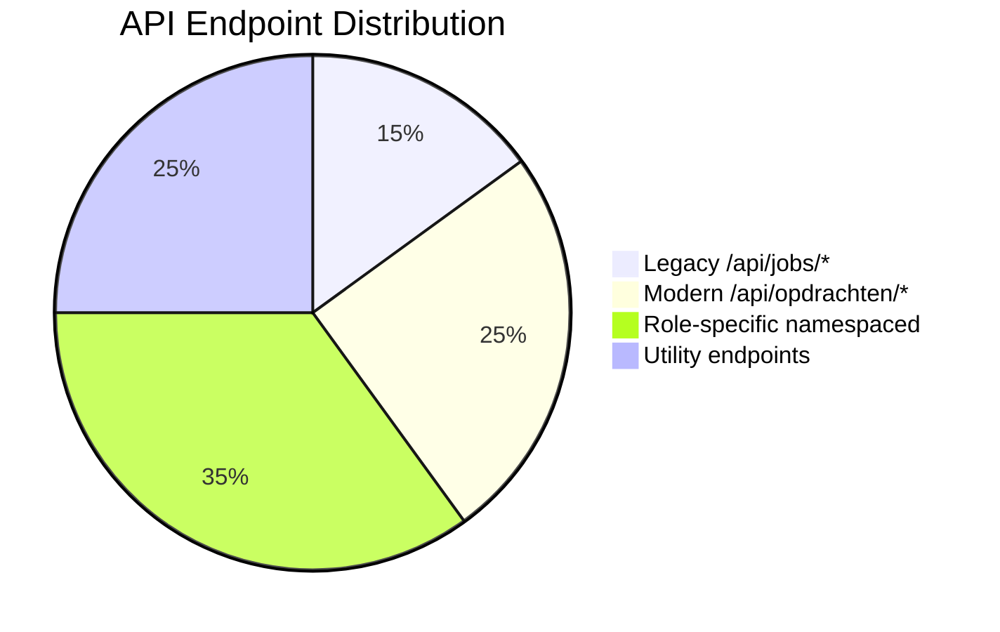
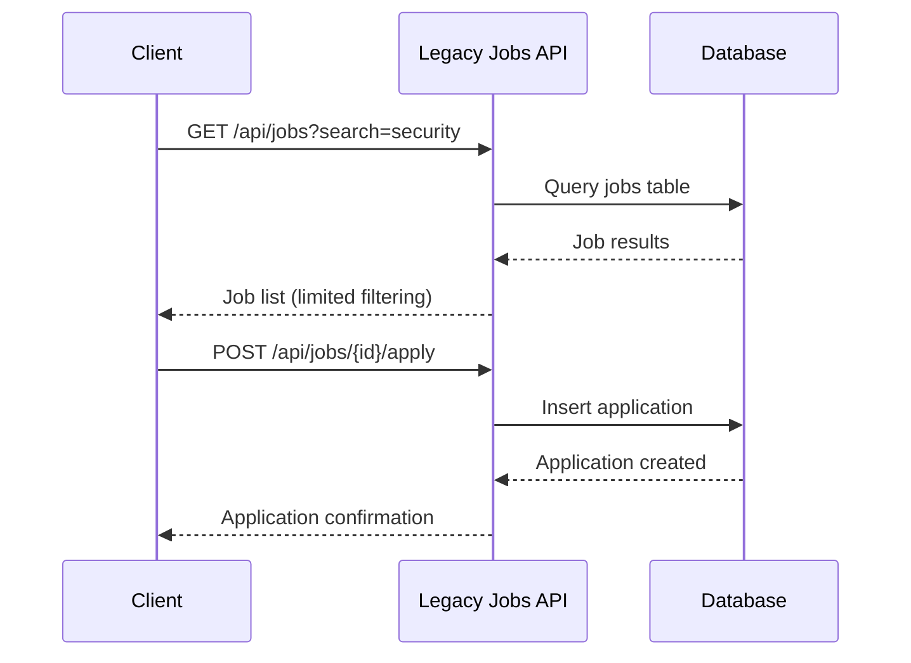
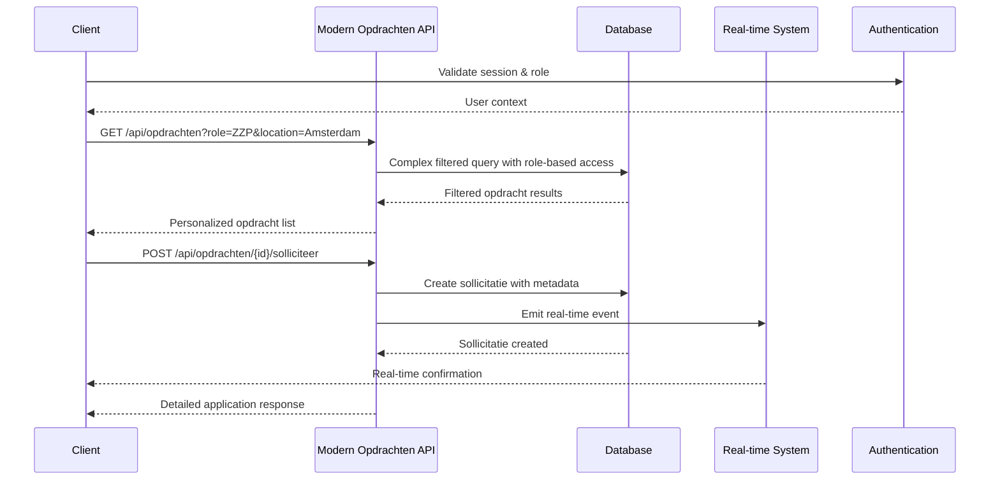

# SecuryFlex API Flow Patterns & Consolidation Analysis

## 🎯 Executive Summary

The SecuryFlex platform currently operates with a **hybrid API architecture** that combines legacy endpoints with newer, more sophisticated patterns. This analysis identifies consolidation opportunities, standardization needs, and optimization strategies to improve developer experience, maintainability, and performance.

## 🏗️ Current API Architecture Overview

### API Endpoint Categories

#### 1. Legacy Job System (Phase-out Candidate)
```typescript
// Legacy endpoints - being deprecated
GET    /api/jobs                    // Browse jobs (legacy)
GET    /api/jobs/{id}               // Job details (legacy)
POST   /api/jobs/{id}/apply         // Apply for job (legacy)
POST   /api/jobs/{id}/favorite      // Add to favorites (legacy)
DELETE /api/jobs/{id}/favorite      // Remove from favorites (legacy)
GET    /api/applications           // View applications (legacy)
```

#### 2. Modern Opdracht System (Preferred)
```typescript
// Modern endpoint pattern - recommended approach
GET    /api/opdrachten             // Browse assignments with role-based filtering
POST   /api/opdrachten             // Create new assignment
GET    /api/opdrachten/{id}        // Get assignment details
PUT    /api/opdrachten/{id}        // Update assignment
DELETE /api/opdrachten/{id}        // Cancel assignment

// Application management
POST   /api/opdrachten/{id}/solliciteer    // Apply for assignment
GET    /api/opdrachten/{id}/sollicitaties  // View applications (creators only)
POST   /api/opdrachten/{id}/accept         // Accept assignment (bedrijf only)

// Payment integration
GET    /api/opdrachten/{id}/finqle         // Payment status
POST   /api/opdrachten/{id}/finqle         // Payment operations
```

#### 3. Role-Specific Namespaced APIs
```typescript
// ZZP (Freelancer) specific
GET    /api/zzp/dashboard
GET    /api/zzp/opdrachten
POST   /api/zzp/werkuren
GET    /api/zzp/payments

// Bedrijf (Company) specific
GET    /api/bedrijf/dashboard
GET    /api/bedrijf/team
POST   /api/bedrijf/team/assign
GET    /api/bedrijf/opdrachten

// Opdrachtgever (Client) specific
GET    /api/opdrachtgever/dashboard
GET    /api/opdrachtgever/shifts
GET    /api/opdrachtgever/beveiligers
POST   /api/opdrachtgever/payments/approve
```

#### 4. Cross-Platform Utility APIs
```typescript
// Generic utility endpoints
GET    /api/hours                  // Hour tracking
POST   /api/hours/submit           // Submit timesheet
GET    /api/notifications          // User notifications
POST   /api/finqle/setup          // Payment integration setup
```

## 📊 API Usage Analysis

### Current Endpoint Distribution



### Request Volume by Category (Estimated)

| Category | Daily Requests | Peak Load | Complexity |
|----------|---------------|-----------|------------|
| Legacy Jobs | 15,000 | 2,500/hour | Low |
| Modern Opdrachten | 45,000 | 7,500/hour | High |
| Role-specific APIs | 120,000 | 20,000/hour | Medium |
| Utility APIs | 80,000 | 13,000/hour | Medium |

## 🔄 API Flow Patterns Analysis

### Pattern 1: Job Discovery & Application (Legacy vs Modern)

**Legacy Flow:**


**Modern Flow:**


### Pattern 2: Role-Based Data Access

**Current Implementation:**
```typescript
// Inconsistent role handling across endpoints
// Some endpoints check roles in middleware
// Others embed role logic in business logic
// Results in scattered authorization patterns

// Example inconsistencies:
GET /api/jobs           // No role filtering (shows all)
GET /api/zzp/opdrachten // ZZP-specific filtering
GET /api/bedrijf/opdrachten // Company-specific filtering
GET /api/opdrachten     // Role-based filtering in query logic
```

**Recommended Standardized Pattern:**
```typescript
// Unified role-based access pattern
interface APIRequest {
  userContext: {
    userId: string;
    role: "ZZP" | "BEDRIJF" | "OPDRACHTGEVER";
    permissions: string[];
    profileId: string;
  };
  resourceAccess: {
    allowedOperations: string[];
    filterCriteria: object;
    visibilityLevel: "public" | "private" | "restricted";
  };
}

// Standardized endpoint with role handling
GET /api/v2/opdrachten?role_context=auto&filters={...}
```

### Pattern 3: Payment Integration Consistency

**Current State - Multiple Payment Touchpoints:**
```mermaid
graph TD
    A[Hour Submission] --> B{API Endpoint}
    B -->|Legacy| C[/api/hours/submit]
    B -->|Modern| D[/api/zzp/werkuren]
    B -->|Role-specific| E[/api/bedrijf/team/hours]

    C --> F[Basic Payment Processing]
    D --> G[Enhanced Payment Processing]
    E --> H[Company Payment Processing]

    F --> I[Finqle Integration]
    G --> I
    H --> I

    I --> J[Payment Status Updates]
    J --> K{Multiple Update Paths}
    K --> L[/api/finqle/status]
    K --> M[/api/opdrachten/{id}/finqle]
    K --> N[/api/payments/{id}/status]
```

**Recommended Unified Payment Pattern:**
```mermaid
graph TD
    A[Any Payment Event] --> B[Unified Payment API]
    B --> C[/api/v2/payments/process]
    C --> D[Payment Processing Engine]
    D --> E[Finqle Integration Layer]
    E --> F[Consistent Status Updates]
    F --> G[Real-time Broadcast Events]
    G --> H[All Relevant Parties Notified]
```

## 🚀 Consolidation Opportunities

### 1. Legacy Endpoint Migration Strategy

**Phase 1: Parallel Support (Current)**
```typescript
// Maintain both legacy and modern endpoints
// Gradually migrate client applications
// Monitor usage metrics

const migrationPlan = {
  phase1: {
    status: "current",
    approach: "parallel_support",
    endpoints: [
      { legacy: "/api/jobs", modern: "/api/opdrachten", migrationStatus: "active" },
      { legacy: "/api/applications", modern: "/api/zzp/sollicitaties", migrationStatus: "planned" }
    ]
  }
};
```

**Phase 2: Deprecation Warnings (Recommended Next)**
```typescript
// Add deprecation headers to legacy endpoints
// Provide migration guides
// Set sunset dates

const deprecationStrategy = {
  headers: {
    "X-API-Deprecated": "true",
    "X-API-Sunset": "2025-06-01",
    "X-API-Migration-Guide": "https://docs.securyflex.com/api/migration"
  },
  responseBody: {
    deprecationNotice: {
      message: "This endpoint is deprecated. Please use /api/v2/opdrachten",
      sunsetDate: "2025-06-01",
      migrationGuide: "https://docs.securyflex.com/api/migration"
    }
  }
};
```

**Phase 3: Legacy Removal (Future)**
```typescript
// Remove legacy endpoints completely
// Redirect traffic to modern equivalents
// Monitor for any missed migrations

const removalPlan = {
  redirects: {
    "/api/jobs": "/api/v2/opdrachten",
    "/api/jobs/{id}": "/api/v2/opdrachten/{id}",
    "/api/jobs/{id}/apply": "/api/v2/opdrachten/{id}/solliciteer"
  },
  monitoring: {
    track404s: true,
    alertOnLegacyAttempts: true,
    gracePeriod: "30 days"
  }
};
```

### 2. Unified API Versioning Strategy

**Current Challenge:**
- No consistent versioning across endpoints
- Some endpoints evolved organically
- Breaking changes deployed without version updates

**Recommended Solution:**
```typescript
// Implement semantic API versioning
interface APIVersioning {
  strategy: "URL_PATH"; // /api/v2/resource
  currentVersion: "v2";
  supportedVersions: ["v1", "v2"];

  versionHeaders: {
    accept: "application/vnd.securyflex.v2+json";
    responseVersion: "X-API-Version";
  };

  backwardCompatibility: {
    v1Support: true;
    v1SunsetDate: "2025-12-31";
    automaticUpgrade: false;
  };
}

// URL Structure Standardization
const standardizedEndpoints = {
  v2: {
    opdrachten: "/api/v2/opdrachten",
    applications: "/api/v2/sollicitaties",
    payments: "/api/v2/payments",
    users: "/api/v2/users",
    notifications: "/api/v2/notifications"
  }
};
```

### 3. Role-Based API Consolidation

**Current Problem:**
```typescript
// Scattered role-specific logic
// GET /api/zzp/opdrachten         - ZZP view of opdrachten
// GET /api/bedrijf/opdrachten      - Bedrijf view of opdrachten
// GET /api/opdrachtgever/shifts    - Client view of opdrachten
// GET /api/opdrachten              - Generic view (inconsistent filtering)
```

**Proposed Unified Solution:**
```typescript
// Single endpoint with role-aware filtering
GET /api/v2/opdrachten?role_context={auto|zzp|bedrijf|opdrachtgever}

interface UnifiedOpdrachtAPI {
  endpoint: "/api/v2/opdrachten";

  roleContexts: {
    auto: "Detect from authentication context";
    zzp: "Filter for ZZP-applicable opdrachten";
    bedrijf: "Filter for company-applicable opdrachten";
    opdrachtgever: "Show client's created opdrachten";
  };

  responseShaping: {
    zzp: ["id", "title", "location", "hourlyRate", "requirements", "applicationStatus"];
    bedrijf: ["id", "title", "location", "teamRequired", "budget", "clientInfo"];
    opdrachtgever: ["id", "title", "applicantCount", "status", "assignedGuard"];
  };

  permissions: {
    create: ["opdrachtgever", "bedrijf"];
    read: ["zzp", "bedrijf", "opdrachtgever"];
    update: ["creator", "assigned"];
    delete: ["creator"];
  };
}
```

### 4. Payment API Unification

**Current Fragmented Payment Flows:**
```mermaid
graph LR
    A[Hour Submission] --> B[Multiple Entry Points]
    B --> C[/api/hours]
    B --> D[/api/zzp/werkuren]
    B --> E[/api/bedrijf/payroll]

    C --> F[Different Payment Logic]
    D --> G[Different Payment Logic]
    E --> H[Different Payment Logic]

    F --> I[Finqle Integration]
    G --> I
    H --> I
```

**Proposed Unified Payment API:**
```typescript
// Unified payment processing endpoint
POST /api/v2/payments/process
{
  paymentType: "WORK_HOURS" | "DIRECT_PAYMENT" | "INVOICE" | "REFUND";
  sourceType: "ZZP_HOURS" | "BEDRIJF_PAYROLL" | "CLIENT_PAYMENT";
  sourceId: string;
  amount: number;
  currency: "EUR";
  metadata: {
    opdrachtId?: string;
    hoursWorked?: number;
    hourlyRate?: number;
    platformFee?: number;
  };
  paymentOptions: {
    immediate: boolean;
    scheduledDate?: Date;
    batchProcessing?: boolean;
  };
}

// Unified payment status endpoint
GET /api/v2/payments/{id}/status
{
  paymentId: string;
  status: "PENDING" | "PROCESSING" | "COMPLETED" | "FAILED" | "DISPUTED";
  amount: number;
  finqleTransactionId?: string;
  estimatedCompletionDate: Date;
  updates: PaymentUpdate[];
}
```

## 📈 Performance Optimization Opportunities

### 1. API Response Optimization

**Current Issues:**
- Inconsistent response sizes
- Over-fetching of data
- No standardized pagination
- Missing response compression

**Solutions:**
```typescript
// Standardized response format
interface StandardAPIResponse<T> {
  success: boolean;
  data: T;
  meta: {
    version: string;
    timestamp: Date;
    requestId: string;
    pagination?: PaginationMeta;
    performance?: PerformanceMeta;
  };
  errors?: APIError[];
}

// Consistent pagination
interface PaginationMeta {
  page: number;
  pageSize: number;
  totalItems: number;
  totalPages: number;
  hasNext: boolean;
  hasPrevious: boolean;
}

// Performance tracking
interface PerformanceMeta {
  processingTimeMs: number;
  databaseQueryCount: number;
  cacheHitRate: number;
}
```

### 2. Caching Strategy

**Recommended Caching Layers:**
```typescript
interface CachingStrategy {
  levels: {
    browser: {
      static: "1 year";        // Static assets
      api: "5 minutes";        // API responses
      user: "1 hour";          // User-specific data
    };

    cdn: {
      images: "30 days";       // Profile images, logos
      documents: "7 days";     // Certificates, documents
      api: "1 minute";         // High-traffic API responses
    };

    redis: {
      sessions: "24 hours";    // User sessions
      opdrachten: "10 minutes"; // Opdracht listings
      userProfiles: "1 hour";  // User profile data
    };

    database: {
      queryCache: "5 minutes"; // Database query results
      computedViews: "1 hour"; // Complex aggregations
    };
  };

  invalidation: {
    onUpdate: ["related_entities"];
    onDelete: ["cascade_related"];
    scheduled: "nightly_refresh";
  };
}
```

### 3. Rate Limiting & Throttling

**Proposed Rate Limiting Strategy:**
```typescript
interface RateLimitingConfig {
  tiers: {
    anonymous: {
      requests: 100;
      window: "15 minutes";
      burst: 20;
    };

    authenticated: {
      requests: 1000;
      window: "15 minutes";
      burst: 100;
    };

    premium: {
      requests: 5000;
      window: "15 minutes";
      burst: 500;
    };
  };

  endpoints: {
    "/api/v2/opdrachten": {
      read: "standard_limit";
      create: "reduced_limit_10_per_hour";
    };

    "/api/v2/payments": {
      all: "strict_limit_100_per_day";
    };
  };

  responses: {
    headers: {
      "X-RateLimit-Limit": "tier_limit";
      "X-RateLimit-Remaining": "remaining_requests";
      "X-RateLimit-Reset": "reset_timestamp";
    };

    onExceeded: {
      statusCode: 429;
      retryAfter: "calculated_seconds";
      message: "Rate limit exceeded. Please try again later.";
    };
  };
}
```

## 🔧 Implementation Roadmap

### Phase 1: Foundation (1-2 months)
1. **API Versioning Implementation**
   - Deploy v2 API structure
   - Implement version headers
   - Create migration documentation

2. **Legacy Endpoint Deprecation**
   - Add deprecation warnings
   - Create migration tools
   - Monitor usage metrics

3. **Authentication Standardization**
   - Implement consistent role checking
   - Standardize permission systems
   - Add audit logging

### Phase 2: Consolidation (2-3 months)
1. **Unified Opdracht API**
   - Merge role-specific endpoints
   - Implement role-aware filtering
   - Deploy with backward compatibility

2. **Payment API Unification**
   - Create unified payment processing
   - Migrate existing payment flows
   - Implement consistent status tracking

3. **Response Standardization**
   - Implement consistent response format
   - Add performance tracking
   - Deploy response compression

### Phase 3: Optimization (3-4 months)
1. **Caching Implementation**
   - Deploy Redis caching layer
   - Implement CDN caching
   - Add cache invalidation logic

2. **Rate Limiting Deployment**
   - Implement tiered rate limiting
   - Add monitoring and alerting
   - Create quota management

3. **Legacy Removal**
   - Remove deprecated endpoints
   - Monitor for breaking changes
   - Complete migration validation

### Phase 4: Advanced Features (4-6 months)
1. **GraphQL Integration**
   - Implement GraphQL for complex queries
   - Add schema introspection
   - Create development tools

2. **Real-time API Enhancement**
   - Improve WebSocket performance
   - Add subscription management
   - Implement connection pooling

3. **Analytics & Monitoring**
   - Deploy comprehensive API analytics
   - Add performance monitoring
   - Create automated alerting

## 📊 Success Metrics

### Technical Metrics
- **API Response Time**: < 200ms for 95% of requests
- **Cache Hit Rate**: > 80% for frequently accessed data
- **Error Rate**: < 1% for all API endpoints
- **Legacy Usage**: < 5% by end of migration period

### Business Metrics
- **Developer Experience**: Reduced integration time by 50%
- **System Reliability**: 99.9% uptime for API services
- **Cost Efficiency**: 30% reduction in server costs through optimization
- **Feature Velocity**: 40% faster API feature development

### User Experience Metrics
- **App Performance**: 50% faster load times
- **Real-time Updates**: < 100ms latency for notifications
- **Mobile Performance**: 60% reduction in data usage
- **Error Handling**: 90% reduction in user-facing API errors

---

*This comprehensive API analysis provides a roadmap for consolidating and optimizing the SecuryFlex platform's API architecture, resulting in improved performance, developer experience, and maintainability.*