# Bedrijf (Security Company) Workflow - Three-Mode Operation System

## 🏢 Overview

Bedrijven (Security Companies) represent the most complex user type in the SecuryFlex platform, operating in **three distinct modes** that can run simultaneously:

1. **🔧 Leverancier (Service Provider)** - Accept external opdrachten from clients
2. **📋 Opdrachtgever (Client Creator)** - Create opdrachten for other companies to fulfill
3. **👥 Werkgever (Internal Employer)** - Manage internal team for direct assignments

This multi-modal approach allows companies to maximize revenue streams while efficiently managing their security workforce.

## 🎭 Three Operational Modes

### Mode 1: Leverancier (Service Provider)
**"We provide security services to external clients"**

Companies browse available external opdrachten and deploy their teams to fulfill client needs.

### Mode 2: Opdrachtgever (Client Creator)
**"We have clients who need security and subcontract to other companies"**

Companies create opdrachten on behalf of their clients, opening them to the marketplace for other security companies or freelancers to fulfill.

### Mode 3: Werkgever (Internal Employer)
**"We assign our team members directly to internal clients"**

Companies manage their own team assignments, creating internal opdrachten specifically for their employees with `targetAudience: EIGEN_TEAM`.

## 🔄 Complete Bedrijf Workflows

### 🔧 Mode 1: Leverancier (Service Provider) Workflow

#### Phase 1: External Opportunity Discovery

**Navigation Path:**
- Desktop: Sidebar → "Opdrachten" → "Solliciteren"
- Mobile: More tab → "Externe Opdrachten"

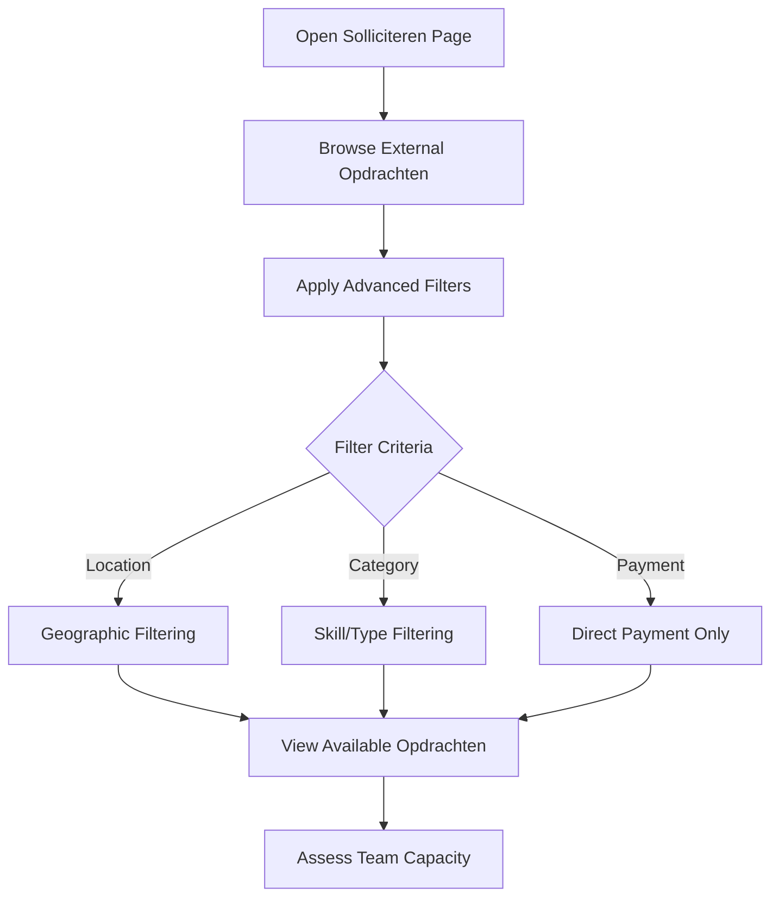

**Smart Matching System:**
```typescript
interface ExternalOpdracht {
  matchScore: number;        // 0-100 AI-calculated match
  directPayment: boolean;    // Finqle integration available
  urgency: "normal" | "urgent" | "critical";
  requiredBeveiligers: number;
  skills: string[];
  hourlyRate: number;
  totalValue: number;
}
```

#### Phase 2: Team Capacity Assessment

**Automated Team Matching:**
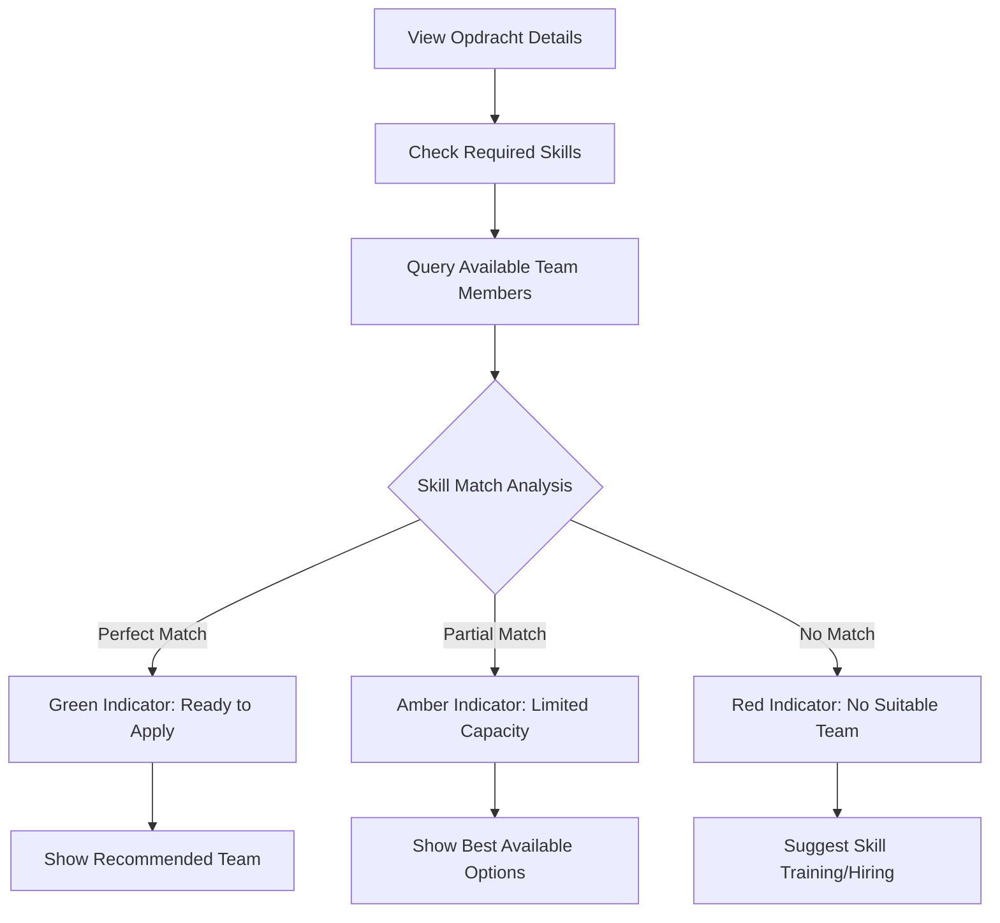

**Team Availability Logic:**
```typescript
const availableTeamForOpdracht = (opdracht: ExternalOpdracht) => {
  return teamMembers.filter(member => {
    // Base availability check
    if (!member.available) return false;

    // Skill matching
    const hasMatchingSkills = opdracht.skills.some(skill =>
      member.skills.includes(skill)
    );

    // Location proximity check
    const locationMatch = checkProximity(member.location, opdracht.location);

    // Finqle readiness for direct payment
    const finqleReady = !opdracht.directPayment || member.finqleOnboarded;

    return hasMatchingSkills && locationMatch && finqleReady;
  });
};
```

#### Phase 3: Application Submission

**Team Selection Interface:**
```mermaid
graph TD
    A[Click 'Solliciteren'] --> B[Open Team Selection Modal]
    B --> C[View Eligible Team Members]
    C --> D[Select Required Number]
    D --> E{Validation Check}
    E -->|Valid Selection| F[Submit Application]
    E -->|Invalid| G[Show Error Message]
    F --> H[API Call: POST /api/opdrachten/[id]/solliciteer]
    H --> I[Real-time Broadcast Event]
    I --> J[Application Tracking]
```

**Application API Structure:**
```typescript
// Bedrijf application API
POST /api/opdrachten/{id}/solliciteer
{
  applicationType: "BEDRIJF",
  bedrijfId: string,
  selectedTeamMembers: string[],
  proposedRate?: number,     // Optional counter-offer
  coverLetter?: string,      // Company introduction
  directPaymentRequested: boolean
}

// Response with credit check
{
  success: true,
  data: {
    sollicitatieId: string,
    creditPreApproved: boolean,
    estimatedPayment: number,
    teamMembersConfirmed: string[]
  }
}
```

#### Phase 4: Assignment Acceptance & Deployment

**Acceptance Workflow:**
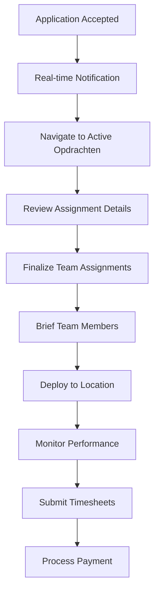

**Assignment Management API:**
```typescript
// Accept external opdracht
POST /api/opdrachten/{id}/accept
{
  bedrijfId: string,
  finalTeamMembers: string[],
  startDate: Date,
  specialInstructions?: string
}

// Assignment tracking
GET /api/bedrijf/assignments/active
{
  success: true,
  data: {
    activeAssignments: [{
      opdrachtId: string,
      client: string,
      location: string,
      assignedTeam: TeamMember[],
      status: "CONFIRMED" | "IN_PROGRESS" | "COMPLETED",
      finqlePaymentStatus: "PENDING" | "APPROVED" | "PAID"
    }]
  }
}
```

### 📋 Mode 2: Opdrachtgever (Client Creator) Workflow

#### Phase 1: Client Requirement Analysis

**Client Onboarding Process:**
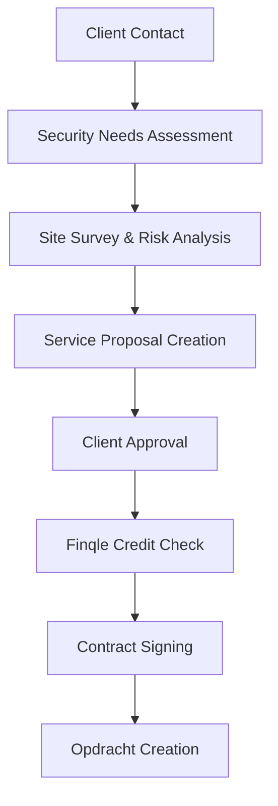

#### Phase 2: Opdracht Creation

**Navigation Path:**
- Desktop: Sidebar → "Opdrachten" → "Plaatsen"
- Mobile: More tab → "Nieuwe Opdracht"

**Comprehensive Opdracht Builder:**
```typescript
interface OpdrachtCreationForm {
  // Basic Information
  title: string;
  description: string;
  category: "evenement" | "object" | "receptie" | "surveillance" | "vip";
  location: string;
  hourlyRate: number;

  // Shift Configuration
  shifts: [{
    date: Date;
    startTime: string;
    endTime: string;
    beveiligers: number;
  }];

  // Requirements
  requiredSkills: string[];
  additionalRequirements: string;

  // Targeting
  targetAudience: "ALLEEN_BEDRIJVEN" | "ALLEEN_ZZP" | "BEIDEN";
  directZZPAllowed: boolean;

  // Payment Settings
  enableDirectPayment: boolean;
  autoAccept: boolean;
  maxApplications?: number;
}
```

**Smart Pricing Calculator:**
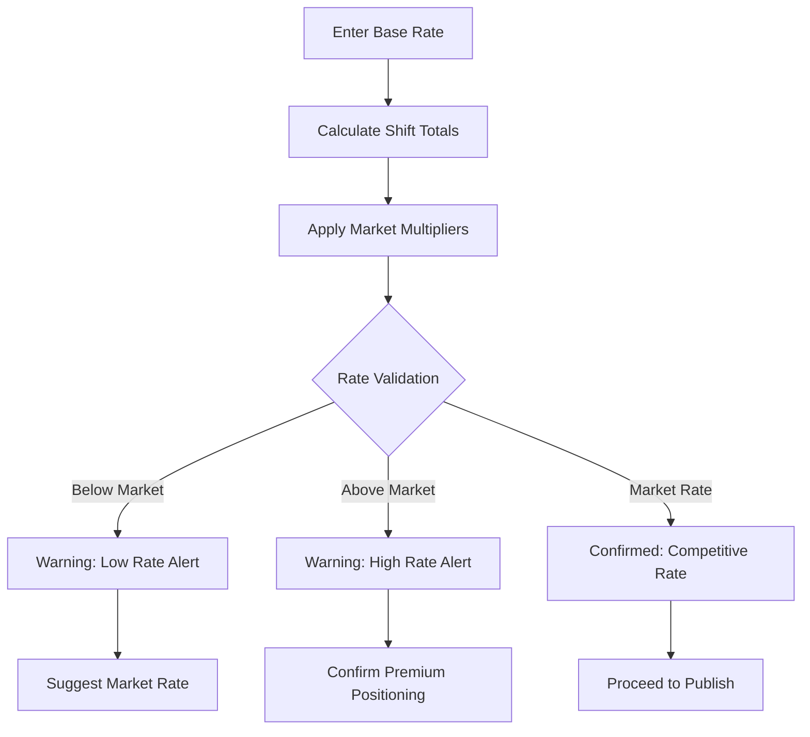

#### Phase 3: Application Management

**Application Review Dashboard:**
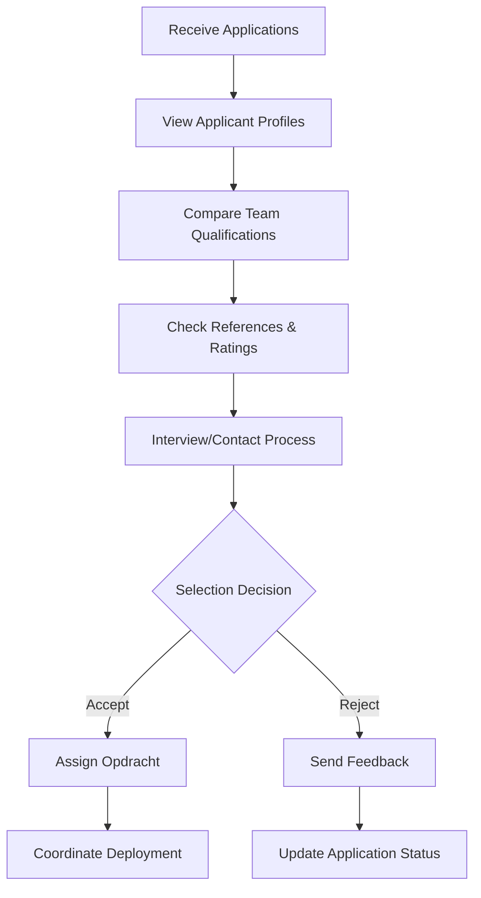

**Application Management APIs:**
```typescript
// View applications for created opdracht
GET /api/bedrijf/opdrachten/{id}/sollicitaties
{
  success: true,
  data: {
    applications: [{
      id: string,
      applicantType: "BEDRIJF" | "ZZP",
      applicantProfile: BedrijfProfile | ZZPProfile,
      proposedTeam: TeamMember[],
      coverLetter: string,
      applicationDate: Date,
      status: "PENDING" | "ACCEPTED" | "REJECTED"
    }]
  }
}

// Accept/reject applications
POST /api/opdrachten/{id}/applications/{applicationId}/respond
{
  decision: "ACCEPT" | "REJECT",
  feedback?: string,
  counterOffer?: {
    rate: number,
    conditions: string
  }
}
```

### 👥 Mode 3: Werkgever (Internal Employer) Workflow

#### Phase 1: Team Management

**Navigation Path:**
- Desktop: Sidebar → "Team" → "Management"
- Mobile: More tab → "Team Beheer"

**Comprehensive Team Dashboard:**
```typescript
interface TeamMember {
  // Personal Information
  id: string;
  name: string;
  email: string;
  phone: string;
  avatar?: string;

  // Professional Details
  role: "Beveiliger" | "Senior Beveiliger" | "Teamleider" | "Supervisor";
  status: "actief" | "inactief" | "verlof";
  employmentType: "VAST" | "FREELANCE" | "TIJDELIJK";

  // Finqle Integration
  finqleStatus: "onboarded" | "pending" | "not_started";
  finqleMerchantId?: string;

  // Compliance & Documentation
  documents: [{
    type: "VOG" | "Diploma Beveiliging" | "EHBO" | "BHV" | "Leidinggevende";
    status: "geldig" | "verloopt" | "verlopen";
    expiryDate?: Date;
    documentUrl?: string;
  }];

  // Skills & Performance
  skills: string[];
  certifications: string[];
  performance: {
    rating: number;           // 1-5 star rating
    completedShifts: number;
    hoursWorked: number;
    lastShift?: Date;
    clientFeedback: number;   // Average client satisfaction
  };

  // Availability
  availability: {
    monday: boolean;
    tuesday: boolean;
    wednesday: boolean;
    thursday: boolean;
    friday: boolean;
    saturday: boolean;
    sunday: boolean;
  };
  preferredShifts: "DAG" | "AVOND" | "NACHT" | "FLEXIBEL";
}
```

#### Phase 2: Internal Assignment Creation

**Direct Team Assignment Process:**
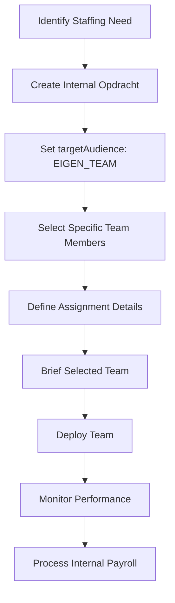

**Internal Assignment API:**
```typescript
// Create internal team assignment
POST /api/bedrijf/opdrachten/internal
{
  title: string,
  description: string,
  client: string,            // Internal client reference
  location: string,
  shifts: ShiftRequirement[],
  assignedTeamMembers: string[],
  specialInstructions?: string,
  internalRate: number,      // Different from market rate
  targetAudience: "EIGEN_TEAM",
  creatorType: "BEDRIJF",
  creatorBedrijfId: string
}
```

#### Phase 3: Performance & Payroll Management

**Team Performance Dashboard:**
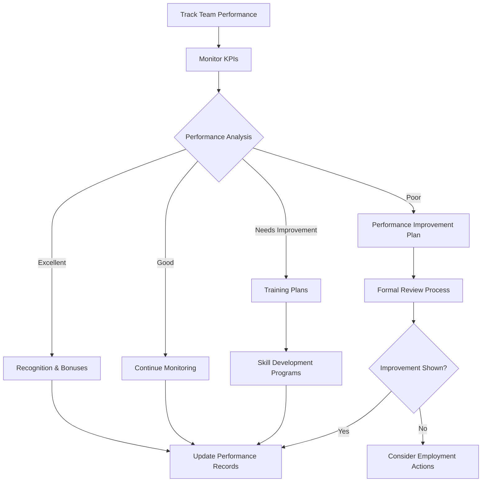

## 🔗 API Architecture for Multi-Mode Operations

### Unified Bedrijf Dashboard API

```typescript
// Get comprehensive bedrijf dashboard data
GET /api/bedrijf/dashboard
{
  success: true,
  data: {
    // Mode 1: Leverancier metrics
    serviceProvider: {
      activeExternalOpdrachten: number,
      pendingApplications: number,
      monthlyRevenue: number,
      teamUtilization: number,
      averageRating: number
    },

    // Mode 2: Opdrachtgever metrics
    clientServices: {
      activeCreatedOpdrachten: number,
      pendingApplicationsReceived: number,
      clientSatisfaction: number,
      markupRevenue: number
    },

    // Mode 3: Werkgever metrics
    teamManagement: {
      totalTeamMembers: number,
      activeMembers: number,
      documentsExpiring: number,
      finqleOnboardingPending: number,
      averageTeamRating: number
    },

    // Unified metrics
    financials: {
      totalMonthlyRevenue: number,
      pendingPayments: number,
      finqleCreditAvailable: number,
      profitMargin: number
    }
  }
}
```

### Mode-Specific API Patterns

```typescript
// Mode 1: Service Provider APIs
GET    /api/bedrijf/opdrachten/external           // Browse external opportunities
POST   /api/bedrijf/opdrachten/{id}/apply         // Apply with team
GET    /api/bedrijf/assignments/active            // Active external assignments

// Mode 2: Client Creator APIs
POST   /api/bedrijf/opdrachten/create             // Create opdracht for others
GET    /api/bedrijf/opdrachten/created            // Manage created opdrachten
GET    /api/bedrijf/opdrachten/{id}/applications  // Review applications

// Mode 3: Internal Employer APIs
GET    /api/bedrijf/team                          // Team management
POST   /api/bedrijf/team/assign                   // Direct team assignments
GET    /api/bedrijf/payroll                       // Internal payroll management
POST   /api/bedrijf/team/performance              // Performance tracking

// Cross-mode APIs
GET    /api/bedrijf/finqle/status                 // Payment processing status
POST   /api/bedrijf/finqle/onboard                // Finqle integration setup
GET    /api/bedrijf/analytics                     // Cross-mode analytics
```

## 💳 Finqle Payment Integration

### Multi-Mode Payment Flows

**Mode 1 (Leverancier): Receiving Payments**
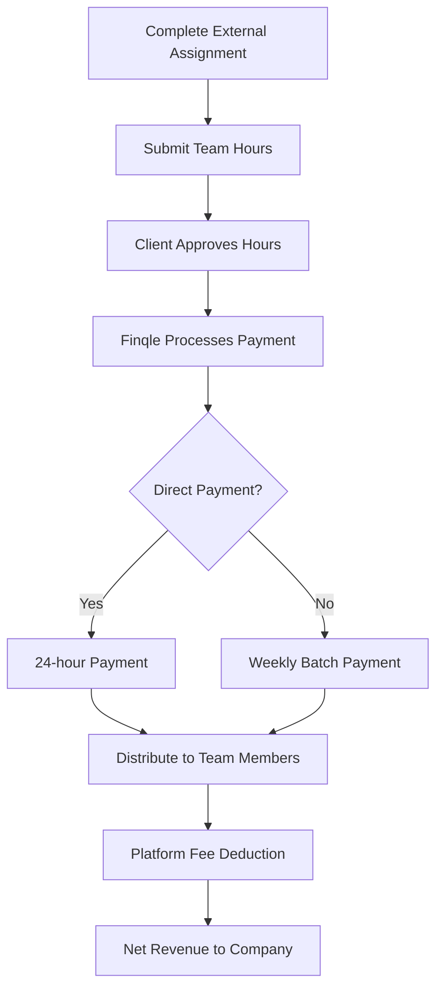

**Mode 2 (Opdrachtgever): Making Payments**
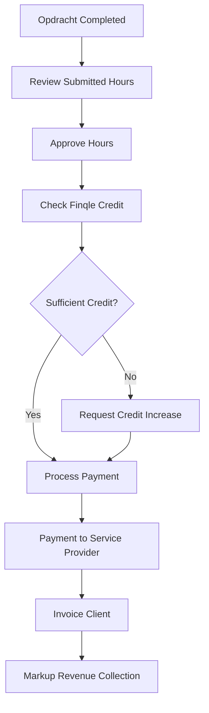

**Mode 3 (Werkgever): Internal Payroll**
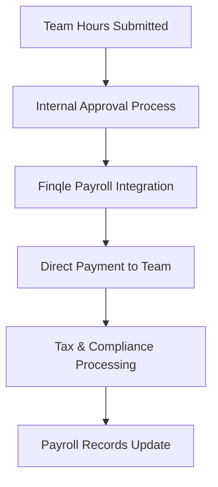

### Payment Status Tracking

```typescript
// Unified payment dashboard
GET /api/bedrijf/payments/dashboard
{
  success: true,
  data: {
    incoming: {
      pendingFromClients: number,
      processingPayments: number,
      expectedThisWeek: number
    },
    outgoing: {
      owedToTeam: number,
      owedToProviders: number,
      payrollScheduled: number
    },
    finqleStatus: {
      creditAvailable: number,
      creditLimit: number,
      directPaymentEnabled: boolean,
      pendingKYC: string[]
    }
  }
}
```

## 📊 Performance Analytics & Optimization

### Cross-Mode KPI Dashboard

**Operational Metrics:**
- **Capacity Utilization**: Team member hours vs available hours
- **Revenue per Mode**: Income breakdown by operational mode
- **Client Satisfaction**: Average ratings across all service types
- **Market Position**: Competitive analysis for rates and win rates

**Financial Performance:**
- **Profit Margin per Mode**: Understanding most profitable operations
- **Cash Flow Analysis**: Payment timing and credit utilization
- **Team ROI**: Revenue generated per team member
- **Growth Trends**: Month-over-month growth by operational mode

### Smart Recommendations Engine

```typescript
interface BedrijfRecommendations {
  capacity: {
    underutilizedTeam: TeamMember[],
    hiringRecommendations: {
      skills: string[],
      urgency: "high" | "medium" | "low",
      marketDemand: number
    }
  },

  market: {
    pricingOptimization: {
      currentRate: number,
      suggestedRate: number,
      confidence: number
    },
    opportunityAlerts: ExternalOpdracht[]
  },

  financial: {
    cashFlowOptimization: string[],
    creditUtilizationAdvice: string,
    profitabilityImprovements: string[]
  }
}
```

## 🚀 Advanced Features & Optimizations

### Smart Team Assignment Algorithm

**AI-Powered Matching:**
```typescript
interface TeamAssignmentAI {
  skillMatching: {
    score: number,
    reasoning: string[],
    alternatives: TeamMember[]
  },

  locationOptimization: {
    travelTime: number,
    travelCost: number,
    carbonFootprint: number
  },

  performancePrediction: {
    expectedRating: number,
    riskFactors: string[],
    successProbability: number
  },

  financialOptimization: {
    profitMargin: number,
    competitivenessScore: number,
    recommendedBid: number
  }
}
```

### Automated Workflow Triggers

**Smart Automation Rules:**
- **Auto-Accept Conditions**: Automatically accept high-match external opdrachten
- **Team Auto-Assignment**: Assign optimal team members based on availability and skills
- **Payment Optimization**: Choose between direct payment and batch processing
- **Document Expiry Alerts**: Automated reminders for team compliance
- **Performance Threshold Alerts**: Notifications for team member performance changes

### Cross-Mode Workflow Integration

**Scenario: Client Needs Exceed Internal Capacity**
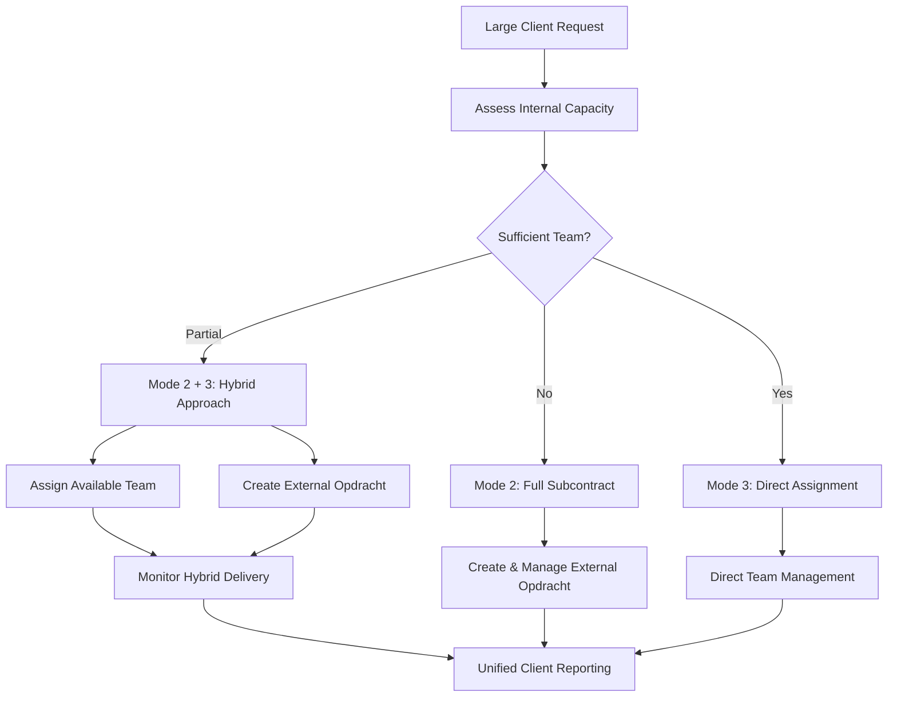

## 🔮 Future Enhancements

### Short-term (1-3 months)
- **Mobile Team Management**: Full team management capabilities on mobile
- **Advanced Analytics**: Predictive analytics for demand forecasting
- **Integration APIs**: Connect with existing HR and payroll systems

### Medium-term (3-6 months)
- **AI-Powered Pricing**: Dynamic pricing based on market conditions
- **Advanced Scheduling**: Intelligent team scheduling with conflict resolution
- **Client Portal**: Dedicated client interface for Mode 2 operations

### Long-term (6+ months)
- **Marketplace Expansion**: Additional service categories beyond security
- **International Operations**: Multi-country team and client management
- **Blockchain Integration**: Immutable performance and compliance records

---

*This comprehensive workflow analysis demonstrates the sophisticated multi-modal operation system that enables Bedrijven to maximize their business potential on the SecuryFlex platform, efficiently managing service provision, client relationships, and internal team operations simultaneously.*