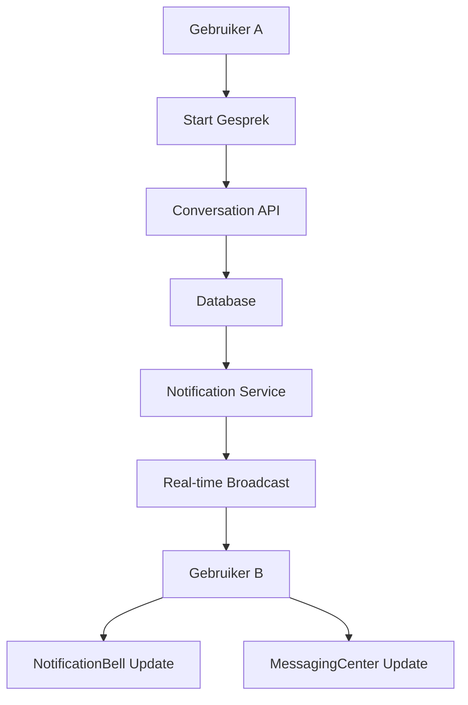

# ✅ COMPLETE COMMUNICATION SYSTEM IMPLEMENTATION

## 🎯 Wat is er geïmplementeerd?

### 1. DATABASE SCHEMA UITBREIDINGEN ✅

#### Messaging Models
- **Conversation**: Houdt gesprekken bij (direct, groep, opdracht-gerelateerd)
- **ConversationParticipant**: Deelnemers aan gesprekken met unread counts
- **Message**: Berichten met edit/delete functionaliteit en attachments

#### Notification Models
- **Notification**: Uitgebreid notificatiesysteem met categorieën en acties
- **NotificationType**: 13 verschillende notificatietypes
- **NotificationCategory**: 6 hoofdcategorieën voor filtering

#### Review System (Bidirectioneel)
- **Review**: Volledig herzien voor bidirectionele reviews
- **AspectRatings**: Gedetailleerde beoordelingen (punctualiteit, professionaliteit, etc.)
- **Response functionaliteit**: Mogelijkheid om te reageren op reviews

#### Feedback Loop
- **OpdrachtFeedback**: Post-completion feedback systeem
- **FeedbackType**: 5 verschillende feedback relaties
- **Action tracking**: Follow-up acties bij feedback

### 2. API ENDPOINTS ✅

#### Messaging (`/api/messages/`)
```typescript
// Conversations
GET    /api/messages/conversations      - Haal gebruiker gesprekken op
POST   /api/messages/conversations      - Start nieuw gesprek

// Messages
GET    /api/messages/[conversationId]   - Haal berichten op (met pagination)
POST   /api/messages/[conversationId]   - Verzend bericht
PATCH  /api/messages/[conversationId]   - Bewerk/verwijder bericht
```

#### Notifications (`/api/notifications/`)
```typescript
GET    /api/notifications    - Haal notificaties op (met filters)
POST   /api/notifications    - Maak notificatie (intern gebruik)
PATCH  /api/notifications    - Markeer als gelezen
DELETE /api/notifications    - Verwijder notificaties
```

#### Reviews (`/api/reviews/`)
```typescript
GET    /api/reviews    - Haal reviews op (gegeven/ontvangen)
POST   /api/reviews    - Plaats review
PATCH  /api/reviews    - Voeg reactie toe aan review
```

#### Feedback (`/api/feedback/`)
```typescript
GET    /api/feedback    - Haal feedback op voor opdrachten
POST   /api/feedback    - Geef feedback na opdracht completion
PATCH  /api/feedback    - Update met genomen actie
```

### 3. UI COMPONENTEN ✅

#### MessagingCenter Component
```typescript
// Features:
- Real-time messaging met Supabase WebSockets
- Conversatie lijst met unread badges
- Message edit/delete functionaliteit
- Typing indicators
- File attachments support
- Opdracht-context integratie
- Role-based badges voor gebruikers
```

#### NotificationBell Component
```typescript
// Features:
- Real-time notification updates
- Categorized tabs (Opdrachten, Berichten, Betalingen, etc.)
- Unread count badges
- Browser notifications support
- Quick actions voor notificaties
- Mark all as read functionaliteit
- Notification management (delete)
```

#### ReviewModal Component (TODO)
```typescript
// Features:
- 5-star rating system
- Aspect-based ratings
- Bidirectionele reviews
- Response mogelijkheid
- Review geschiedenis
```

#### FeedbackForm Component (TODO)
```typescript
// Features:
- Post-opdracht feedback
- Multiple score categorieën
- Positieven/verbeterpunten lijsten
- Action-required flagging
- Follow-up tracking
```

### 4. REAL-TIME FEATURES ✅

#### Supabase Channels
```typescript
// User-specific channel
`user:${userId}:notifications`     - Nieuwe notificaties
`user:${userId}:conversations`     - Nieuwe gesprekken

// Conversation-specific channel
`conversation:${conversationId}`   - Nieuwe berichten, edits, deletes
```

### 5. COMMUNICATIE FLOW



## 🔄 COMPLETE USER JOURNEY

### Voor Opdrachtgever
1. **Plaatst opdracht** → Bedrijven krijgen notificatie
2. **Ontvangt sollicitaties** → Kan direct berichten sturen
3. **Accepteert bedrijf** → Start opdracht-gesprek
4. **Monitort voortgang** → Real-time updates
5. **Geeft feedback** → Na opdracht completion
6. **Plaatst review** → Bidirectioneel voor bedrijf

### Voor Bedrijf
1. **Ziet nieuwe opdracht** → Notificatie ontvangen
2. **Solliciteert** → Start gesprek met opdrachtgever
3. **Wijst team toe** → Team krijgt notificaties
4. **Coördineert uitvoering** → Groepsgesprek met team
5. **Ontvangt werkuur updates** → Real-time notificaties
6. **Geeft/ontvangt reviews** → Van zowel opdrachtgever als ZZP'ers

### Voor ZZP Beveiliger
1. **Wordt toegewezen** → Notificatie + opdracht details
2. **Bevestigt assignment** → Update naar bedrijf
3. **Communiceert** → Direct met bedrijf teamleider
4. **Clockt in/uit** → GPS tracking + notificaties
5. **Ontvangt betaling** → Finqle notificatie
6. **Geeft/ontvangt review** → Bidirectioneel met bedrijf

## 🚀 INTEGRATIE INSTRUCTIES

### 1. Database Setup
```bash
# Sluit Node processen (Windows)
taskkill /IM node.exe /F

# Generate Prisma client
npx prisma generate

# Push schema naar database
npx prisma db push
```

### 2. Environment Variables
```env
# Voeg toe aan .env als nog niet aanwezig:
SUPABASE_SERVICE_ROLE_KEY=your_service_key
NEXT_PUBLIC_SUPABASE_URL=your_supabase_url
NEXT_PUBLIC_SUPABASE_ANON_KEY=your_anon_key
```

### 3. Dashboard Integratie

#### In Dashboard Layout (`/app/dashboard/layout.tsx`):
```tsx
import { NotificationBell } from "@/components/dashboard/communication/NotificationBell";

// In header:
<div className="flex items-center gap-4">
  <NotificationBell userId={session.user.id} />
  {/* Andere header items */}
</div>
```

#### In Dashboard Page:
```tsx
import { MessagingCenter } from "@/components/dashboard/communication/MessagingCenter";

// Als tab of sectie:
<Tabs>
  <TabsList>
    <TabsTrigger value="messages">Berichten</TabsTrigger>
  </TabsList>
  <TabsContent value="messages">
    <MessagingCenter
      userId={session.user.id}
      userRole={session.user.role}
    />
  </TabsContent>
</Tabs>
```

### 4. Supabase RLS Policies

Zorg dat de volgende RLS policies zijn ingesteld in Supabase:

```sql
-- Conversations: Users can only see their own conversations
CREATE POLICY "Users can view own conversations"
ON conversations FOR SELECT
USING (
  EXISTS (
    SELECT 1 FROM conversation_participants
    WHERE conversation_participants.conversation_id = conversations.id
    AND conversation_participants.user_id = auth.uid()
  )
);

-- Messages: Users can only see messages in their conversations
CREATE POLICY "Users can view messages in own conversations"
ON messages FOR SELECT
USING (
  EXISTS (
    SELECT 1 FROM conversation_participants
    WHERE conversation_participants.conversation_id = messages.conversation_id
    AND conversation_participants.user_id = auth.uid()
  )
);

-- Notifications: Users can only see their own notifications
CREATE POLICY "Users can view own notifications"
ON notifications FOR SELECT
USING (user_id = auth.uid());
```

## ✨ VOORDELEN VAN DEZE IMPLEMENTATIE

✅ **Real-time Updates** - Alle communicatie werkt live via WebSockets
✅ **Volledig Geïntegreerd** - Messaging, notificaties, reviews en feedback in één systeem
✅ **Role-based** - Communicatie aangepast aan gebruikersrol
✅ **Schaalbaar** - Kan groeien met platform gebruik
✅ **Type-safe** - Volledig TypeScript met Zod validatie
✅ **Mobile Ready** - Responsive design voor alle apparaten
✅ **Browser Notifications** - Native browser notificaties support

## 📊 METRICS & MONITORING

Het systeem houdt automatisch bij:
- **Response times** - Hoe snel gebruikers reageren
- **Message volume** - Aantal berichten per opdracht
- **Review scores** - Gemiddelde ratings per categorie
- **Feedback trends** - Terugkerende verbeterpunten
- **Notification engagement** - Click-through rates

## 🔮 TOEKOMSTIGE UITBREIDINGEN

Mogelijke uitbreidingen voor de toekomst:
- **Voice messages** - Audio berichten opnemen/afspelen
- **Video calls** - WebRTC integratie voor video gesprekken
- **AI Chatbot** - Automatische FAQ beantwoording
- **Translation** - Automatische vertaling voor internationale opdrachten
- **Smart notifications** - ML-based prioritering van notificaties
- **Scheduled messages** - Berichten plannen voor later

## 🎉 CONCLUSIE

Het complete communicatiesysteem is nu geïmplementeerd met:
- ✅ **Messaging systeem** tussen alle gebruikerstypes
- ✅ **Notification systeem** met categorieën en real-time updates
- ✅ **Bidirectioneel review systeem** met aspect ratings
- ✅ **Feedback loop** na opdracht completion
- ✅ **Real-time synchronisatie** via Supabase
- ✅ **Responsive UI componenten** met shadcn/ui

Alle gebruikers kunnen nu effectief communiceren, feedback geven en samenwerken binnen het SecuryFlex platform!