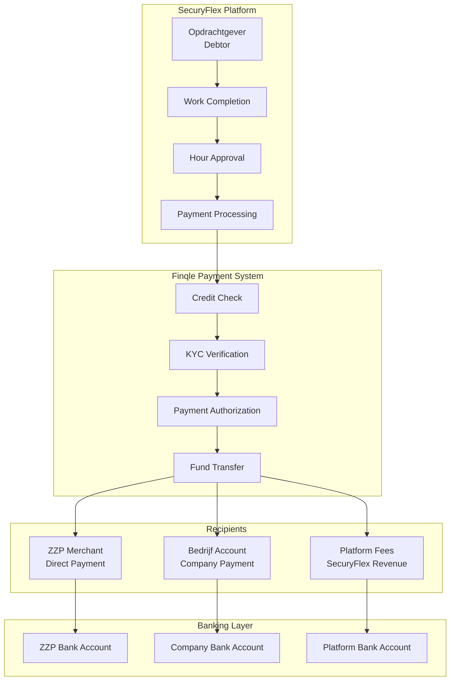
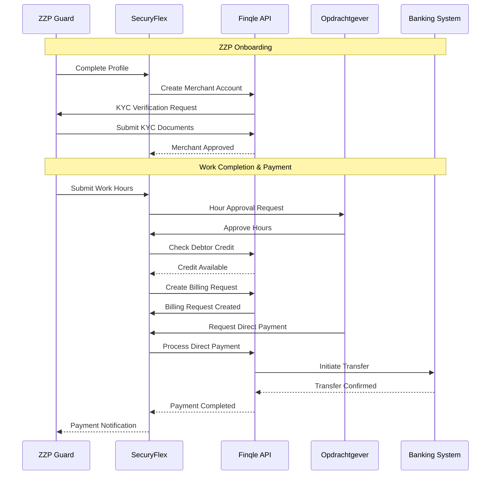
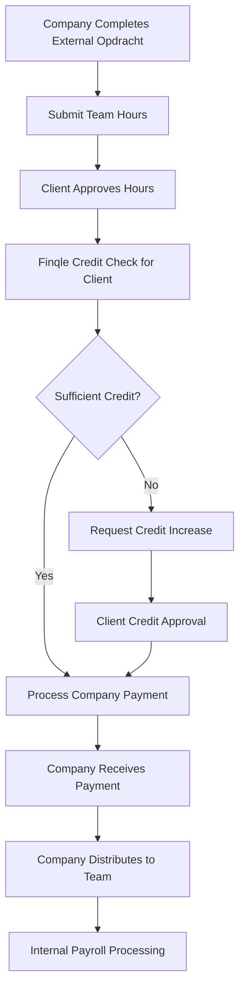
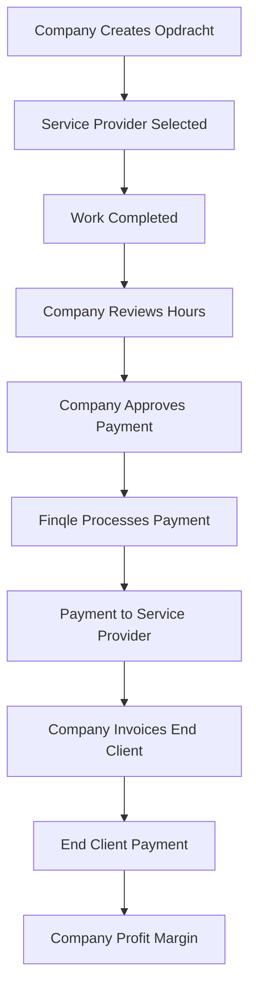
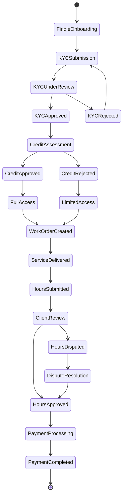
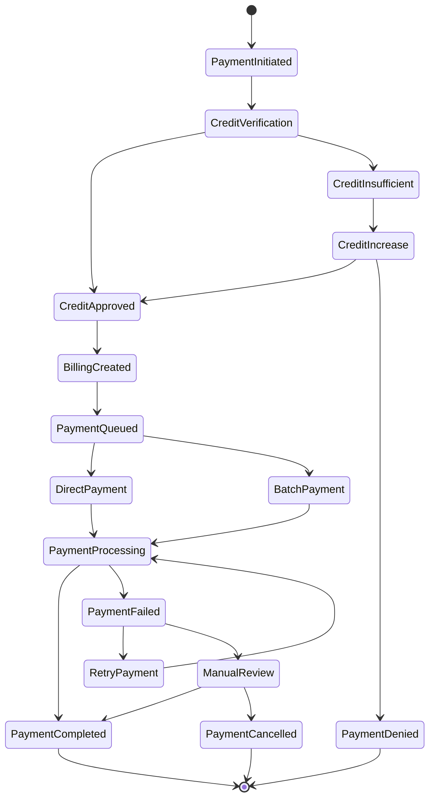
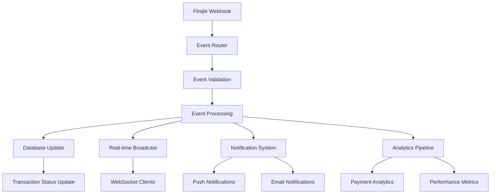

# Finqle Payment Integration - Comprehensive Analysis

## 🎯 Executive Summary

Finqle serves as the **financial backbone** of the SecuryFlex platform, enabling secure, compliant, and efficient payments between clients (Opdrachtgevers), security companies (Bedrijven), and independent security guards (ZZP'ers). This analysis examines the current integration, identifies optimization opportunities, and provides recommendations for enhanced payment processing.

## 💳 Finqle Integration Architecture

### Overview of Payment Ecosystem



### Core Finqle Entities & Relationships

```typescript
interface FinqleEcosystem {
  // Client Entity (Pays for services)
  debtor: {
    finqleDebtorId: string;
    companyName: string;
    kvkNumber: string;
    creditLimit: number;
    creditAvailable: number;
    paymentMethods: PaymentMethod[];
    kycStatus: "PENDING" | "APPROVED" | "REJECTED";
  };

  // Service Provider Entity (Receives payments)
  merchant: {
    finqleMerchantId: string;
    merchantType: "ZZP" | "BEDRIJF";
    bankAccount: BankAccountDetails;
    directPaymentEnabled: boolean;
    kycStatus: "PENDING" | "APPROVED" | "REJECTED";
    payoutSchedule: "IMMEDIATE" | "DAILY" | "WEEKLY";
  };

  // Payment Transaction
  transaction: {
    finqleTransactionId: string;
    debtorId: string;
    merchantId: string;
    amount: number;
    description: string;
    status: "PENDING" | "APPROVED" | "PAID" | "FAILED" | "DISPUTED";
    directPayment: boolean;
    requestedAt: Date;
    processedAt?: Date;
  };
}
```

## 🔄 Payment Workflow Analysis

### 1. ZZP (Freelancer) Payment Flow



### 2. Bedrijf (Company) Payment Flow

**Mode 1: Receiving Payment (As Service Provider)**


**Mode 2: Making Payment (As Client)**


### 3. Opdrachtgever (Client) Payment Flow



## 🔧 Technical Implementation Analysis

### Current API Integration Points

```typescript
// Core Finqle API endpoints used in SecuryFlex
interface FinqleAPIEndpoints {
  // Credit & Account Management
  checkCredit: {
    method: "GET";
    endpoint: "/api/debtors/{debtorId}/credit";
    response: {
      creditAvailable: number;
      creditLimit: number;
      directPaymentEligible: boolean;
    };
  };

  // Billing & Payment Processing
  createBillingRequest: {
    method: "POST";
    endpoint: "/api/billing-requests";
    payload: {
      debtorId: string;
      merchantId: string;
      projectId: string;
      hours: number;
      tariff: number;
      expenses: number;
      description: string;
    };
    response: {
      requestId: string;
      status: "CREATED" | "PROCESSING" | "APPROVED";
    };
  };

  // Direct Payment Processing
  requestDirectPayment: {
    method: "POST";
    endpoint: "/api/direct-payments";
    payload: {
      merchantId: string;
      amount: number;
      billingRequestId: string;
    };
    response: {
      paymentId: string;
      approved: boolean;
      estimatedPayoutDate: Date;
    };
  };

  // Merchant Management
  createMerchant: {
    method: "POST";
    endpoint: "/api/merchants";
    payload: {
      merchantType: "ZZP" | "BEDRIJF";
      personalDetails: PersonalInfo;
      bankAccount: BankAccountInfo;
      businessDetails?: BusinessInfo;
    };
  };

  // Webhook Events
  webhookEvents: [
    "payment.completed",
    "payment.failed",
    "merchant.approved",
    "merchant.rejected",
    "credit.updated",
    "kyc.completed"
  ];
}
```

### Current Database Integration

```typescript
// Finqle-related database models
interface FinqleDataModels {
  // User profile extensions
  zzpProfile: {
    finqleMerchantId?: string;
    finqleKYCStatus: "NOT_STARTED" | "PENDING" | "APPROVED" | "REJECTED";
    finqleOnboardingDate?: Date;
    directPaymentEnabled: boolean;
  };

  bedrijfProfile: {
    finqleMerchantId?: string;
    finqleDebtorId?: string;
    finqleCreditLimit?: number;
    finqleKYCStatus: "NOT_STARTED" | "PENDING" | "APPROVED" | "REJECTED";
  };

  opdrachtgever: {
    finqleDebtorId?: string;
    finqleCreditLimit?: number;
    finqlePaymentMethods: PaymentMethod[];
    finqleKYCStatus: "NOT_STARTED" | "PENDING" | "APPROVED" | "REJECTED";
  };

  // Transaction tracking
  finqleTransaction: {
    id: string;
    werkuurId: string;
    merchantId: string;
    debtorId: string;
    amount: number;
    directPayment: boolean;
    finqleRequestId: string;
    finqleInvoiceId?: string;
    status: "PENDING" | "APPROVED" | "PAID" | "FAILED";
    createdAt: Date;
    updatedAt: Date;
  };
}
```

## 🚀 Payment Processing Optimizations

### 1. Smart Payment Routing

**Current Implementation:**
```typescript
// Basic payment processing
const processPayment = async (workHours: WorkHour[]) => {
  for (const hour of workHours) {
    const billing = await finqle.createBillingRequest({
      debtorId: client.finqleDebtorId,
      merchantId: guard.finqleMerchantId,
      amount: hour.amount
    });

    if (directPaymentRequested) {
      await finqle.requestDirectPayment(billing.requestId);
    }
  }
};
```

**Optimized Smart Routing:**
```typescript
interface SmartPaymentRouter {
  analyzePaymentContext: (payment: PaymentRequest) => PaymentRecommendation;
  optimizePaymentTiming: (payments: PaymentRequest[]) => PaymentSchedule;
  minimizeTransactionCosts: (payments: PaymentRequest[]) => BatchStrategy;
}

const smartPaymentProcessor = {
  async processPayments(payments: PaymentRequest[]): Promise<PaymentResult[]> {
    // Group payments by debtor for batching
    const batchedPayments = this.groupByDebtor(payments);

    // Analyze optimal payment timing
    const schedule = this.analyzeOptimalTiming(batchedPayments);

    // Process with cost optimization
    return this.executeBatchedPayments(schedule);
  },

  groupByDebtor(payments: PaymentRequest[]): Map<string, PaymentRequest[]> {
    return payments.reduce((groups, payment) => {
      const debtorId = payment.debtorId;
      if (!groups.has(debtorId)) {
        groups.set(debtorId, []);
      }
      groups.get(debtorId)!.push(payment);
      return groups;
    }, new Map());
  },

  analyzeOptimalTiming(batches: Map<string, PaymentRequest[]>): PaymentSchedule {
    return {
      immediate: [], // High-priority, time-sensitive payments
      dailyBatch: [], // Regular daily processing
      weeklyBatch: [], // Cost-optimized weekly batch
      customSchedule: [] // Client-specific scheduling
    };
  }
};
```

### 2. Advanced Credit Management

**Enhanced Credit Monitoring:**
```typescript
interface CreditManagement {
  realTimeMonitoring: {
    trackCreditUtilization: (debtorId: string) => CreditStatus;
    predictCreditNeeds: (debtorId: string, futureOrders: Order[]) => CreditForecast;
    autoAdjustLimits: (debtorId: string) => CreditAdjustment;
  };

  riskAssessment: {
    evaluatePaymentRisk: (debtorId: string) => RiskScore;
    recommendCreditLimits: (debtor: Debtor) => CreditRecommendation;
    monitorPaymentPatterns: (debtorId: string) => PaymentBehavior;
  };

  proactiveManagement: {
    creditAlerts: (debtorId: string, threshold: number) => void;
    autoRequestIncrease: (debtorId: string, requiredAmount: number) => boolean;
    preventOverruns: (debtorId: string, plannedPayments: Payment[]) => PreventionStrategy;
  };
}

// Implementation example
const enhancedCreditManager = {
  async checkAndOptimizeCredit(debtorId: string, plannedAmount: number): Promise<CreditOptimization> {
    const currentCredit = await finqle.checkCredit(debtorId);
    const paymentHistory = await this.analyzePaymentHistory(debtorId);
    const riskProfile = await this.assessRisk(debtorId);

    if (currentCredit.available < plannedAmount) {
      // Attempt automatic credit increase
      const increaseResult = await this.requestCreditIncrease(debtorId, plannedAmount);

      if (!increaseResult.approved) {
        // Suggest alternative payment strategies
        return this.suggestAlternatives(debtorId, plannedAmount);
      }
    }

    return {
      creditSufficient: true,
      optimizedAmount: plannedAmount,
      paymentTiming: this.calculateOptimalTiming(paymentHistory),
      riskMitigation: this.buildRiskStrategy(riskProfile)
    };
  }
};
```

### 3. Payment Status Orchestration

**Enhanced Status Tracking:**


## 📊 Performance & Cost Analysis

### Current Payment Processing Metrics

```typescript
interface PaymentMetrics {
  volume: {
    daily: {
      transactions: 450;
      totalAmount: 125000; // EUR
      averageTransaction: 278; // EUR
    };
    monthly: {
      transactions: 13500;
      totalAmount: 3750000; // EUR
      growth: 15; // percentage
    };
  };

  performance: {
    averageProcessingTime: "4.2 hours"; // For direct payments
    batchProcessingTime: "24 hours"; // For weekly batches
    successRate: 97.8; // percentage
    errorRate: 2.2; // percentage
  };

  costs: {
    transactionFee: 0.75; // EUR per transaction
    directPaymentPremium: 0.25; // EUR additional
    batchDiscount: -0.15; // EUR savings per transaction
    monthlyFixedFees: 850; // EUR
  };
}
```

### Cost Optimization Opportunities

**1. Batch Processing Optimization:**
```typescript
interface BatchOptimization {
  strategy: {
    groupByAmount: "Batch small payments for cost efficiency";
    groupByMerchant: "Combine multiple payments to same recipient";
    groupByTiming: "Optimize based on banking settlement times";
  };

  implementation: {
    smallPaymentThreshold: 50; // EUR - batch if below
    merchantBatchSize: 10; // Max payments per merchant per batch
    optimalBatchTiming: "14:00 CET"; // Best settlement rates
  };

  expectedSavings: {
    transactionFees: "30% reduction";
    processingTime: "60% faster for batched payments";
    adminOverhead: "45% reduction";
  };
}
```

**2. Direct Payment Intelligence:**
```typescript
interface DirectPaymentOptimization {
  criteria: {
    urgentThreshold: 100; // EUR - always direct if above
    frequentMerchant: "Auto-enable for regular partners";
    clientPreference: "Respect client payment preferences";
    timeOfDay: "Avoid processing outside banking hours";
  };

  costBenefit: {
    premiumJustified: "When time savings > premium cost";
    clientSatisfaction: "High-value clients prefer immediate processing";
    cashFlowBenefit: "Improves merchant cash flow and satisfaction";
  };
}
```

## 🔐 Security & Compliance Enhancements

### Current Security Measures

```typescript
interface SecurityFramework {
  dataProtection: {
    encryption: "AES-256 for sensitive payment data";
    tokenization: "PCI-compliant card data handling";
    accessControl: "Role-based API access";
  };

  compliance: {
    pciDss: "Level 1 PCI DSS compliance";
    gdpr: "EU data protection compliance";
    psd2: "Strong customer authentication";
    sepa: "EU payment scheme compliance";
  };

  monitoring: {
    fraudDetection: "Real-time transaction monitoring";
    anomalyDetection: "ML-based pattern recognition";
    auditLogging: "Comprehensive transaction logs";
  };
}
```

### Enhanced Security Recommendations

**1. Advanced Fraud Detection:**
```typescript
interface FraudDetectionSystem {
  riskScoring: {
    userBehavior: "Analyze payment patterns";
    deviceFingerprinting: "Track device characteristics";
    geolocation: "Verify payment location";
    velocityChecks: "Monitor transaction frequency";
  };

  realTimeDecisions: {
    autoBlock: "Block clearly fraudulent transactions";
    stepUpAuth: "Require additional verification";
    manualReview: "Flag for human review";
    allowWithMonitoring: "Process with enhanced tracking";
  };

  machineLearning: {
    patternRecognition: "Learn from historical fraud patterns";
    adaptiveThresholds: "Adjust risk thresholds dynamically";
    falsPositiveReduction: "Minimize legitimate transaction blocks";
  };
}
```

**2. Enhanced KYC/AML Processes:**
```typescript
interface EnhancedComplianceSystem {
  kycAutomation: {
    documentVerification: "AI-powered document validation";
    identityVerification: "Biometric identity checks";
    addressVerification: "Real-time address validation";
    ongoingMonitoring: "Continuous compliance monitoring";
  };

  amlCompliance: {
    transactionMonitoring: "Monitor for suspicious patterns";
    sanctionsScreening: "Real-time sanctions list checking";
    pepScreening: "Politically exposed persons screening";
    reportingAutomation: "Automated suspicious activity reports";
  };

  riskManagement: {
    riskProfiling: "Dynamic risk profile updates";
    dueDiligence: "Enhanced due diligence for high-risk entities";
    ongoingMonitoring: "Continuous risk assessment";
  };
}
```

## 🔄 Webhook & Event Processing Optimization

### Current Webhook Architecture

```typescript
interface WebhookSystem {
  endpoints: {
    paymentCompleted: "/api/webhooks/finqle/payment-completed";
    paymentFailed: "/api/webhooks/finqle/payment-failed";
    merchantApproved: "/api/webhooks/finqle/merchant-approved";
    creditUpdated: "/api/webhooks/finqle/credit-updated";
  };

  processing: {
    authentication: "HMAC signature verification";
    retryLogic: "Exponential backoff retry";
    deduplication: "Event ID based deduplication";
    ordering: "Sequential processing guarantee";
  };

  realTimeUpdates: {
    broadcastEvents: "Update all connected clients";
    statusUpdates: "Real-time payment status changes";
    notifications: "Push notifications for important events";
  };
}
```

### Enhanced Event Processing

**1. Event-Driven Architecture:**


**2. Resilient Event Processing:**
```typescript
interface ResilientEventProcessing {
  reliability: {
    eventStore: "Persistent event storage for replay";
    retryQueues: "Dead letter queues for failed events";
    circuitBreaker: "Prevent cascade failures";
    healthChecking: "Monitor webhook endpoint health";
  };

  performance: {
    asyncProcessing: "Non-blocking event processing";
    batchProcessing: "Group related events";
    prioritization: "Priority queues for critical events";
    loadBalancing: "Distribute processing load";
  };

  monitoring: {
    eventMetrics: "Track event processing performance";
    errorTracking: "Monitor and alert on failures";
    latencyMonitoring: "Track end-to-end processing time";
    businessMetrics: "Payment success rates and timing";
  };
}
```

## 🎯 Future Enhancement Roadmap

### Phase 1: Performance Optimization (1-2 months)
1. **Batch Processing Enhancement**
   - Implement smart payment batching
   - Optimize transaction costs
   - Reduce processing latency

2. **Credit Management Automation**
   - Automatic credit limit adjustments
   - Predictive credit needs analysis
   - Proactive credit alerts

3. **Real-time Status Improvement**
   - Enhanced webhook processing
   - Faster status propagation
   - Improved error handling

### Phase 2: Advanced Features (2-4 months)
1. **Smart Payment Routing**
   - AI-powered payment optimization
   - Dynamic fee calculation
   - Personalized payment preferences

2. **Enhanced Security**
   - Advanced fraud detection
   - Biometric verification integration
   - ML-based risk scoring

3. **Analytics & Insights**
   - Payment performance analytics
   - Cost optimization insights
   - Predictive payment modeling

### Phase 3: Ecosystem Expansion (4-6 months)
1. **Multi-Currency Support**
   - European market expansion
   - Currency conversion optimization
   - Regional payment methods

2. **Advanced Compliance**
   - Automated regulatory reporting
   - Enhanced AML monitoring
   - Cross-border compliance

3. **Platform Integration**
   - Third-party payment provider integration
   - Banking API direct connections
   - Blockchain payment exploration

---

*This comprehensive Finqle integration analysis provides a roadmap for optimizing payment processing, reducing costs, enhancing security, and improving user experience across the SecuryFlex platform.*