# SecuryFlex Job Workflows - Complete Analysis

## 🏗️ System Architecture Overview

SecuryFlex operates as a **three-sided marketplace** connecting:
- **ZZP'ers (Freelance Security Guards)** - Independent contractors seeking assignments
- **Bedrijven (Security Companies)** - Companies with teams managing security services
- **Opdrachtgevers (Clients)** - Organizations requiring security services

### Core Database Entities

```prisma
model Opdracht {
  // Flexible creator system
  creatorType       CreatorType      // OPDRACHTGEVER | BEDRIJF
  creatorId         String           // Polymorphic reference

  // Audience targeting
  targetAudience    TargetAudience   // ALLEEN_BEDRIJVEN | ALLEEN_ZZP | BEIDEN | EIGEN_TEAM
  directZZPAllowed  Boolean          // Can ZZP apply directly

  // Status progression
  status           OpdrachtStatus    // OPEN → TOEGEWEZEN → IN_PROGRESS → VOLTOOID

  // Relationships
  opdrachtgeverId   String?          // If created by Opdrachtgever
  creatorBedrijfId  String?          // If created by Bedrijf
  acceptedBedrijfId String?          // Bedrijf that accepted
}
```

## 🔄 Complete User Workflows

### 1. ZZP (Freelancer) Workflow

**Primary Journey: Find Work → Apply → Execute → Get Paid**

#### Phase 1: Job Discovery
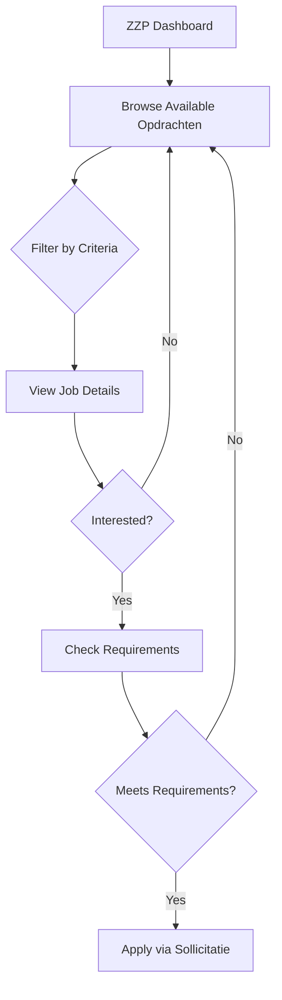

**API Interactions:**
- `GET /api/opdrachten` - Browse available assignments (filtered for ZZP)
- `GET /api/opdrachten/[id]` - View detailed job requirements
- `POST /api/opdrachten/[id]/solliciteer` - Submit application

#### Phase 2: Application & Acceptance
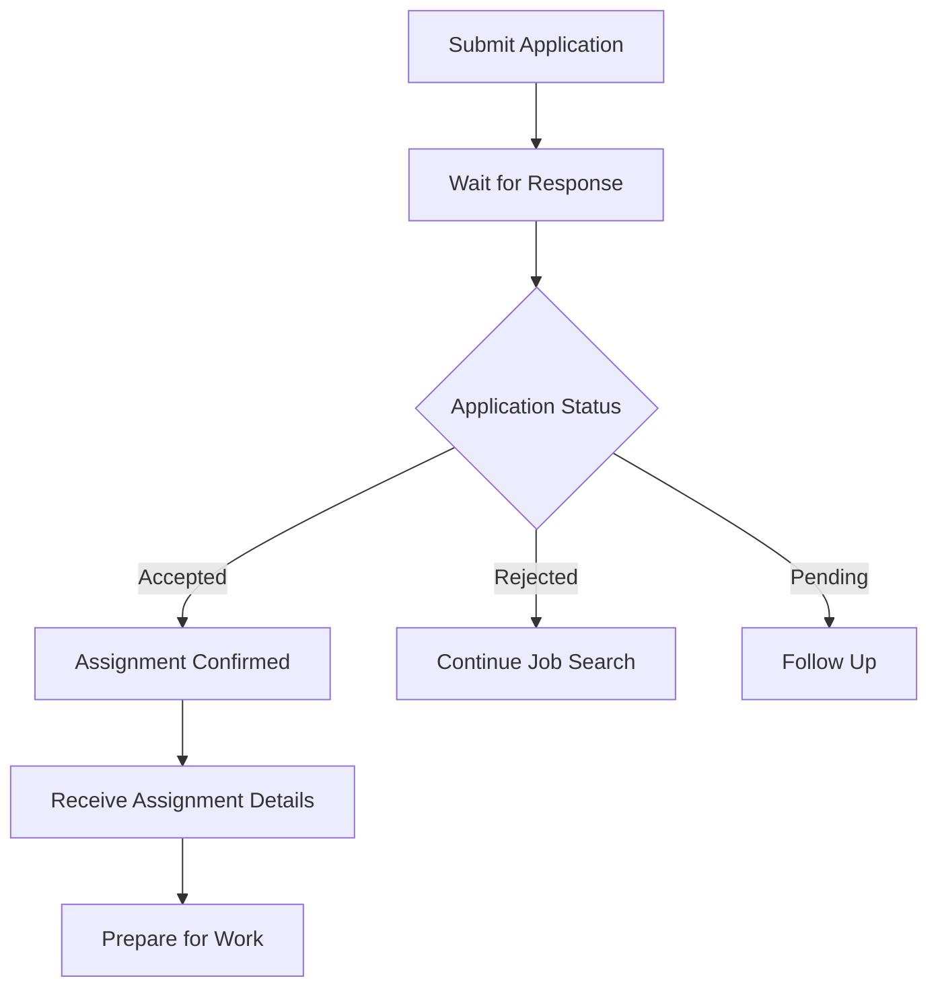

**Real-time Events:**
- `sollicitatie:created` - Application submitted
- `sollicitatie:accepted` - Assignment confirmed
- `sollicitatie:rejected` - Application declined

#### Phase 3: Work Execution
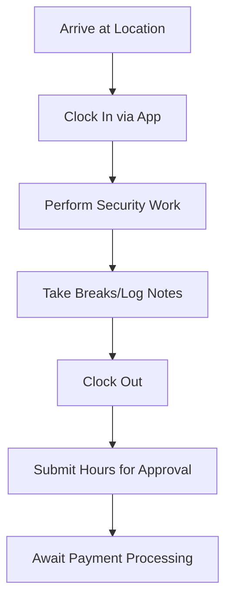

**Hour Tracking API:**
- `POST /api/werkuren` - Clock in/out and log hours
- `PUT /api/werkuren/[id]` - Update work details
- `GET /api/werkuren` - View submitted hours

#### Phase 4: Payment
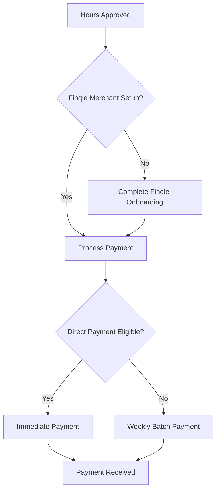

### 2. Bedrijf (Security Company) Workflows

**Bedrijven operate in three distinct modes:**

#### Mode 1: Leverancier (Service Provider)
**Find External Work → Accept → Deploy Team → Manage Delivery**

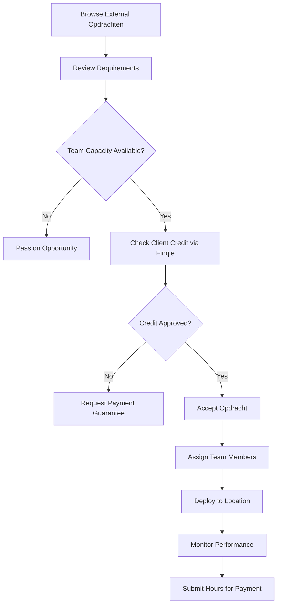

**Key APIs:**
- `GET /api/opdrachten?targetAudience=ALLEEN_BEDRIJVEN` - External opportunities
- `POST /api/opdrachten/[id]/accept` - Accept assignment
- `POST /api/bedrijf/team/assign` - Assign team members

#### Mode 2: Opdrachtgever (Client Creator)
**Create Jobs for Others → Manage Applications → Select Provider**

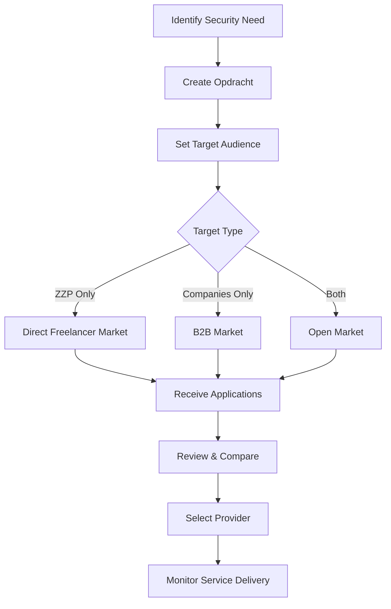

#### Mode 3: Werkgever (Internal Employer)
**Manage Internal Team → Create Internal Assignments → Direct Management**

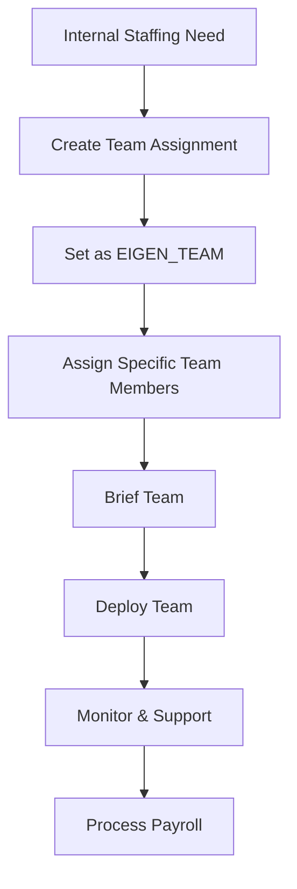

### 3. Opdrachtgever (Client) Workflow

**Need Security → Post Job → Select Provider → Manage Service → Pay**

#### Phase 1: Job Creation
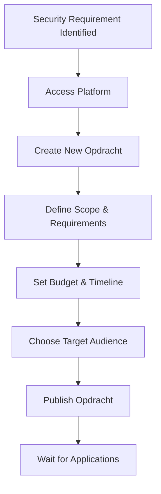

**Key Data Points:**
- Location and duration
- Number of guards needed
- Hourly rate budget
- Special requirements/certifications
- Target audience (ZZP, Companies, or Both)

#### Phase 2: Provider Selection
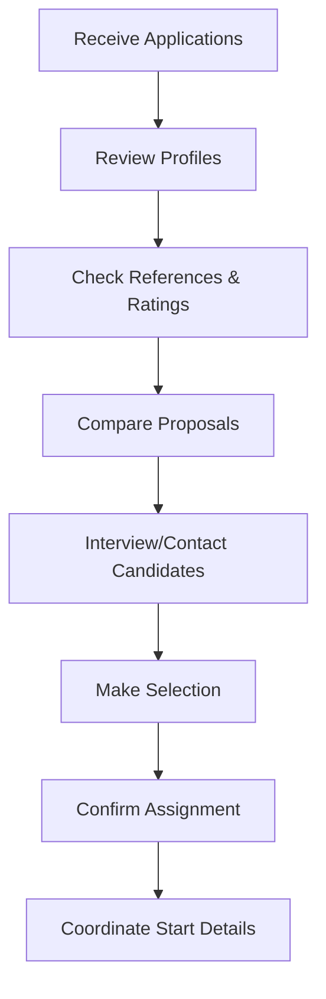

#### Phase 3: Service Management
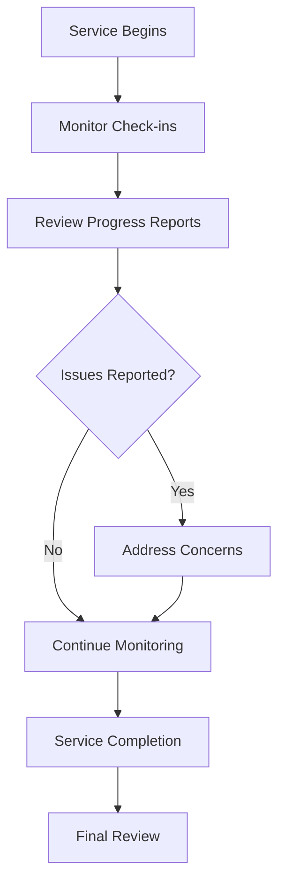

#### Phase 4: Payment Processing
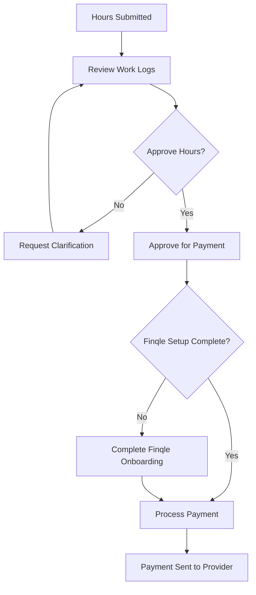

## 🔌 API Architecture & Patterns

### Core API Endpoints

#### Opdracht Management
```typescript
// Main opdracht operations
GET    /api/opdrachten              // Browse with role-based filtering
POST   /api/opdrachten              // Create new opdracht
GET    /api/opdrachten/[id]         // Get detailed opdracht info
PUT    /api/opdrachten/[id]         // Update opdracht
DELETE /api/opdrachten/[id]         // Cancel opdracht

// Application system
POST   /api/opdrachten/[id]/solliciteer  // Apply for opdracht
GET    /api/opdrachten/[id]/sollicitaties // View applications

// Bedrijf-specific
POST   /api/opdrachten/[id]/accept       // Accept opdracht (bedrijf only)

// Payment integration
GET    /api/opdrachten/[id]/finqle       // Payment status
POST   /api/opdrachten/[id]/finqle       // Payment operations
```

#### Role-Specific APIs
```typescript
// ZZP APIs
GET    /api/zzp/dashboard               // ZZP dashboard data
GET    /api/zzp/opdrachten             // Available assignments
POST   /api/zzp/werkuren               // Submit work hours

// Bedrijf APIs
GET    /api/bedrijf/dashboard           // Company dashboard
GET    /api/bedrijf/team                // Team management
POST   /api/bedrijf/team/assign         // Assign team members
GET    /api/bedrijf/opdrachten          // Company assignments

// Opdrachtgever APIs
GET    /api/opdrachtgever/dashboard     // Client dashboard
GET    /api/opdrachtgever/shifts        // Shift management
GET    /api/opdrachtgever/beveiligers   // Security guard pool
```

### API Pattern Consolidation

**Current State:**
- Legacy `/api/jobs/*` endpoints (being phased out)
- New `/api/opdrachten/*` endpoints (preferred)
- Role-specific namespaced endpoints

**Recommended Consolidation:**
1. **Migrate all legacy `/api/jobs/*` to `/api/opdrachten/*`**
2. **Standardize response formats across all endpoints**
3. **Implement consistent error handling patterns**

### Real-time Broadcast Events

The system uses Supabase for real-time updates across different workflow stages:

```typescript
// Opdracht lifecycle events
BroadcastEvent.OPDRACHT_CREATED    // New job posted
BroadcastEvent.OPDRACHT_UPDATED    // Job details changed
BroadcastEvent.OPDRACHT_DELETED    // Job cancelled
BroadcastEvent.STATUS_CHANGED      // Status progression

// Application events
BroadcastEvent.SOLLICITATIE_CREATED   // New application
BroadcastEvent.SOLLICITATIE_ACCEPTED  // Application accepted
BroadcastEvent.SOLLICITATIE_REJECTED  // Application rejected

// Team management events
BroadcastEvent.TEAM_MEMBER_ASSIGNED  // Guard assigned to job
BroadcastEvent.TEAM_MEMBER_REMOVED   // Guard removed from job

// Payment events
BroadcastEvent.PAYMENT_INITIATED     // Payment process started
BroadcastEvent.PAYMENT_COMPLETED     // Payment successful
BroadcastEvent.PAYMENT_FAILED        // Payment failed
```

**Broadcast Channels:**
- `opdracht:{id}` - All updates for specific opdracht
- `bedrijf:{id}:team` - Team updates for company
- `user:{id}:notifications` - User-specific notifications

## 💳 Finqle Payment Integration

### Payment Workflow Architecture

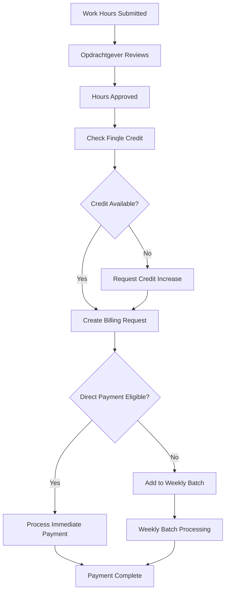

### Finqle Integration Points

1. **Credit Checking:** `/api/opdrachten/[id]/finqle` (POST with action: "check")
2. **Payment Approval:** `/api/opdrachten/[id]/finqle` (POST with action: "approve")
3. **Status Tracking:** `/api/opdrachten/[id]/finqle` (GET)

### Payment States
- **PENDING** - Billing request created
- **APPROVED** - Payment approved by Finqle
- **PAID** - Funds transferred to guard
- **FAILED** - Payment failed (insufficient credit, etc.)

## 📱 Mobile vs Desktop Experience

### Mobile-First Design Considerations

**Bottom Navigation (Mobile):**
- Dashboard 🏠
- Jobs 💼
- Profile 👤
- More ⋯

**Key Mobile Workflows:**
1. **Quick Job Browsing** - Swipe through available jobs
2. **One-Tap Applications** - Streamlined application process
3. **Location-Based Filtering** - GPS integration for nearby jobs
4. **Push Notifications** - Real-time updates on applications

**Desktop Enhanced Features:**
1. **Advanced Filtering** - More sophisticated search options
2. **Bulk Operations** - Manage multiple jobs/applications
3. **Detailed Analytics** - Company performance dashboards
4. **Multi-pane Interface** - Split views for efficiency

### Navigation Differences

**Mobile:** Context-sensitive actions, progressive disclosure
**Desktop:** Persistent navigation, parallel task management

## 🚀 Optimization Opportunities

### 1. UX Improvements

**For ZZP'ers:**
- **Smart Job Matching** - AI-powered job recommendations
- **Quick Apply** - One-click applications for pre-qualified jobs
- **Earnings Tracking** - Better visibility into payment status

**For Bedrijven:**
- **Capacity Planning** - Visual team availability calendar
- **Automated Matching** - System suggests optimal team assignments
- **Performance Dashboards** - Real-time service delivery metrics

**For Opdrachtgevers:**
- **Provider Comparison** - Side-by-side comparison tools
- **Service Monitoring** - Real-time check-in status
- **Payment Automation** - Auto-approve recurring services

### 2. Technical Optimizations

**API Performance:**
- Implement response caching for frequently accessed opdrachten
- Add pagination to large result sets
- Optimize database queries with proper indexing

**Real-time Efficiency:**
- Batch broadcast events to reduce WebSocket overhead
- Implement selective subscriptions based on user interests
- Add offline support for mobile apps

**Payment Processing:**
- Pre-validate Finqle credit limits during opdracht creation
- Implement payment retry mechanisms for failed transactions
- Add batch payment scheduling for regular clients

### 3. Business Logic Enhancements

**Multi-Mode Company Operations:**
- Simplified role switching interface for companies
- Consolidated dashboard showing all company activities
- Clear separation of different business activities

**Assignment Optimization:**
- **Auto-Assignment** - System suggests optimal guard-job matches
- **Skill Matching** - Match guard certifications with job requirements
- **Geographic Optimization** - Minimize travel time for guards

## 📊 Key Performance Indicators

### System Health Metrics
- **Opdracht Fill Rate** - % of jobs successfully filled
- **Time to Fill** - Average time from posting to assignment
- **Application Success Rate** - % of applications that result in assignments
- **Payment Processing Time** - Time from hour submission to payment

### User Experience Metrics
- **User Satisfaction Scores** - By role and workflow stage
- **Feature Adoption Rates** - Usage of new features
- **Error Rates** - Failed API calls and user errors
- **Mobile vs Desktop Usage** - Platform preference analysis

## 🔮 Future Enhancements

### Short-term (1-3 months)
1. **Mobile App Optimization** - Improve core workflows for mobile users
2. **API Consolidation** - Phase out legacy endpoints
3. **Payment UX** - Streamline Finqle onboarding and status visibility

### Medium-term (3-6 months)
1. **AI-Powered Matching** - Intelligent job and guard matching
2. **Advanced Analytics** - Predictive insights for all user types
3. **Multi-language Support** - Expand platform accessibility

### Long-term (6+ months)
1. **Marketplace Expansion** - Additional security service types
2. **Integration Ecosystem** - Third-party tools and services
3. **Advanced Automation** - Reduce manual workflow steps

---

*This analysis provides a comprehensive view of SecuryFlex's job workflow system, identifying current capabilities, optimization opportunities, and future enhancement possibilities.*