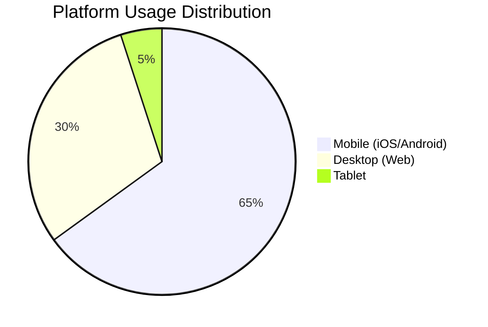
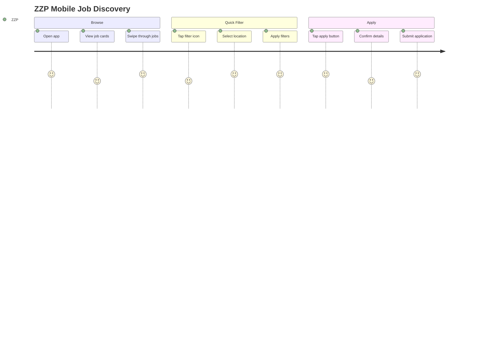
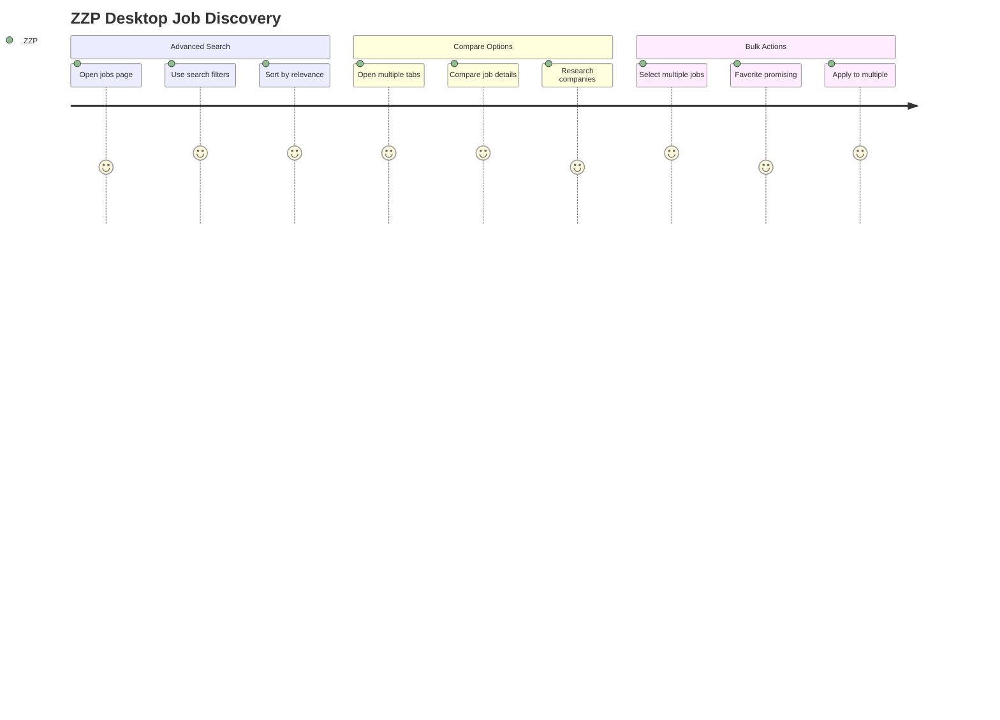

# Mobile vs Desktop Workflow Analysis - SecuryFlex Platform

## 🎯 Executive Summary

SecuryFlex operates across multiple platforms with **distinct user experiences** optimized for different contexts. This analysis examines workflow differences between mobile and desktop platforms, identifies opportunities for improvement, and provides recommendations for creating a more unified yet platform-appropriate experience.

## 📱 Platform Usage Patterns

### User Behavior Analysis



### Context-Based Usage Patterns

```typescript
interface PlatformUsageContext {
  mobile: {
    primaryContexts: ["On-the-go job browsing", "Real-time check-ins", "Quick communications", "Emergency situations"];
    peakHours: ["Morning commute: 7-9 AM", "Lunch break: 12-1 PM", "Evening: 6-8 PM"];
    sessionDuration: "3-5 minutes average";
    connectionType: "Often on cellular networks";
  };

  desktop: {
    primaryContexts: ["Detailed planning", "Administrative tasks", "Bulk operations", "Complex data entry"];
    peakHours: ["Business hours: 9 AM - 5 PM"];
    sessionDuration: "15-25 minutes average";
    connectionType: "Stable WiFi/Ethernet";
  };

  tablet: {
    primaryContexts: ["Field supervision", "Presentations", "Document review"];
    peakHours: ["Business hours with mobile flexibility"];
    sessionDuration: "8-12 minutes average";
    connectionType: "WiFi primary, cellular secondary";
  };
}
```

## 🗂️ Navigation Architecture Comparison

### Mobile Navigation Strategy

```typescript
interface MobileNavigationDesign {
  bottomNavigation: {
    structure: "4-tab bottom navigation";
    items: [
      { icon: "home", label: "Dashboard", features: ["Overview", "Quick actions"] },
      { icon: "briefcase", label: "Jobs", features: ["Browse", "Applications", "Active"] },
      { icon: "user", label: "Profile", features: ["Settings", "Verzekeringen", "Stats"] },
      { icon: "more", label: "More", features: ["Hours", "Payments", "Help"] }
    ];
    advantages: ["Thumb-friendly", "Always visible", "Gesture support"];
    limitations: ["Limited top-level items", "Feature discovery challenges"];
  };

  contextualNavigation: {
    swipeGestures: "Horizontal swipe between related screens";
    backButton: "Hardware/software back button support";
    floatingActionButton: "Primary action always accessible";
    pullToRefresh: "Intuitive data refresh mechanism";
  };

  emergencyAccess: {
    urgentSecurityButton: "Prominent red emergency button";
    quickActions: "Swipe shortcuts for common tasks";
    voiceCommands: "Voice-activated emergency procedures";
  };
}
```

### Desktop Navigation Strategy

```typescript
interface DesktopNavigationDesign {
  sidebarNavigation: {
    structure: "Expandable sidebar with hierarchical menu";
    sections: [
      { label: "Dashboard", subsections: ["Overview", "Analytics"] },
      { label: "Jobs & Opdrachten", subsections: ["Browse", "Create", "Manage"] },
      { label: "Team", subsections: ["Members", "Planning", "Performance"] },
      { label: "Payments", subsections: ["Overview", "History", "Settings"] },
      { label: "Verzekeringen", subsections: ["Catalog", "Applications", "Benefits"] }
    ];
    advantages: ["Information hierarchy", "Quick access", "Keyboard shortcuts"];
    limitations: ["Screen real estate", "Cognitive load"];
  };

  breadcrumbNavigation: {
    structure: "Hierarchical breadcrumb trail";
    purpose: "Clear navigation context";
    features: ["Click to navigate", "Current location highlight"];
  };

  tabInterface: {
    multiTabSupport: "Multiple open tabs/views";
    tabPersistence: "Maintain state across tabs";
    keyboardShortcuts: "Ctrl+Tab navigation";
  };
}
```

### Navigation Comparison Matrix

| Feature | Mobile | Desktop | Tablet |
|---------|---------|---------|---------|
| Primary Navigation | Bottom tabs | Sidebar menu | Adaptive hybrid |
| Secondary Navigation | Drill-down | Breadcrumbs | Context menu |
| Quick Actions | FAB + Swipe | Keyboard shortcuts | Touch + keyboard |
| Back Navigation | Hardware button | Breadcrumb/history | Gesture + button |
| Search | Full-screen overlay | Persistent search bar | Adaptive |
| Filters | Modal/drawer | Sidebar panel | Popover |

## 🔄 User Workflow Comparisons

### 1. ZZP Job Discovery & Application

#### Mobile Workflow (Optimized for Speed)


**Mobile Advantages:**
- **Speed**: 3-tap application process
- **Location awareness**: GPS-based job filtering
- **Push notifications**: Instant job alerts
- **Touch-optimized**: Large buttons, swipe gestures

**Mobile Limitations:**
- **Limited information**: Condensed job details
- **No bulk operations**: One job at a time
- **Small screen**: Difficulty comparing multiple jobs
- **Network dependency**: Requires good cellular connection

#### Desktop Workflow (Optimized for Detail)


**Desktop Advantages:**
- **Comprehensive view**: Full job details visible
- **Multi-tasking**: Compare jobs side-by-side
- **Advanced filtering**: Complex search criteria
- **Bulk operations**: Apply to multiple jobs

**Desktop Limitations:**
- **Not portable**: Requires computer access
- **No location context**: Manual location entry
- **Slower for quick tasks**: More clicks required
- **No real-time location**: No GPS integration

### 2. Shift Creation (Opdrachtgever)

#### Mobile Shift Creation (Quick & Emergency)
```typescript
interface MobileShiftCreation {
  emergencyFlow: {
    steps: 2;
    duration: "60 seconds";
    fields: ["location", "urgency", "guards_needed", "contact"];
    features: ["GPS location", "Voice input", "Photo attachment"];
  };

  quickFlow: {
    steps: 3;
    duration: "3 minutes";
    fields: ["basic_info", "timing", "budget"];
    features: ["Smart defaults", "Recent locations", "Auto-save"];
  };

  limitations: {
    complexity: "Limited to simple shifts";
    detailLevel: "Basic requirements only";
    multitasking: "Single-focus interaction";
  };
}
```

#### Desktop Shift Creation (Comprehensive)
```typescript
interface DesktopShiftCreation {
  comprehensiveFlow: {
    steps: 5;
    duration: "8-12 minutes";
    fields: ["complete_job_spec", "detailed_requirements", "advanced_settings"];
    features: ["Multi-step wizard", "Document upload", "Team assignment"];
  };

  bulkOperations: {
    features: ["Duplicate shifts", "Template management", "Batch creation"];
    efficiency: "High for recurring needs";
  };

  advantages: {
    detail: "Complete job specification";
    complexity: "Handle complex requirements";
    planning: "Advanced scheduling tools";
  };
}
```

### 3. Real-time Monitoring Differences

#### Mobile Real-time Experience
```typescript
interface MobileRealTimeFeatures {
  locationTracking: {
    gpsCheckin: "Automatic location verification";
    breadcrumbs: "Location history during shift";
    geofencing: "Alerts when leaving assigned area";
  };

  instantCommunication: {
    pushNotifications: "Immediate alerts";
    quickMessages: "Pre-defined message templates";
    photoReports: "Camera integration for incident reports";
    voiceNotes: "Audio messages for complex situations";
  };

  emergencyFeatures: {
    panicButton: "One-touch emergency alert";
    emergencyContacts: "Quick dial emergency numbers";
    locationSharing: "Share location with supervisors";
  };
}
```

#### Desktop Real-time Experience
```typescript
interface DesktopRealTimeFeatures {
  dashboardView: {
    multipleShifts: "Monitor multiple active shifts simultaneously";
    detailedTimeline: "Comprehensive timeline view";
    analyticsOverlay: "Real-time performance metrics";
  };

  communicationHub: {
    centralizedMessages: "All communications in one view";
    fileSharing: "Document and media sharing";
    videoConferencing: "Built-in video calls for complex issues";
  };

  coordinationTools: {
    teamOverview: "See all team members status";
    resourceAllocation: "Manage resources across shifts";
    incidentManagement: "Comprehensive incident tracking";
  };
}
```

## 📊 Feature Parity Analysis

### Cross-Platform Feature Matrix

| Feature Category | Mobile | Desktop | Notes |
|------------------|---------|----------|-------|
| **Job Browsing** | ★★★★☆ | ★★★★★ | Desktop has advanced filtering |
| **Job Application** | ★★★★★ | ★★★★☆ | Mobile optimized for speed |
| **Shift Creation** | ★★★☆☆ | ★★★★★ | Desktop better for complex shifts |
| **Real-time Monitoring** | ★★★★★ | ★★★★☆ | Mobile has location advantages |
| **Communication** | ★★★★★ | ★★★☆☆ | Mobile has push notifications |
| **Payment Management** | ★★★☆☆ | ★★★★★ | Desktop better for bulk operations |
| **Analytics** | ★★☆☆☆ | ★★★★★ | Desktop has comprehensive views |
| **Emergency Features** | ★★★★★ | ★★☆☆☆ | Mobile optimized for emergencies |

### Platform-Specific Limitations

#### Mobile Limitations
```typescript
interface MobileLimitations {
  screenSize: {
    challenges: ["Limited information density", "Difficult data comparison", "Small touch targets"];
    solutions: ["Progressive disclosure", "Card-based design", "Large touch areas"];
  };

  inputMethods: {
    challenges: ["Typing on virtual keyboard", "Form complexity", "File uploads"];
    solutions: ["Voice input", "Smart defaults", "Camera integration"];
  };

  connectivity: {
    challenges: ["Cellular data limits", "Intermittent connection", "Slower speeds"];
    solutions: ["Offline capability", "Progressive sync", "Data optimization"];
  };

  batteryLife: {
    challenges: ["Location services drain", "Real-time updates", "Background processing"];
    solutions: ["Efficient GPS usage", "Selective sync", "Power management"];
  };
}
```

#### Desktop Limitations
```typescript
interface DesktopLimitations {
  portability: {
    challenges: ["Fixed location usage", "No GPS", "Can't be used on-site"];
    solutions: ["Mobile companion app", "Remote access", "Offline reports"];
  };

  contextAwareness: {
    challenges: ["No location data", "No camera", "No sensors"];
    solutions: ["Manual location entry", "Photo upload", "External integrations"];
  };

  realTimeAlerts: {
    challenges: ["Browser notifications limited", "Not always active", "No push when closed"];
    solutions: ["Email notifications", "SMS alerts", "Desktop app"];
  };
}
```

## 🔄 Workflow Adaptation Strategies

### Responsive Design Principles

#### Adaptive Layout Strategy
```typescript
interface ResponsiveLayoutStrategy {
  breakpoints: {
    mobile: "320px - 767px";
    tablet: "768px - 1023px";
    desktop: "1024px+";
  };

  layoutAdaptation: {
    navigation: {
      mobile: "Bottom tabs + hamburger menu";
      tablet: "Side drawer + bottom tabs";
      desktop: "Persistent sidebar + breadcrumbs";
    };

    contentLayout: {
      mobile: "Single column, vertical stack";
      tablet: "Flexible grid, 2-3 columns";
      desktop: "Multi-column layout, dashboard style";
    };

    interactionPatterns: {
      mobile: "Touch-first, gesture-based";
      tablet: "Hybrid touch/keyboard";
      desktop: "Keyboard/mouse optimized";
    };
  };
}
```

### Progressive Enhancement Strategy

```typescript
interface ProgressiveEnhancement {
  coreFeatures: {
    mobile: ["Job browsing", "Applications", "Basic communication", "Check-in/out"];
    enhanced: ["Advanced search", "Bulk operations", "Analytics", "Complex forms"];
  };

  capabilityDetection: {
    gps: "Enable location features when available";
    camera: "Enable photo features when available";
    push: "Enable notifications when supported";
    offline: "Enable offline features when supported";
  };

  gracefulDegradation: {
    noGPS: "Fall back to manual location entry";
    noCamera: "Fall back to file upload";
    noPush: "Fall back to in-app notifications";
    offline: "Show cached data with sync indicators";
  };
}
```

## 📈 Performance Optimization by Platform

### Mobile Performance Priorities
```typescript
interface MobilePerformanceOptimization {
  loadingSpeed: {
    criticalPath: "Optimize critical rendering path for mobile";
    bundleSize: "Minimize JavaScript bundle size";
    imageOptimization: "Serve appropriate image sizes";
    caching: "Aggressive caching for repeat visits";
  };

  batteryEfficiency: {
    gpsUsage: "Optimize GPS polling frequency";
    backgroundSync: "Minimize background processing";
    networkUsage: "Efficient data synchronization";
    animations: "Hardware-accelerated animations";
  };

  memoryManagement: {
    componentCleanup: "Proper component unmounting";
    imageMemory: "Efficient image loading/unloading";
    dataStructures: "Memory-efficient data handling";
  };
}
```

### Desktop Performance Priorities
```typescript
interface DesktopPerformanceOptimization {
  renderingSpeed: {
    largeDatatables: "Virtualized rendering for large datasets";
    complexDashboards: "Efficient dashboard rendering";
    multipleViews: "Optimized multi-tab performance";
  };

  dataProcessing: {
    bulkOperations: "Efficient bulk data processing";
    realTimeUpdates: "Optimized WebSocket connections";
    caching: "Intelligent client-side caching";
  };

  userExperience: {
    keyboardShortcuts: "Comprehensive keyboard navigation";
    multitasking: "Support for multiple workflows";
    contextSwitching: "Fast context switching between tasks";
  };
}
```

## 🎯 Platform-Specific Optimization Opportunities

### Mobile Enhancement Opportunities

#### 1. Location-Aware Features
```typescript
interface LocationAwareFeatures {
  smartJobDiscovery: {
    proximitySearch: "Jobs within commuting distance";
    routeOptimization: "Suggest jobs along user's route";
    travelTimeEstimation: "Real-time travel time calculations";
  };

  contextualNotifications: {
    arrivalReminders: "Remind user when approaching job location";
    trafficAlerts: "Alert about traffic affecting arrival time";
    weatherUpdates: "Weather conditions affecting outdoor security";
  };

  emergencyIntegration: {
    quickEmergencyAccess: "Emergency services integration";
    locationSharing: "Share precise location with emergency contacts";
    safetyCheckins: "Automated safety check-in systems";
  };
}
```

#### 2. Voice and Camera Integration
```typescript
interface MultimodalMobileFeatures {
  voiceCapabilities: {
    voiceCommands: "Voice-activated job search and applications";
    dictatedReports: "Voice-to-text incident reporting";
    handsFreeOperation: "Voice navigation during active shifts";
  };

  cameraIntegration: {
    documentScanning: "Scan and submit required documents";
    incidentPhotography: "Photo evidence for security incidents";
    qrCodeCheckin: "QR code-based location verification";
  };

  gestureControls: {
    swipeNavigation: "Gesture-based navigation between screens";
    quickActions: "Swipe gestures for common actions";
    emergencyGestures: "Special gestures for emergency situations";
  };
}
```

### Desktop Enhancement Opportunities

#### 1. Power User Features
```typescript
interface DesktopPowerFeatures {
  keyboardShortcuts: {
    globalShortcuts: "System-wide keyboard shortcuts";
    contextualShortcuts: "Context-aware shortcut suggestions";
    customShortcuts: "User-customizable keyboard bindings";
  };

  bulkOperations: {
    multiSelect: "Select and operate on multiple items";
    batchProcessing: "Process multiple jobs/applications at once";
    templateManagement: "Create and manage job templates";
  };

  advancedWorkflows: {
    workspaceManagement: "Multiple workspace support";
    taskAutomation: "Automated workflow triggers";
    integrationSupport: "Deep integration with business tools";
  };
}
```

#### 2. Analytics and Reporting
```typescript
interface DesktopAnalyticsFeatures {
  comprehensiveDashboards: {
    multiMetricViews: "Multiple KPIs in single view";
    drillDownCapability: "Deep dive into specific metrics";
    customDashboards: "User-customizable dashboard layouts";
  };

  reportGeneration: {
    scheduledReports: "Automated report generation and delivery";
    exportCapabilities: "Export data in multiple formats";
    reportTemplates: "Pre-built report templates";
  };

  dataVisualization: {
    interactiveCharts: "Interactive data visualizations";
    trendAnalysis: "Historical trend analysis tools";
    comparativeAnalysis: "Compare performance across periods";
  };
}
```

## 🔄 Unified Experience Strategy

### Cross-Platform Consistency

#### 1. Shared Design Language
```typescript
interface UnifiedDesignSystem {
  brandConsistency: {
    colorPalette: "Consistent colors across all platforms";
    typography: "Unified font choices and hierarchy";
    iconography: "Consistent icon style and usage";
    spacing: "Unified spacing and layout principles";
  };

  componentLibrary: {
    sharedComponents: "Common UI components across platforms";
    platformAdaptations: "Platform-specific component variants";
    responsiveBehavior: "Components that adapt to screen size";
  };

  interactionPatterns: {
    consistentBehavior: "Similar features work similarly";
    platformConventions: "Respect platform-specific conventions";
    learningTransfer: "Skills transfer between platforms";
  };
}
```

#### 2. Feature Synchronization
```typescript
interface FeatureSynchronization {
  dataSync: {
    realTimeSync: "Changes sync immediately across devices";
    conflictResolution: "Handle conflicts when editing on multiple devices";
    offlineCapability: "Work offline and sync when reconnected";
  };

  stateManagement: {
    sessionContinuity: "Continue tasks across devices";
    preferenceSync: "User preferences sync across platforms";
    contextPreservation: "Preserve context when switching platforms";
  };

  crossPlatformWorkflows: {
    startMobile: "Start task on mobile, complete on desktop";
    handoffSupport: "Seamless handoff between devices";
    progressTracking: "Track progress across all platforms";
  };
}
```

## 📊 Recommendations Summary

### Immediate Improvements (1-2 months)

#### Mobile Platform
1. **Enhanced Touch Targets**: Increase button sizes for better accessibility
2. **Gesture Navigation**: Implement swipe gestures for common actions
3. **Offline Capability**: Basic offline browsing and form submission
4. **Push Notification Optimization**: Smarter, context-aware notifications

#### Desktop Platform
1. **Keyboard Shortcuts**: Comprehensive keyboard navigation
2. **Bulk Operations**: Multi-select and batch processing capabilities
3. **Advanced Filtering**: Enhanced search and filter capabilities
4. **Multi-tab Support**: Better support for multiple concurrent tasks

### Medium-term Enhancements (3-6 months)

#### Cross-Platform
1. **Unified Design System**: Consistent design language across platforms
2. **Progressive Enhancement**: Feature enhancement based on device capabilities
3. **Context Switching**: Seamless task continuation across devices
4. **Performance Optimization**: Platform-specific performance improvements

### Long-term Vision (6+ months)

#### Advanced Integration
1. **AI-Powered Adaptation**: AI that learns user preferences per platform
2. **Predictive Features**: Anticipate user needs based on platform and context
3. **Seamless Handoff**: Start task on one device, continue on another
4. **Unified Analytics**: Cross-platform user behavior analysis

---

*This comprehensive analysis provides the foundation for creating a truly unified yet platform-optimized experience that leverages the strengths of each platform while maintaining consistency and ease of use across the SecuryFlex ecosystem.*