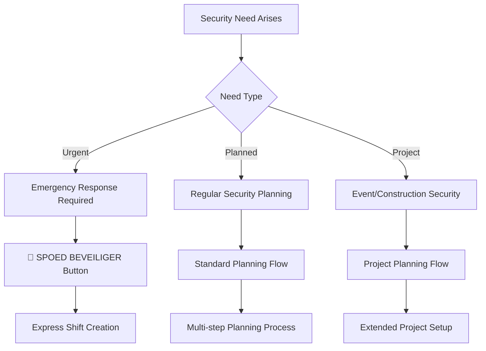
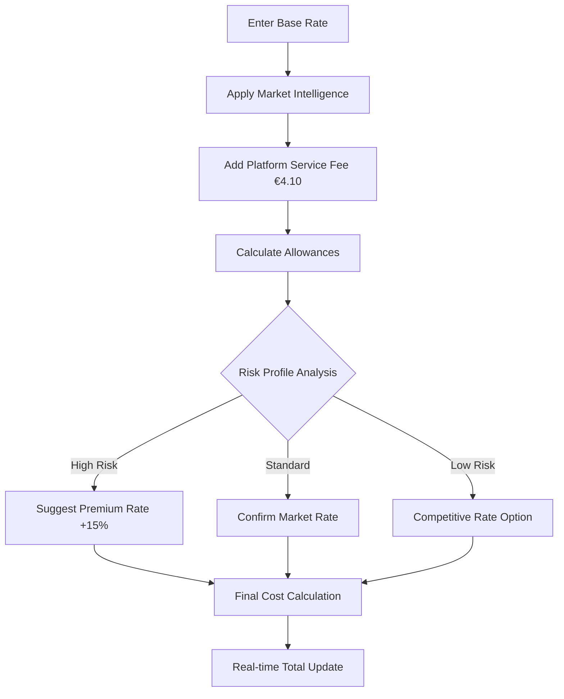
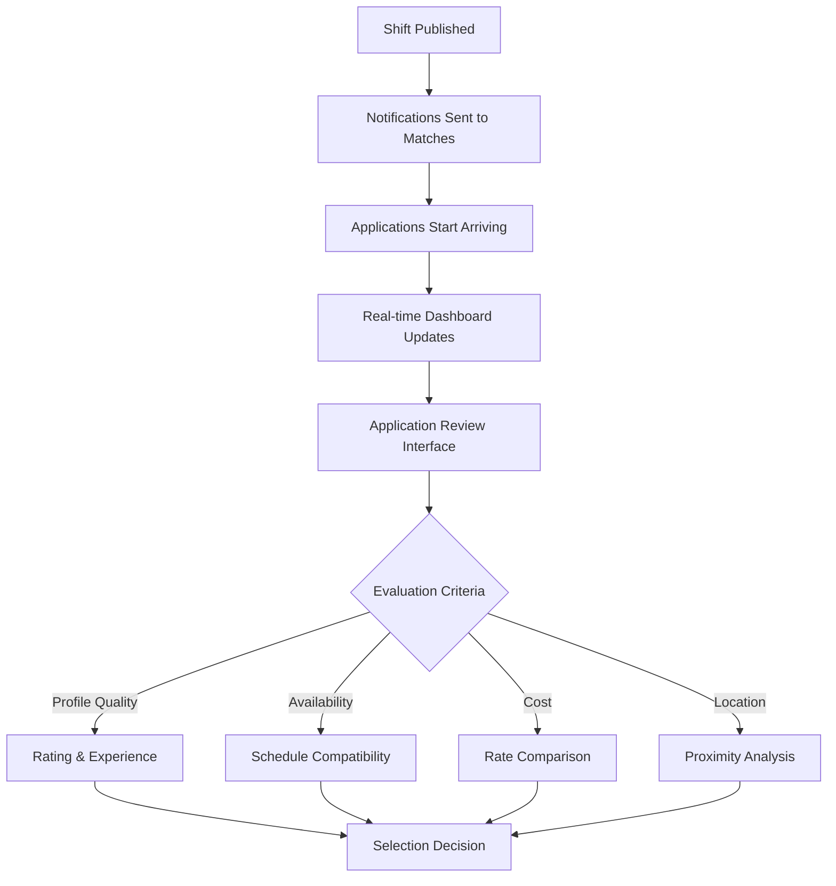
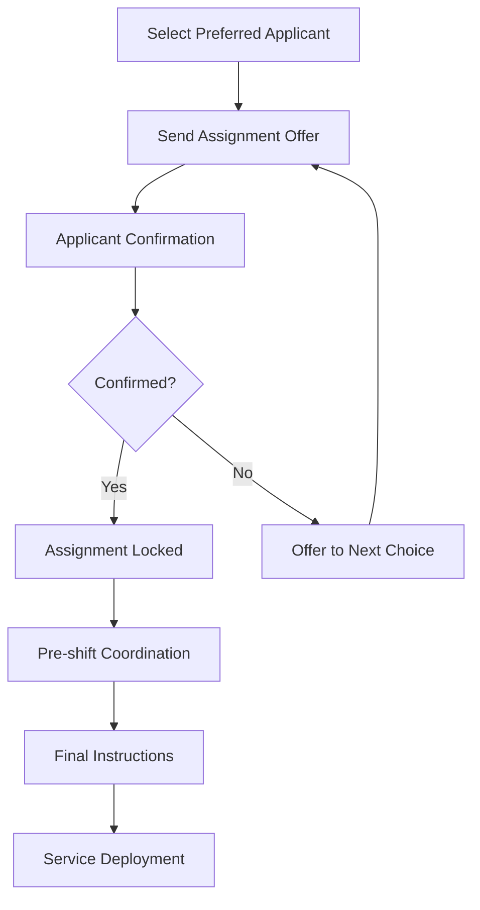
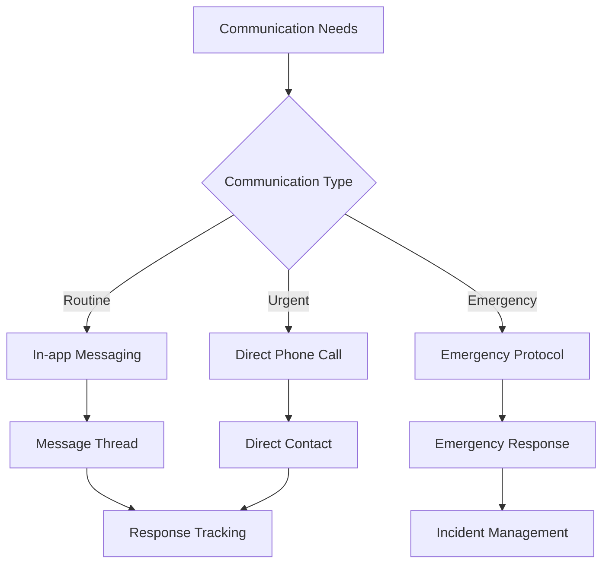
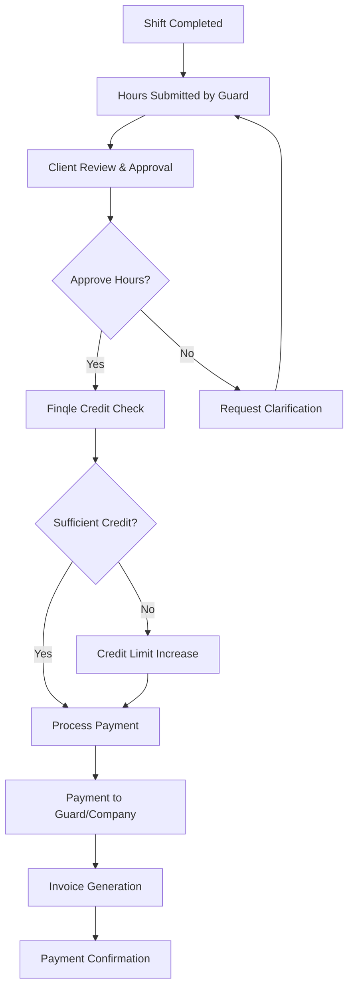

# Opdrachtgever (Client) Workflow - Complete Security Service Management

## 🏢 Overview

Opdrachtgevers represent organizations and individuals who require professional security services. They are the demand side of the SecuryFlex marketplace, driving the platform's economy by creating opportunities for both ZZP'ers and Bedrijven.

The Opdrachtgever workflow is designed to **simplify complex security procurement** while ensuring **transparent pricing**, **quality assurance**, and **reliable service delivery**.

## 🎯 Core Value Proposition

- **Simplified Procurement**: No complex RFP processes or vendor management
- **Transparent Pricing**: Real-time cost calculations with market-based recommendations
- **Quality Assurance**: Verified security professionals with ratings and compliance tracking
- **Flexible Payment**: Finqle integration for immediate or scheduled payments
- **Real-time Monitoring**: Live tracking of security services and incidents

## 🔄 Complete Opdrachtgever Journey

### Phase 1: Security Need Identification & Assessment

#### 1.1 Need Recognition Triggers


**Common Triggers:**
- **Emergency Situations**: Break-ins, threats, immediate security needs
- **Planned Events**: Conferences, parties, VIP visits
- **Ongoing Services**: Daily/weekly security for buildings, retail
- **Project-Based**: Construction sites, temporary installations
- **Seasonal Needs**: Holiday periods, summer festivals

#### 1.2 Platform Entry Points

**Desktop Navigation:**
- Sidebar → "Shifts" → "Nieuwe Shift"
- Dashboard → "Plan Shift" quick action
- Emergency button (prominent red button)

**Mobile Navigation:**
- Bottom tab → "More" → "Plan Shift"
- Dashboard widget → "Quick Actions"
- Emergency floating action button

### Phase 2: Comprehensive Shift Creation Process

#### 2.1 Five-Step Planning Workflow

**Step 1: Basic Information (Foundation)**
```typescript
interface BasicInformation {
  securityType: "Objectbeveiliging" | "Evenementbeveiliging" | "Mobiele surveillance" | "Horecaportier";
  locationDetails: {
    name: string;           // "Terminal 2, Gate B"
    address: string;        // "Schiphol Airport"
    postalCode: string;     // "1118 AA Schiphol"
  };
  riskProfile: "Laag risico" | "Gemiddeld risico" | "Hoog risico" | "Zeer hoog risico";
  instructions: string;     // Detailed briefing for security guards
  onSiteContact: {
    name: string;
    phone: string;
  };
}
```

**Step 2: Schedule Planning (Timing)**
```typescript
interface SchedulePlanning {
  shiftType: "Eenmalige shift" | "Terugkerende shift" | "Project";
  timing: {
    date: Date;
    startTime: string;      // "08:00"
    endTime: string;        // "18:00"
    totalHours: number;     // Auto-calculated
  };
  staffing: {
    guardsNeeded: number;
    teamLeaderRequired: boolean;
    pauseRule: "Standaard CAO pauze" | "Geen pauze" | "Custom pauze";
  };
  recurrence?: {
    weekDays: string[];     // ["monday", "tuesday"]
    repeatUntil: Date;
  };
}
```

**Step 3: Requirements Definition (Quality)**
```typescript
interface RequirementsDefinition {
  mandatoryDocuments: [
    "Geldige beveiligingspas",    // Always required
    "VOG (niet ouder dan 12 mnd)", // Always required
    "VCA Basis"?,
    "VCA VOL"?,
    "EHBO certificaat"?,
    "BHV certificaat"?
  ];
  specializations: [
    "Evenementbeveiliging"?,
    "Horecaportier"?,
    "Winkelsurveillance"?,
    "Persoonsbeveiliging"?,
    "Mobiele surveillance (rijbewijs)"?
  ];
  languageRequirements: {
    dutch: "Native" | "C2" | "C1" | "B2";
    english: "B1+" | "B2" | "C1" | "C2";
  };
  experience: "Geen ervaring vereist" | "Minimaal 1 jaar" | "Minimaal 2 jaar" | "Minimaal 3 jaar";
  physicalRequirements: [
    "Langdurig staan (8+ uur)"?,
    "Tillen (25+ kg)"?,
    "Nachtdienst geschikt"?
  ];
}
```

**Step 4: Budget & Pricing (Economics)**
```typescript
interface BudgetConfiguration {
  pricingStrategy: "Marktconform tarief" | "Eigen tarief" | "Bieden";
  hourlyRate: number;           // €20.50
  allowances: {
    ortAllowance: boolean;      // Overtime compensation (+€2.50/hour)
    travelAllowance: boolean;   // €0.21/km up to maxDistance
    travelRate: number;
    maxDistance: number;        // 50km
    mealAllowance: boolean;     // €15.00 for 8+ hour shifts
    mealAmount: number;
  };
  costCalculation: {
    baseRate: number;           // Guard hourly rate
    serviceFee: number;         // €4.10/hour platform fee
    allowanceTotal: number;     // Sum of all allowances
    totalPerHour: number;       // All-in hourly cost
    estimatedTotal: number;     // Total shift cost
  };
  budgetControls: {
    maxBudget: number;
    budgetAlert: boolean;       // Warn at 80%
  };
}
```

**Step 5: Review & Confirmation (Validation)**
```typescript
interface ShiftReview {
  shiftOverview: {
    location: string;
    timing: string;
    duration: number;
    staffingRequirements: string;
    securityType: string;
    riskLevel: string;
  };
  requirements: {
    documents: string[];
    languages: LanguageRequirements;
    experience: string;
    specializations: string[];
  };
  costBreakdown: {
    hourlyRate: number;
    serviceFee: number;
    allowances: number;
    totalPerHour: number;
    totalCost: number;
  };
  marketInsights: {
    estimatedMatches: number;   // 23 security guards match criteria
    expectedResponseTime: string; // "First responses within 30 minutes"
    competitiveAnalysis: string;
  };
}
```

#### 2.2 Smart Features & Automation

**Intelligent Cost Calculator:**


**Market Rate Intelligence:**
```typescript
interface MarketIntelligence {
  recommendedRange: {
    min: number;        // €19.00
    max: number;        // €22.00
    optimal: number;    // €20.50
  };
  competitiveFactors: {
    locationPremium: number;     // Airport +€2/hour
    timePremium: number;         // Night shift +€1.50/hour
    specialtyPremium: number;    // VIP protection +€5/hour
    urgencyPremium: number;      // Same-day +€3/hour
  };
  demandIndicators: {
    availableGuards: number;     // 23 matches
    competingShifts: number;     // 5 similar shifts today
    recommendedUrgency: "low" | "medium" | "high";
  };
}
```

### Phase 3: Application Management & Selection

#### 3.1 Application Reception & Review

**Real-time Application Dashboard:**


**Application Review API:**
```typescript
// View applications for created shift
GET /api/opdrachtgever/shifts/{id}/applications
{
  success: true,
  data: {
    applications: [{
      id: string,
      applicantType: "ZZP" | "BEDRIJF",
      applicant: {
        name: string,
        rating: number,           // 4.8/5.0
        experience: number,       // Years in security
        specializations: string[],
        location: string,
        distanceKm: number,
        profileCompleteness: number, // 95%
        finqleVerified: boolean,
        lastActiveDate: Date
      },
      proposal: {
        hourlyRate: number,
        availability: "immediate" | "confirmed" | "tentative",
        coverLetter: string,
        teamSize?: number,        // For Bedrijf applications
        teamMembers?: TeamMember[]
      },
      submissionTime: Date,
      status: "PENDING" | "UNDER_REVIEW" | "ACCEPTED" | "REJECTED"
    }],
    statistics: {
      totalApplications: number,
      averageRating: number,
      priceRange: { min: number, max: number },
      responseTime: string      // "Average 15 minutes"
    }
  }
}
```

#### 3.2 Selection & Assignment Process

**Multi-Criteria Decision Support:**
```typescript
interface ApplicationScoring {
  qualityScore: {
    rating: number;             // 30% weight
    experience: number;         // 25% weight
    specializations: number;    // 20% weight
    compliance: number;         // 15% weight
    availability: number;       // 10% weight
  };
  costScore: {
    hourlyRate: number;
    totalCost: number;
    valueForMoney: number;      // Quality/Cost ratio
  };
  logisticsScore: {
    distance: number;
    responseTime: number;
    reliability: number;        // Historical performance
  };
  overallScore: number;         // Weighted composite
  recommendation: "highly_recommended" | "recommended" | "consider" | "not_recommended";
}
```

**Assignment Confirmation Flow:**


### Phase 4: Service Monitoring & Management

#### 4.1 Real-time Service Tracking

**Live Dashboard Features:**
```typescript
interface LiveShiftMonitoring {
  currentStatus: "SCHEDULED" | "STARTING_SOON" | "ACTIVE" | "COMPLETED" | "INCIDENT";
  guards: [{
    name: string,
    status: "CHECKED_IN" | "ON_DUTY" | "BREAK" | "CHECKED_OUT",
    location: GeolocationData,
    lastUpdate: Date,
    notes: string[]
  }];
  timeline: [{
    timestamp: Date,
    event: "CHECK_IN" | "INCIDENT_REPORTED" | "BREAK_START" | "BREAK_END" | "CHECK_OUT",
    details: string,
    location?: GeolocationData
  }];
  incidents: [{
    id: string,
    timestamp: Date,
    severity: "low" | "medium" | "high" | "critical",
    description: string,
    photos?: string[],
    status: "reported" | "investigating" | "resolved",
    reportedBy: string
  }];
  communication: {
    directMessaging: boolean,
    emergencyContact: string,
    lastContact: Date
  };
}
```

**Real-time Broadcast Integration:**
```typescript
// Live updates via WebSocket
useOpdrachtgeverShiftBroadcast(shiftId, (payload) => {
  switch (payload.event) {
    case BroadcastEvent.GUARD_CHECKED_IN:
      updateGuardStatus(payload.guardId, "ON_DUTY");
      showNotification("Security guard has arrived and checked in");
      break;

    case BroadcastEvent.INCIDENT_REPORTED:
      showUrgentNotification("Security incident reported", payload.incident);
      refreshIncidentLog();
      break;

    case BroadcastEvent.SHIFT_COMPLETED:
      finalizeShift(payload.shiftData);
      showNotification("Shift completed successfully");
      break;
  }
});
```

#### 4.2 Communication & Coordination

**Multi-Channel Communication:**


### Phase 5: Payment Processing & Financial Management

#### 5.1 Finqle Integration Architecture

**Payment Flow Overview:**


**Finqle Client Onboarding:**
```typescript
interface FinqleClientSetup {
  kycVerification: {
    businessRegistration: string,    // KvK number
    vatNumber: string,
    bankAccount: string,
    authorizedSignatory: PersonalData,
    proofOfAddress: DocumentUpload
  };
  creditAssessment: {
    annualRevenue: number,
    requestedCreditLimit: number,
    tradingHistory: number,          // Years in business
    existingDebts: number,
    creditScore: number
  };
  paymentSetup: {
    preferredPaymentMethod: "DIRECT_DEBIT" | "BANK_TRANSFER" | "CREDIT_CARD",
    paymentSchedule: "IMMEDIATE" | "WEEKLY" | "MONTHLY",
    autoApprovalLimit: number,       // Auto-approve payments under this amount
    requiresApproval: boolean        // Manual approval for larger amounts
  };
}
```

#### 5.2 Hour Approval & Payment Processing

**Hour Review Interface:**
```typescript
interface HourApprovalSystem {
  submittedHours: [{
    guardName: string,
    date: Date,
    clockIn: Date,
    clockOut: Date,
    totalHours: number,
    breakTime: number,
    workedHours: number,
    gpsVerified: boolean,
    photos?: string[],
    notes: string,
    rate: number,
    totalAmount: number,
    status: "SUBMITTED" | "UNDER_REVIEW" | "APPROVED" | "DISPUTED"
  }];
  approvalActions: {
    approveAll: () => void,
    approveSelected: (hourIds: string[]) => void,
    requestClarification: (hourId: string, message: string) => void,
    dispute: (hourId: string, reason: string) => void
  };
  paymentOptions: {
    directPayment: boolean,          // Pay immediately via Finqle
    scheduledPayment: Date,          // Pay on specific date
    batchPayment: boolean            // Include in weekly batch
  };
}
```

**Payment Processing API:**
```typescript
// Approve hours and process payment
POST /api/opdrachtgever/shifts/{id}/approve-payment
{
  approvedHours: string[],
  paymentMethod: "DIRECT" | "SCHEDULED" | "BATCH",
  scheduledDate?: Date,
  notes?: string
}

// Response with payment confirmation
{
  success: true,
  data: {
    paymentId: string,
    totalAmount: number,
    finqleTransactionId: string,
    expectedPayoutDate: Date,
    guardNotifications: string[],    // Notified guard IDs
    invoice: {
      invoiceId: string,
      downloadUrl: string,
      emailSent: boolean
    }
  }
}
```

#### 5.3 Financial Dashboard & Reporting

**Cost Management Dashboard:**
```typescript
interface FinancialDashboard {
  currentPeriod: {
    totalSpent: number,
    activeBudgets: number,
    pendingPayments: number,
    budgetUtilization: number       // Percentage of budget used
  };
  historicalData: {
    monthlySpending: MonthlyData[],
    topCategories: CategorySpending[],
    averageHourlyRate: number,
    costTrends: TrendData[]
  };
  upcomingCosts: {
    scheduledShifts: number,
    estimatedCosts: number,
    budgetWarnings: BudgetAlert[]
  };
  finqleIntegration: {
    creditAvailable: number,
    creditUtilized: number,
    nextPaymentDue: Date,
    paymentHistory: PaymentRecord[]
  };
}
```

## 🔗 API Architecture for Opdrachtgevers

### Core Client APIs

```typescript
// Dashboard & Analytics
GET    /api/opdrachtgever/dashboard/stats     // Key metrics and overview
GET    /api/opdrachtgever/dashboard/activity  // Recent activity feed
GET    /api/opdrachtgever/analytics          // Detailed analytics

// Shift Management
POST   /api/opdrachtgever/shifts             // Create new shift
GET    /api/opdrachtgever/shifts             // List client's shifts
PUT    /api/opdrachtgever/shifts/{id}        // Update shift details
DELETE /api/opdrachtgever/shifts/{id}        // Cancel shift

// Application Management
GET    /api/opdrachtgever/shifts/{id}/applications  // View applications
POST   /api/opdrachtgever/shifts/{id}/select        // Select applicant
POST   /api/opdrachtgever/shifts/{id}/reject        // Reject application

// Service Monitoring
GET    /api/opdrachtgever/shifts/{id}/status        // Real-time shift status
GET    /api/opdrachtgever/shifts/{id}/timeline      // Event timeline
POST   /api/opdrachtgever/shifts/{id}/message       // Send message to guard

// Payment & Financial
GET    /api/opdrachtgever/payments                  // Payment history
POST   /api/opdrachtgever/payments/approve          // Approve hours & payment
GET    /api/opdrachtgever/finqle/status            // Finqle integration status
POST   /api/opdrachtgever/finqle/setup             // Configure Finqle

// Security Guard Pool
GET    /api/opdrachtgever/beveiligers               // Browse available guards
GET    /api/opdrachtgever/beveiligers/favorites     // Favorite guards
POST   /api/opdrachtgever/beveiligers/{id}/favorite // Add to favorites

// Notifications & Communication
GET    /api/opdrachtgever/notifications            // Get notifications
PUT    /api/opdrachtgever/notifications/{id}/read  // Mark as read
POST   /api/opdrachtgever/notifications/preferences // Update preferences
```

### Real-time Integration

**WebSocket Subscriptions:**
```typescript
// Client-specific broadcast channels
const channels = [
  `opdrachtgever:${clientId}`,              // All client updates
  `opdrachtgever:${clientId}:shifts`,       // Shift-related updates
  `opdrachtgever:${clientId}:payments`,     // Payment updates
  `opdrachtgever:${clientId}:notifications` // Personal notifications
];

// Event handling
useOpdrachtgeverBroadcast(clientId, (payload) => {
  switch (payload.event) {
    case BroadcastEvent.NEW_APPLICATION:
      playNotificationSound();
      incrementApplicationCounter();
      showToast("New application received for your shift");
      break;

    case BroadcastEvent.GUARD_CHECKED_IN:
      updateShiftStatus("ACTIVE");
      showNotification("Security guard has arrived on-site");
      break;

    case BroadcastEvent.PAYMENT_COMPLETED:
      updatePaymentStatus(payload.paymentId, "COMPLETED");
      showSuccessMessage("Payment processed successfully");
      break;
  }
});
```

## 📊 Success Metrics & KPIs

### Operational Excellence
- **Shift Fill Rate**: Percentage of shifts successfully filled
- **Time to Fill**: Average time from posting to assignment
- **Service Quality**: Average guard ratings from clients
- **Incident Response**: Time to respond to security incidents

### Client Satisfaction
- **Net Promoter Score (NPS)**: Client recommendation likelihood
- **Repeat Usage Rate**: Percentage of clients creating multiple shifts
- **Platform Engagement**: Time spent managing security services
- **Support Resolution**: Time to resolve client issues

### Financial Performance
- **Cost Predictability**: Accuracy of initial cost estimates
- **Payment Processing**: Time from approval to guard payment
- **Budget Adherence**: Percentage of shifts within budget
- **Value Perception**: Client-reported value for money

## 🚀 Advanced Features & Optimizations

### AI-Powered Recommendations

**Smart Guard Matching:**
```typescript
interface GuardRecommendationEngine {
  clientPreferences: {
    previousSelections: GuardProfile[],
    preferredQualities: string[],
    locationPatterns: GeographicData[],
    budgetConstraints: BudgetData
  };

  contextualFactors: {
    shiftType: string,
    riskLevel: string,
    timing: Date,
    location: string,
    specialRequirements: string[]
  };

  recommendations: [{
    guard: GuardProfile,
    matchScore: number,           // 0-100
    reasonsForMatch: string[],
    riskFactors: string[],
    estimatedPerformance: number,
    confidenceLevel: number
  }];
}
```

**Predictive Analytics:**
```typescript
interface PredictiveInsights {
  demandForecasting: {
    optimalPostingTime: Date,
    expectedApplications: number,
    priceElasticity: number,
    competitionLevel: "low" | "medium" | "high"
  };

  costOptimization: {
    suggestedRate: number,
    savingsOpportunities: string[],
    bundlingDiscounts: BundleOption[],
    seasonalTrends: TrendData[]
  };

  riskAssessment: {
    locationRiskScore: number,
    guardReliabilityScore: number,
    weatherImpact: string,
    eventConflicts: ConflictData[]
  };
}
```

### Mobile-First Client Experience

**Mobile App Features:**
- **Quick Shift Creation**: Simplified 3-step mobile flow
- **Push Notifications**: Real-time updates on applications and incidents
- **GPS Tracking**: Live location updates from security guards
- **Photo Reports**: Receive incident photos and shift reports
- **Voice Commands**: "Create urgent security shift at my location"

### Enterprise Integration

**API Integration Capabilities:**
```typescript
interface EnterpriseIntegration {
  erp: {
    sapConnector: boolean,
    oracleConnector: boolean,
    customApi: boolean
  };

  facilities: {
    buildingManagement: boolean,
    accessControl: boolean,
    cctv: boolean,
    alarmSystems: boolean
  };

  hr: {
    employeeDirectory: boolean,
    badgeSystem: boolean,
    timeTracking: boolean,
    complianceReporting: boolean
  };

  finance: {
    automaticInvoicing: boolean,
    costCenterAllocation: boolean,
    budgetIntegration: boolean,
    expenseReporting: boolean
  };
}
```

## 🔮 Future Enhancements

### Short-term (1-3 months)
- **Mobile App Polish**: Enhanced mobile experience with offline capabilities
- **Advanced Analytics**: Predictive insights and cost optimization
- **Integration APIs**: Connect with existing enterprise systems

### Medium-term (3-6 months)
- **AI Guard Matching**: Machine learning for optimal guard selection
- **Dynamic Pricing**: Real-time rate optimization based on demand
- **Multi-location Management**: Corporate accounts with multiple sites

### Long-term (6+ months)
- **IoT Integration**: Smart building integration with security systems
- **Blockchain Verification**: Immutable incident reporting and compliance
- **International Expansion**: Multi-country security service management

---

*This comprehensive workflow analysis demonstrates how SecuryFlex transforms complex security procurement into a streamlined, transparent, and efficient process that delivers measurable value to organizations of all sizes.*