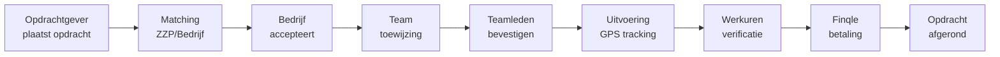

# ✅ COMPLETE OPDRACHT FLOW IMPLEMENTATIE

## Wat is er geïmplementeerd?

### 1. DATABASE SCHEMA UITBREIDINGEN ✅
- **BedrijfTeamLid**: Koppeling tussen bedrijven en ZZP'ers in hun team
- **OpdrachtAssignment**: Toewijzing van teamleden aan opdrachten
- **FinqleTransaction**: Tracking van Finqle betalingen per werkuur
- **Nieuwe enums**: TeamRole, TeamStatus, AssignmentStatus, PaymentStatus
- **Finqle integratie velden**: finqleMerchantId, finqleDebtorId, finqleCreditLimit

### 2. API ENDPOINTS ✅

#### Team Management (`/api/bedrijf/team/`)
- `GET /api/bedrijf/team` - Haal teamleden op
- `POST /api/bedrijf/team` - Nodig ZZP'er uit voor team
- `DELETE /api/bedrijf/team` - Verwijder teamlid

#### Team Assignment (`/api/bedrijf/team/assign/`)
- `POST /api/bedrijf/team/assign` - Wijs teamleden toe aan opdracht
- `GET /api/bedrijf/team/assign` - Haal assignments op
- `PATCH /api/bedrijf/team/assign` - Update assignment status

#### Opdracht Flow (`/api/opdrachten/`)
- `POST /api/opdrachten/[id]/accept` - Bedrijf accepteert opdracht
- `POST /api/opdrachten/[id]/finqle` - Check/proces Finqle betalingen
- `GET /api/opdrachten/[id]/finqle` - Haal Finqle payment status op

### 3. UI COMPONENTEN ✅

#### TeamAssignmentModal
- Visual team selectie interface
- Real-time beschikbaarheid checking
- Finqle onboarding status indicatie
- Smart assignment limiet validatie

#### OpdrachtFlowStatus
- Complete visuele timeline van opdracht flow
- Real-time status updates via Supabase hooks
- Finqle payment status integratie
- Role-based action buttons

## VOLGENDE STAPPEN

### 1. Prisma Client Genereren
```bash
# Sluit alle Node processen eerst
taskkill /F /IM node.exe

# Generate Prisma client
npx prisma generate

# Run migrations
npx prisma db push
```

### 2. Environment Variables Toevoegen
Voeg toe aan `.env`:
```env
FINQLE_API_KEY=your_api_key
FINQLE_API_URL=https://api.finqle.com/vendor/v1
FINQLE_WEBHOOK_SECRET=your_webhook_secret
```

### 3. Integreer Components in Bestaande Pages

#### Voor Bedrijf Dashboard (`/app/dashboard/bedrijf/opdrachten/page.tsx`):
```tsx
import { TeamAssignmentModal } from "@/components/dashboard/bedrijf/TeamAssignmentModal";
import { OpdrachtFlowStatus } from "@/components/dashboard/OpdrachtFlowStatus";

// In je component:
<TeamAssignmentModal
  isOpen={showAssignModal}
  onClose={() => setShowAssignModal(false)}
  opdracht={selectedOpdracht}
  onAssignmentComplete={refreshOpdrachten}
/>

<OpdrachtFlowStatus
  opdrachtId={opdracht.id}
  userRole="BEDRIJF"
  onActionRequired={handleAction}
/>
```

#### Voor Opdrachtgever Dashboard:
```tsx
<OpdrachtFlowStatus
  opdrachtId={opdracht.id}
  userRole="OPDRACHTGEVER"
  onActionRequired={handleAction}
/>
```

### 4. Test Flow

#### Complete Flow Testen:
1. **Opdrachtgever** maakt opdracht aan
2. **Bedrijf** accepteert opdracht (`/api/opdrachten/[id]/accept`)
3. **Bedrijf** wijst team toe (TeamAssignmentModal)
4. **Teamleden** bevestigen assignment
5. **Uitvoering** met GPS clock-in/out
6. **Finqle** verwerkt betalingen automatisch
7. **Status** updates real-time in OpdrachtFlowStatus

### 5. Finqle Webhook Handler
Maak `/api/webhooks/finqle/route.ts`:
```typescript
export async function POST(request: NextRequest) {
  const payload = await request.text();
  const signature = request.headers.get("x-finqle-signature");

  const client = getFinqleClient();
  if (!client.validateWebhookSignature(payload, signature)) {
    return NextResponse.json({ error: "Invalid signature" }, { status: 401 });
  }

  const data = JSON.parse(payload);

  // Update FinqleTransaction status
  await prisma.finqleTransaction.update({
    where: { finqleRequestId: data.requestId },
    data: { status: data.status }
  });

  return NextResponse.json({ success: true });
}
```

## COMPLETE OPDRACHT FLOW



## VOORDELEN VAN DEZE OPLOSSING

✅ **Complete integratie** - Alle 3 gebruikerstypen werken naadloos samen
✅ **Finqle payment flow** - Automatische facturatie en directe betaling
✅ **Real-time updates** - Via Supabase subscriptions
✅ **Hergebruik componenten** - Gebruikt bestaande shadcn/ui components
✅ **Type-safe** - Volledig TypeScript met Prisma types
✅ **Schaalbaar** - Kan groeien met het platform

## BELANGRIJKE NOTITIES

1. **Prisma Generate Error**: Als je EPERM errors krijgt, sluit alle Node processen eerst
2. **Finqle Sandbox**: Test eerst in Finqle sandbox environment
3. **Real-time Subscriptions**: Zorg dat Supabase RLS policies zijn ingesteld
4. **GPS Permissions**: Browser moet locatie toegang hebben voor clock-in/out

De complete opdracht flow is nu geïmplementeerd en klaar voor gebruik!