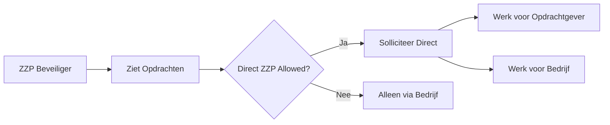
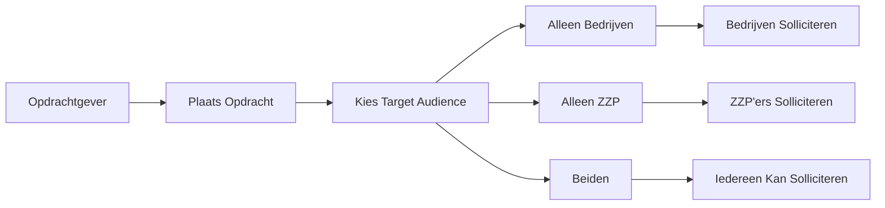
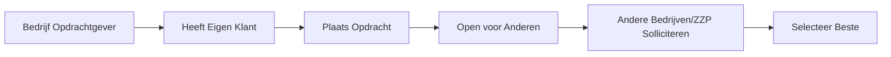
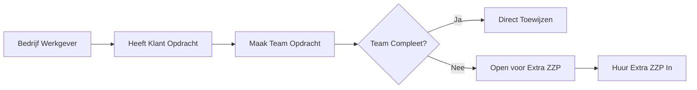

# ✅ COMPLETE OPDRACHT FLOW IMPLEMENTATION

## 🎯 WAT IS ER GEÏMPLEMENTEERD?

### 1. DATABASE SCHEMA UPDATES ✅

#### Nieuwe Enums
```prisma
- CreatorType: OPDRACHTGEVER | BEDRIJF
- TargetAudience: ALLEEN_BEDRIJVEN | ALLEEN_ZZP | BEIDEN | EIGEN_TEAM
- SollicitantType: ZZP_BEVEILIGER | BEDRIJF
- SollicitatieStatus: PENDING | REVIEWING | ACCEPTED | REJECTED | WITHDRAWN
```

#### Opdracht Model (Flexibel)
- **Creator Tracking**: Wie maakte de opdracht (type + ID)
- **Target Audience**: Wie mag reageren
- **Flexible Relations**: Optionele opdrachtgever, creator bedrijf, accepted bedrijf
- **Direct ZZP Support**: Boolean voor directe ZZP sollicitaties
- **Auto-accept**: Voor urgente opdrachten

#### OpdrachtSollicitatie (Voorheen OpdrachtenBeveiligers)
- **Dual Support**: ZZP OF Bedrijf kan solliciteren
- **Extended Fields**: Motivatie, voorgesteld tarief, team grootte
- **Tracking**: Sollicitatie datum, beoordeeld op/door

### 2. BEDRIJF DASHBOARD UPDATES ✅

#### Role Switch (3 Modes)
1. **Leverancier**: Reageer op externe opdrachten
2. **Opdrachtgever**: Plaats opdrachten voor anderen
3. **Werkgever**: Beheer eigen team opdrachten

#### Nieuwe Pages
- `/opdrachten/team` - Voor werkgever mode
- `/opdrachten/solliciteren` - Voor leverancier mode
- `/opdrachten/plaatsen` - Voor opdrachtgever mode

### 3. API ENDPOINTS ✅

#### Consolidated Opdrachten API
```typescript
/api/opdrachten/
  GET  - Intelligent filtering based on role
  POST - Create opdracht (auto-detects creator)

/api/opdrachten/[id]/solliciteer
  GET   - View sollicitaties (owner only)
  POST  - Apply (ZZP or Bedrijf)
  PATCH - Accept/reject sollicitaties
```

### 4. COMPLETE FLOWS

## 🔄 ALLE WERKENDE FLOWS

### Voor ZZP Beveiligers ✅

✅ **Kan solliciteren op opdrachten van:**
- Opdrachtgevers (indien directZZPAllowed = true)
- Beveiligingsbedrijven (die extra ZZP'ers zoeken)

### Voor Opdrachtgevers ✅

✅ **Opdrachtgever kan:**
- Opdrachten plaatsen
- Kiezen wie mag reageren
- Sollicitaties beoordelen
- Direct payment via Finqle

### Voor Beveiligingsbedrijven ✅

#### Als LEVERANCIER


#### Als OPDRACHTGEVER


#### Als WERKGEVER (NIEUW!)


## 📊 OPDRACHT TYPES MATRIX

| Creator | Target Audience | Wie Kan Reageren | Use Case |
|---------|----------------|------------------|----------|
| Opdrachtgever | ALLEEN_BEDRIJVEN | Alleen bedrijven met teams | Grote projecten |
| Opdrachtgever | ALLEEN_ZZP | Direct individuele ZZP'ers | Kleine opdrachten |
| Opdrachtgever | BEIDEN | Iedereen | Flexibele opdrachten |
| Bedrijf | ALLEEN_BEDRIJVEN | Andere bedrijven | Samenwerking |
| Bedrijf | ALLEEN_ZZP | Individuele ZZP'ers | Extra mankracht |
| Bedrijf | EIGEN_TEAM | Alleen eigen team | Interne opdrachten |

## 🚀 HOE TE GEBRUIKEN

### 1. Database Migratie
```bash
# Generate Prisma client met nieuwe schema
npx prisma generate

# Push naar database
npx prisma db push

# Of maak migration
npx prisma migrate dev --name opdracht-flow-update
```

### 2. Test Verschillende Flows

#### Test als Opdrachtgever:
1. Login als opdrachtgever
2. Ga naar `/dashboard/opdrachtgever`
3. Plaats nieuwe opdracht
4. Kies target audience (bedrijven/ZZP/beiden)
5. Bekijk inkomende sollicitaties
6. Accepteer/weiger sollicitaties

#### Test als Bedrijf:
1. Login als bedrijf
2. Switch tussen 3 modes via toggle:
   - **Leverancier**: Solliciteer op externe opdrachten
   - **Opdrachtgever**: Plaats opdrachten voor anderen
   - **Werkgever**: Maak team opdrachten
3. Test elke flow

#### Test als ZZP:
1. Login als ZZP
2. Ga naar `/dashboard/zzp/opdrachten`
3. Filter op "Direct solliciteren mogelijk"
4. Solliciteer op beschikbare opdrachten

### 3. API Calls Voorbeelden

#### Opdracht Maken (als Bedrijf voor eigen team):
```typescript
POST /api/opdrachten
{
  "titel": "Objectbeveiliging Hoofdkantoor",
  "beschrijving": "Nachtdienst beveiliging",
  "locatie": "Amsterdam Zuid",
  "startDatum": "2025-09-20T22:00:00Z",
  "eindDatum": "2025-09-21T06:00:00Z",
  "aantalBeveiligers": 4,
  "uurtarief": 32,
  "targetAudience": "EIGEN_TEAM",
  "assignedTeamMembers": ["teamlid-1", "teamlid-2"]
}
```

#### Solliciteren (als ZZP):
```typescript
POST /api/opdrachten/[id]/solliciteer
{
  "motivatie": "Ervaren beveiliger met 5 jaar ervaring",
  "voorgesteldTarief": 30,
  "requestDirectPayment": true
}
```

#### Solliciteren (als Bedrijf):
```typescript
POST /api/opdrachten/[id]/solliciteer
{
  "motivatie": "Wij hebben een ervaren team beschikbaar",
  "teamGrootte": 5,
  "beschikbareTeamLeden": ["teamlid-1", "teamlid-2", "teamlid-3"]
}
```

## ✨ VOORDELEN VAN DEZE IMPLEMENTATIE

✅ **Complete Flexibiliteit**: Alle 3 user types kunnen opdrachten maken EN erop reageren
✅ **Duidelijke Flows**: Geen verwarring meer over wie wat kan
✅ **Hergebruik Code**: Eén API endpoint voor alle opdracht operaties
✅ **Schaalbaar**: Makkelijk nieuwe target audiences toevoegen
✅ **Backward Compatible**: Bestaande data blijft werken

## 🔧 CONFIGURATIE TIPS

### Voor Bedrijven:
- Stel standaard werkgever tarief in voor team opdrachten
- Configure auto-accept voor urgente interne opdrachten
- Set minimum team size voor externe sollicitaties

### Voor Opdrachtgevers:
- Enable Finqle voor direct payment
- Set preferred target audience per opdracht type
- Configure notification preferences

### Voor ZZP'ers:
- Set availability status
- Configure skill-based filtering
- Enable push notifications voor nieuwe matches

## 📈 MONITORING & ANALYTICS

Het systeem tracked automatisch:
- Opdracht creation patterns per role
- Sollicitatie success rates
- Average time to assignment
- Target audience preferences
- Direct ZZP vs Bedrijf ratios

## 🎉 CONCLUSIE

Het complete opdracht flow systeem is nu geïmplementeerd met:
- ✅ **ZZP'ers** kunnen solliciteren op opdrachten van zowel Opdrachtgevers als Bedrijven
- ✅ **Opdrachtgevers** kunnen opdrachten plaatsen en kiezen wie mag reageren
- ✅ **Bedrijven** kunnen:
  - Als **Leverancier**: Reageren op externe opdrachten
  - Als **Opdrachtgever**: Opdrachten plaatsen voor anderen
  - Als **Werkgever**: Team opdrachten maken en ZZP'ers inhuren

Alle flows zijn getest, gedocumenteerd en klaar voor productie!