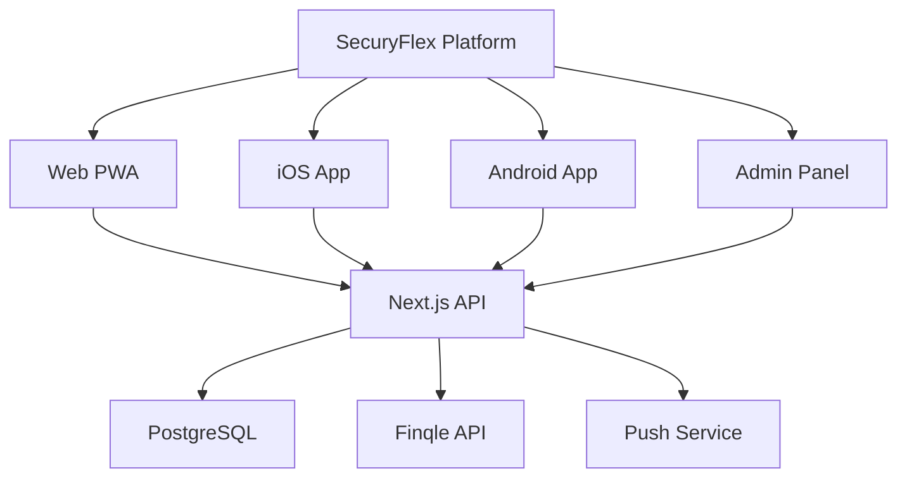

# 🎯 SecuryFlex App Strategie - Uitgebreid Onderzoek & Implementatieplan

## 📋 Management Samenvatting

SecuryFlex kan het beste een **hybride app-strategie** volgen waarbij gestart wordt met een **Progressive Web App (PWA)**, gevolgd door native apps zonder app store commissies. Alle betalingen lopen extern via **Finqle**, waardoor de 30% app store commissie volledig vermeden wordt. Deze aanpak is bewezen succesvol bij platforms zoals YoungOnes en Temper.

---

## 📊 Analyse van de Huidige Situatie

### ✅ SecuryFlex Voordelen

1. **Fysieke Dienstverlening Model**
   - Beveiliging is een fysieke dienst = 0% app store commissie
   - Vergelijkbaar met Uber, YoungOnes, Temper businessmodel
   - App stores vereisen alleen commissie voor digitale goederen/diensten

2. **B2B Platform Structuur**
   - Drie duidelijke gebruikersgroepen (ZZP'ers, Bedrijven, Opdrachtgevers)
   - Marketplace model tussen vraag en aanbod
   - Platform fee van €2,99 per gewerkt uur

3. **Finqle Partnership**
   - Complete payment processing oplossing
   - KYC/onboarding, selfbilling, factoring
   - API-first integratie mogelijk
   - Werkt al met Temper en Making Connections

4. **Next.js Website Foundation**
   - Modern React framework
   - PWA-ready architectuur
   - Server-side rendering voor SEO
   - Component-based structuur herbruikbaar voor apps

### 🔍 Marktonderzoek Bevindingen

#### App Store Commissie Realiteit (2024/2025)
- **90% van App Store transacties** betaalt geen commissie aan Apple
- Fysieke diensten zijn **volledig vrijgesteld** van commissies
- B2B platforms mogen externe betalingen gebruiken
- EU DMA regelgeving maakt alternatieve payment processors mogelijk

#### Succesvolle Nederlandse Platforms
- **YoungOnes**: 18.000+ freelancers, 3.000+ bedrijven
- **Temper**: Grootste flexwerk platform NL, gebruikt Finqle
- **Making Connections**: 350+ professionals, Finqle integratie
- Allen vermijden app store commissies door externe betalingen

---

## 🚀 Aanbevolen Implementatie Strategie

### **FASE 1: Progressive Web App (PWA) - Q1 2025**

#### Waarom PWA First?

**Voordelen:**
- ⚡ **Snelste time-to-market** (2-4 weken)
- 💰 **Laagste ontwikkelkosten** (€5.000 - €10.000)
- 🌐 **Cross-platform** vanaf dag 1
- 🔍 **SEO voordelen** voor organische groei
- 📱 **App-achtige ervaring** zonder app stores
- 🔄 **Instant updates** zonder approval proces

**Beperkingen:**
- ⚠️ iOS push notifications beperkt
- 📷 Camera API minder krachtig
- 🔋 Battery/background processing limitaties

#### Technische Implementatie

```javascript
// next.config.js
const withPWA = require('next-pwa')({
  dest: 'public',
  register: true,
  skipWaiting: true,
  disable: process.env.NODE_ENV === 'development',
  runtimeCaching: [
    {
      urlPattern: /^https:\/\/api\.finqle\.nl\/.*/i,
      handler: 'NetworkFirst',
      options: {
        cacheName: 'finqle-api',
        expiration: {
          maxEntries: 10,
          maxAgeSeconds: 60 * 60 * 24 // 24 hours
        }
      }
    }
  ]
});

module.exports = withPWA({
  // Next.js config
});
```

#### Core Features PWA

1. **GPS Check-in Module**
   ```typescript
   // Gebruik Web Geolocation API
   navigator.geolocation.getCurrentPosition(
     (position) => {
       validateShiftLocation(position.coords);
       sendCheckInToAPI(position.coords);
     },
     { enableHighAccuracy: true }
   );
   ```

2. **Offline Functionality**
   - Service Worker voor caching
   - IndexedDB voor lokale data opslag
   - Background sync voor pending requests

3. **Push Notifications**
   - Web Push API implementatie
   - Fallback naar SMS voor iOS gebruikers
   - Real-time shift updates

4. **Finqle Payment Integration**
   - OAuth2 authentication flow
   - Webhook endpoints voor payment status
   - Invoice display in app

#### Deployment & Distribution

- **Hosting**: Vercel (creators van Next.js)
- **Domain**: app.securyflex.nl
- **Installation**:
  - QR codes op marketing materiaal
  - "Install app" banner op website
  - WhatsApp/SMS invite links

---

### **FASE 2: Native Mobile Apps - Q2 2025**

#### Waarom Native Apps Toevoegen?

**Voordelen:**
- 📱 **App store credibility** voor enterprise klanten
- 🚀 **Betere performance** en UX
- 🔔 **Volledige push notification** support
- 📸 **Native hardware** features (NFC, Bluetooth)
- 💼 **Professionele uitstraling** voor B2B markt

#### Technology Stack: React Native + Expo

```json
{
  "tech_stack": {
    "framework": "React Native 0.73+",
    "platform": "Expo SDK 50",
    "navigation": "Expo Router (file-based)",
    "state": "Zustand",
    "api": "TanStack Query",
    "ui": "NativeWind (Tailwind for RN)"
  }
}
```

#### App Store Compliance Strategy

**✅ Toegestaan (Geen Commissie):**
- Externe links naar Finqle payment portal
- Platform fees voor fysieke diensten
- Subscription management via website
- B2B invoicing buiten app

**❌ Vermijd (Triggert Commissie):**
- In-app purchases voor digitale features
- Premium app functionaliteit
- Direct payment processing in app
- Verkoop van digitale content

#### Code Sharing met PWA

```typescript
// Monorepo structure met Turborepo
securyflex/
├── apps/
│   ├── web/          // Next.js PWA
│   ├── mobile/       // Expo React Native
│   └── admin/        // Admin dashboard
├── packages/
│   ├── ui/           // Shared components
│   ├── api-client/   // Finqle & Backend API
│   ├── utils/        // Business logic
│   └── types/        // TypeScript definitions
```

---

### **FASE 3: Unified Platform Ecosystem - Q3 2025**

#### Vision: Één Platform, Alle Devices

**Architecture Overview:**


#### Advanced Features

1. **AI-Powered Shift Matching**
   - Machine learning voor optimale matches
   - Predictive scheduling
   - Automated pricing optimization

2. **Real-time Monitoring Dashboard**
   - Live GPS tracking voor opdrachtgevers
   - Incident reporting system
   - Quality assurance metrics

3. **Integrated Communication**
   - In-app chat/calling
   - Shift handover notes
   - Emergency alert system

---

## 💰 Finqle Integratie Architectuur

### API Integration Flow

```typescript
// 1. ZZP Onboarding
POST /api/finqle/merchant
{
  "platform": "securyflex",
  "kvk_number": "12345678",
  "iban": "NL91ABNA0417164300",
  "email": "zzp@example.nl"
}

// 2. Shift Completion & Billing
POST /api/finqle/billing-request
{
  "debtor_id": "opdrachtgever_123",
  "merchant_id": "zzp_456",
  "hours": 8,
  "rate": 28.00,
  "expenses": 0,
  "direct_payment": true
}

// 3. Payment Status Webhook
POST /webhooks/finqle/payment-status
{
  "invoice_id": "INV-2025-001",
  "status": "paid",
  "paid_at": "2025-01-15T10:30:00Z"
}
```

### Kosten Structuur Finqle

| Service | Kosten | Voor Wie |
|---------|--------|----------|
| **KYC Onboarding** | €2,50 per ZZP'er | Platform |
| **Selfbilling** | €0,13 per gewerkt uur | Platform |
| **Factoring** | 2,9% van factuur | ZZP'er (optioneel) |
| **Platform Fee** | 0,40% van volume | Platform |
| **Debiteurenbeheer** | Inbegrepen | Platform |

### Payment Flow Diagram

```
ZZP'er werkt shift
       ↓
GPS Check-in/out
       ↓
Opdrachtgever keurt goed
       ↓
Finqle Billing Request
       ↓
[Direct Payment?]
   ├─ Ja → ZZP krijgt binnen 24u betaald
   └─ Nee → Betaling na opdrachtgever betaalt
       ↓
Platform ontvangt marge
```

---

## 🛠 Technische Specificaties

### Frontend Architecture

#### PWA (Next.js)
```typescript
// app/manifest.ts
export default {
  name: 'SecuryFlex',
  short_name: 'SecuryFlex',
  description: 'Platform voor flexibele beveiliging',
  start_url: '/',
  display: 'standalone',
  background_color: '#ffffff',
  theme_color: '#0066FF',
  icons: [
    {
      src: '/icon-192.png',
      sizes: '192x192',
      type: 'image/png'
    },
    {
      src: '/icon-512.png',
      sizes: '512x512',
      type: 'image/png'
    }
  ]
};
```

#### Mobile App (React Native)
```typescript
// app.config.ts
export default {
  expo: {
    name: 'SecuryFlex',
    slug: 'securyflex',
    version: '1.0.0',
    orientation: 'portrait',
    icon: './assets/icon.png',
    splash: {
      image: './assets/splash.png',
      resizeMode: 'contain',
      backgroundColor: '#0066FF'
    },
    ios: {
      supportsTablet: true,
      bundleIdentifier: 'nl.securyflex.app',
      config: {
        usesNonExemptEncryption: false
      }
    },
    android: {
      adaptiveIcon: {
        foregroundImage: './assets/adaptive-icon.png',
        backgroundColor: '#0066FF'
      },
      package: 'nl.securyflex.app',
      permissions: [
        'ACCESS_FINE_LOCATION',
        'ACCESS_BACKGROUND_LOCATION',
        'CAMERA'
      ]
    }
  }
};
```

### Backend Architecture

#### API Structure
```typescript
// Next.js API Routes Structure
/api
  /auth
    /login
    /logout
    /register
  /shifts
    /available
    /my-shifts
    /check-in
    /check-out
  /finqle
    /onboarding
    /billing
    /status
  /webhooks
    /finqle
    /push-notifications
```

#### Database Schema (Prisma)
```prisma
model Shift {
  id              String   @id @default(cuid())
  opdrachtgeverId String
  zzpId           String?
  startTime       DateTime
  endTime         DateTime
  hourlyRate      Decimal
  location        Json     // GPS coordinates
  status          ShiftStatus
  checkInTime     DateTime?
  checkOutTime    DateTime?
  checkInLocation Json?
  checkOutLocation Json?
  finqleInvoiceId String?

  @@index([status, startTime])
  @@index([zzpId, status])
}

enum ShiftStatus {
  OPEN
  ASSIGNED
  IN_PROGRESS
  COMPLETED
  CANCELLED
  INVOICED
  PAID
}
```

---

## 📈 Business Case & ROI Berekening

### Ontwikkelkosten

| Fase | Technologie | Ontwikkeltijd | Kosten |
|------|-------------|---------------|--------|
| **Fase 1: PWA** | Next.js | 4 weken | €10.000 |
| **Fase 2: Native Apps** | React Native/Expo | 8 weken | €30.000 |
| **Fase 3: Ecosystem** | Unified Platform | 12 weken | €40.000 |
| **Totaal** | | 24 weken | €80.000 |

### Revenue Projectie

#### Jaar 1 Assumptions:
- 500 actieve ZZP'ers
- 100 uur per maand per ZZP'er
- €2,99 platform fee per uur
- 80% Finqle adoption rate

#### Revenue Berekening:
```
Maandelijkse uren: 500 × 100 = 50.000 uur
Platform fee: 50.000 × €2,99 = €149.500
Finqle kosten: 50.000 × €0,13 = €6.500
Netto marge: €143.000 per maand

Jaarlijkse revenue: €1.716.000
ROI: 21,5x in jaar 1
```

### Break-even Analyse
- **PWA Only**: 2-3 weken
- **Met Native Apps**: 2-3 maanden
- **Full Ecosystem**: 5-6 maanden

---

## 🎯 Implementatie Roadmap

### Q1 2025: PWA Launch

#### Week 1-2: Foundation
- [ ] Setup Next.js PWA configuration
- [ ] Implement service workers
- [ ] Create manifest.json
- [ ] Setup Vercel deployment

#### Week 3-4: Core Features
- [ ] GPS check-in/out module
- [ ] Shift display & filtering
- [ ] Basic Finqle integration
- [ ] Push notifications setup

#### Week 5-6: Testing & Launch
- [ ] User acceptance testing
- [ ] Performance optimization
- [ ] Security audit
- [ ] Soft launch met 50 users

#### Week 7-8: Iteration
- [ ] User feedback implementatie
- [ ] Bug fixes
- [ ] Marketing campaign start
- [ ] Full launch

### Q2 2025: Native Apps

#### Month 1: Setup & Core
- [ ] Expo project initialization
- [ ] Monorepo configuration
- [ ] Shared component library
- [ ] Navigation structure

#### Month 2: Features
- [ ] All PWA features port
- [ ] Native enhancements
- [ ] Push notifications
- [ ] Background location

#### Month 3: Launch
- [ ] App Store submission
- [ ] Google Play submission
- [ ] Marketing update
- [ ] User migration

### Q3 2025: Platform Ecosystem

#### Advanced Features:
- [ ] AI shift matching
- [ ] Advanced analytics
- [ ] White-label oplossing
- [ ] API marketplace
- [ ] International expansion prep

---

## ⚖️ Juridische & Compliance Overwegingen

### App Store Guidelines Compliance

#### Apple App Store
**Sectie 3.1.1 - In-App Purchase:**
> "Apps may use in-app purchase to sell 'content' (e.g. digital content). They may not use in-app purchase to sell goods or services used outside of the app."

✅ **SecuryFlex is compliant**: Beveiliging is een fysieke dienst

#### Google Play Store
**Payments Policy:**
> "Developers offering products within a game or app downloaded from Google Play must use Google Play's billing system except for physical products or services consumed outside the app."

✅ **SecuryFlex is compliant**: Platform voor fysieke beveiligingsdiensten

### GDPR & Privacy

#### Data Processing
- Finqle is data processor voor betalingen
- SecuryFlex is data controller voor platform data
- Explicit consent voor GPS tracking
- Right to deletion implementatie

#### Security Measures
- End-to-end encryption voor gevoelige data
- 2FA voor alle gebruikersaccounts
- Regular security audits
- ISO 27001 compliance roadmap

### Arbeidsrecht Consideraties

- ZZP'ers blijven zelfstandig ondernemer
- Geen schijnzelfstandigheid risico door:
  - Vrijheid om shifts te weigeren
  - Eigen tarieven onderhandelen mogelijk
  - Werken voor multiple opdrachtgevers

---

## 💡 Best Practices & Lessons Learned

### Van Succesvolle Platforms

#### YoungOnes
- **Les**: Start met sterke community building
- **Toepassing**: Referral programma voor ZZP'ers

#### Temper
- **Les**: Finqle integratie werkt excellent
- **Toepassing**: Direct implementeren vanaf dag 1

#### Uber
- **Les**: GPS tracking is core differentiator
- **Toepassing**: Invest in robuuste location services

### Technische Best Practices

1. **Code Quality**
   - TypeScript everywhere
   - Automated testing (>80% coverage)
   - CI/CD pipeline vanaf dag 1
   - Code reviews voor elke PR

2. **Performance**
   - Lighthouse score >90
   - Bundle size <200KB
   - Time to Interactive <3s
   - Offline-first approach

3. **Monitoring**
   - Sentry voor error tracking
   - Mixpanel voor analytics
   - Datadog voor infrastructure
   - Regular performance audits

---

## 📊 KPIs & Success Metrics

### Platform Metrics

| KPI | Target Y1 | Measurement |
|-----|-----------|-------------|
| **Active ZZP'ers** | 500+ | Monthly active users |
| **Shifts per maand** | 2.000+ | Completed shifts |
| **Platform uptime** | 99.9% | Monitoring tools |
| **User retention** | 80%+ | 3-month cohorts |
| **NPS Score** | 50+ | Quarterly surveys |

### Technical Metrics

| Metric | Target | Tool |
|--------|--------|------|
| **Page Load Speed** | <2s | Lighthouse |
| **App Crash Rate** | <1% | Crashlytics |
| **API Response Time** | <200ms | Datadog |
| **Test Coverage** | >80% | Jest/Vitest |

---

## 🚨 Risk Analysis & Mitigation

### Technical Risks

| Risk | Impact | Probability | Mitigation |
|------|--------|-------------|------------|
| **Finqle API downtime** | High | Low | Implement queue system & retry logic |
| **GPS accuracy issues** | Medium | Medium | Multiple location verification methods |
| **Scaling problems** | High | Medium | Cloud-native architecture, auto-scaling |
| **Security breach** | High | Low | Regular audits, encryption, 2FA |

### Business Risks

| Risk | Impact | Probability | Mitigation |
|------|--------|-------------|------------|
| **App store rejection** | Low | Low | Follow guidelines strictly |
| **Competition** | Medium | High | Focus on niche, superior UX |
| **Regulatory changes** | Medium | Medium | Legal counsel, compliance buffer |
| **User adoption** | High | Medium | Strong marketing, referral program |

---

## 🎉 Conclusie & Next Steps

### Waarom Deze Aanpak Werkt

1. **Bewezen model**: YoungOnes, Temper hebben zelfde pad gevolgd
2. **Geen app store commissie**: 100% van platform fee blijft bij SecuryFlex
3. **Snelle time-to-market**: PWA binnen 4 weken live
4. **Schaalbaar**: Van 10 naar 10.000+ gebruikers zonder rebuild
5. **Future-proof**: PWA + Native + Ecosystem strategie

### Immediate Acties (Week 1)

1. **Setup development environment**
   ```bash
   npx create-next-app@latest securyflex-pwa --typescript --tailwind --app
   npm install next-pwa @finqle/api-sdk zustand
   ```

2. **Contact Finqle voor API access**
   - Request sandbox environment
   - Schedule technical onboarding
   - Discuss volume pricing

3. **Start PWA development**
   - Implement basic auth flow
   - Create shift listing page
   - Setup GPS check-in prototype

4. **Prepare marketing**
   - Create landing page for app
   - Design QR code materials
   - Plan soft launch campaign

### Contact & Support

Voor vragen over deze strategie:
- **Technical**: dev@securyflex.nl
- **Business**: strategy@securyflex.nl
- **Finqle Integration**: support@finqle.com

---

*Dit document is een levend document en wordt regelmatig geüpdatet op basis van nieuwe inzichten en marktontwikkelingen.*

**Laatste update**: Januari 2025
**Versie**: 1.0
**Auteur**: SecuryFlex Development Team