# SecuryFlex Workflow Diagrams - Visual Journey Maps

## 🎯 Overview

This document contains comprehensive Mermaid diagrams illustrating all user workflows in the SecuryFlex platform. These visual representations make complex multi-step processes easier to understand and optimize.

## 🔧 ZZP (Freelancer) Workflows

### ZZP Complete Journey Flow

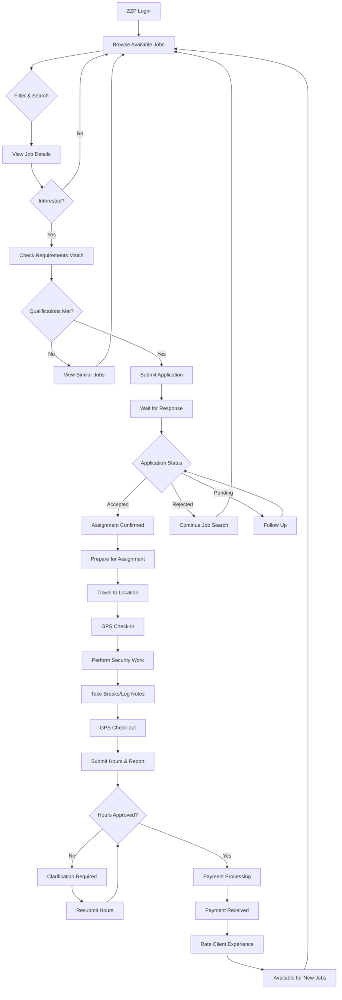

### ZZP Job Application Workflow

```mermaid
flowchart TD
    A[Find Interesting Job] --> B[Read Full Description]
    B --> C[Check Required Skills]
    C --> D{Skills Match?}
    D -->|Partial| E[Apply with Note]
    D -->|Full| F[Standard Application]
    D -->|No| G[Look for Training Options]
    E --> H[API: POST /api/jobs/\{id\}/apply]
    F --> H
    G --> I[Skip This Job]
    H --> J[Real-time Broadcast Event]
    J --> K[Employer Notification]
    K --> L[Application Tracking]
    L --> M{Response Received}
    M -->|Accepted| N[Assignment Details]
    M -->|Interview Request| O[Schedule Interview]
    M -->|Rejected| P[Feedback Review]
    N --> Q[Confirm Availability]
    O --> R[Attend Interview]
    P --> S[Improve Profile]
    Q --> T[Assignment Active]
    R --> U{Interview Result}
    U -->|Success| Q
    U -->|Rejected| P
    S --> I
```

### ZZP Hour Tracking & Payment

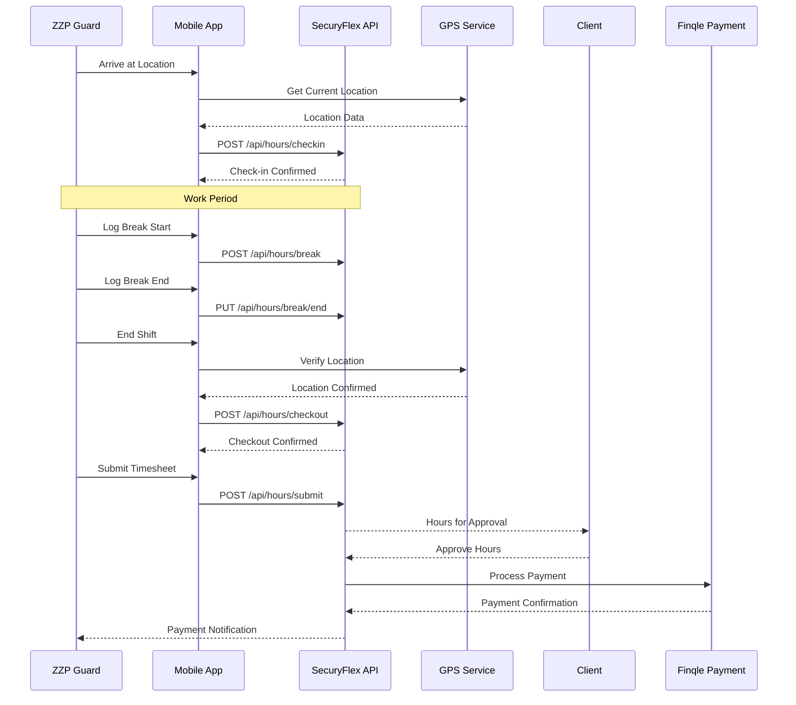

## 🏢 Bedrijf (Security Company) Workflows

### Bedrijf Multi-Mode Operations

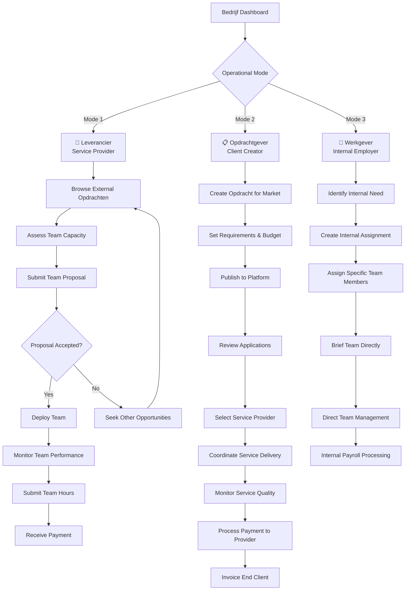

### Bedrijf Team Assignment Algorithm

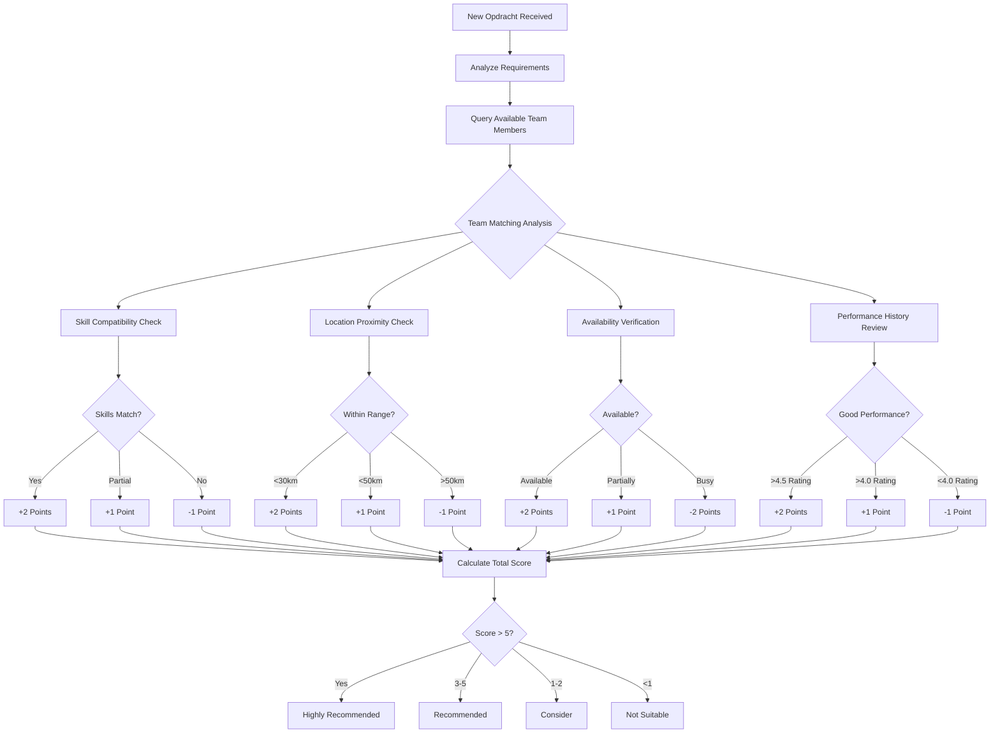

### Bedrijf Financial Multi-Stream

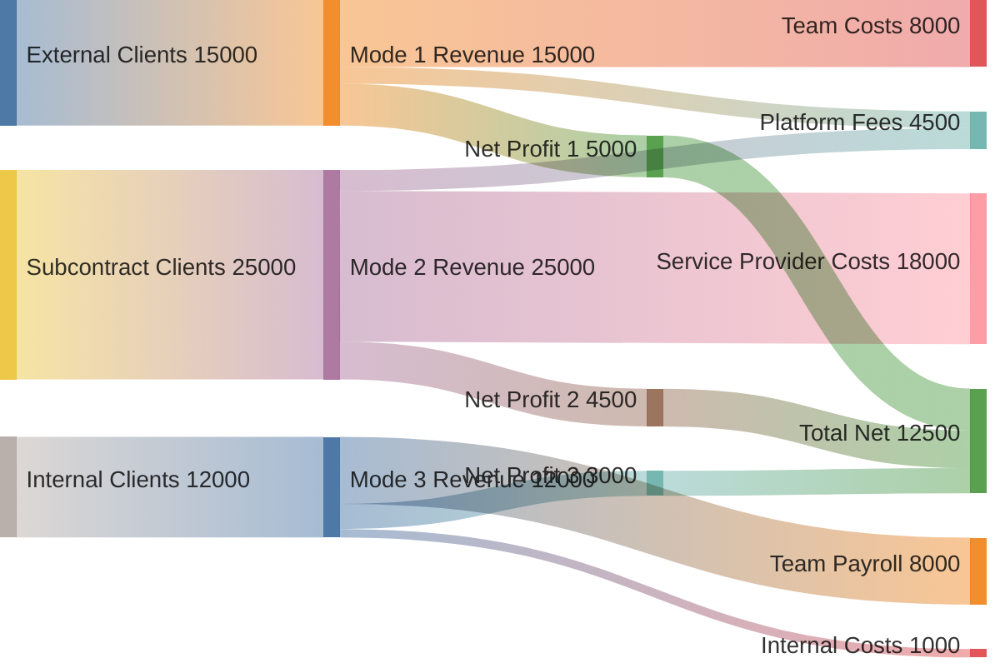

## 👔 Opdrachtgever (Client) Workflows

### Opdrachtgever Complete Shift Creation

```mermaid
journey
    title Client Shift Creation Journey
    section Need Recognition
      Security Incident      : 1: Client
      Plan Prevention       : 3: Client
      Budget Approval       : 4: Client
    section Platform Access
      Login to Platform     : 5: Client
      Navigate to Create    : 5: Client
    section Step 1: Basics
      Select Security Type  : 4: Client
      Enter Location       : 4: Client
      Set Risk Profile     : 3: Client
      Add Instructions     : 4: Client
    section Step 2: Planning
      Choose Shift Type    : 4: Client
      Set Date & Time      : 5: Client
      Define Team Size     : 4: Client
    section Step 3: Requirements
      Select Documents     : 3: Client
      Choose Skills        : 4: Client
      Set Experience       : 3: Client
    section Step 4: Budget
      Review Market Rate   : 5: Client
      Set Hourly Rate      : 4: Client
      Configure Allowances : 3: Client
      Review Total Cost    : 5: Client
    section Step 5: Review
      Validate All Details : 4: Client
      Check Estimated Matches: 5: Client
      Publish Shift        : 5: Client
    section Post-Publication
      Receive Applications : 5: Client
      Review Candidates    : 4: Client
      Make Selection       : 5: Client
```

### Opdrachtgever Payment Processing

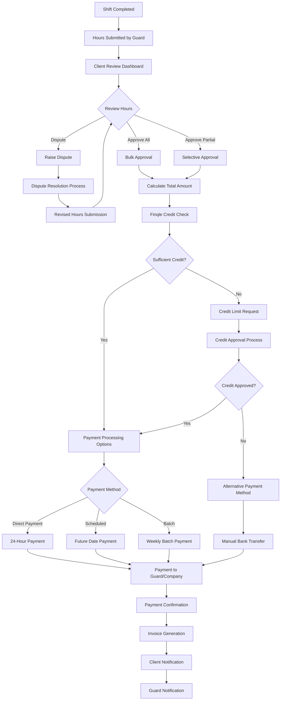

### Opdrachtgever Service Monitoring

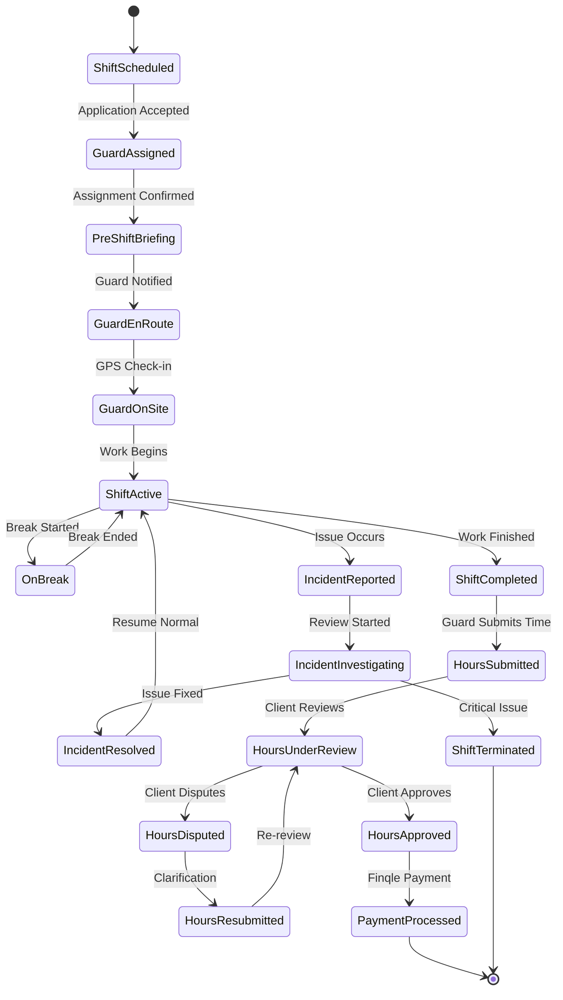

## 💳 Cross-Platform Payment Flows

### Finqle Integration Architecture

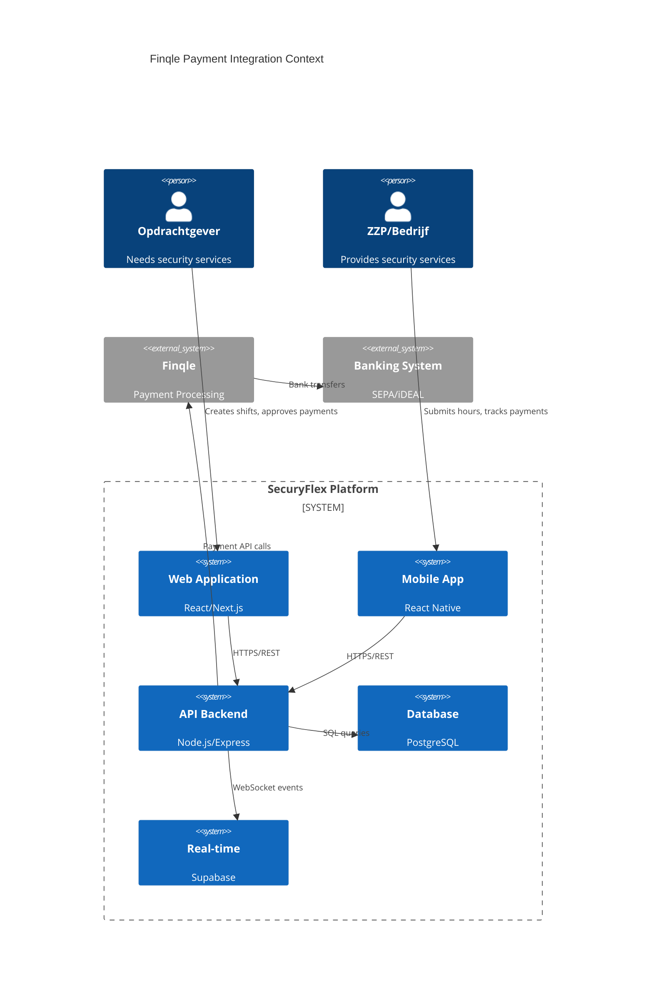

### Finqle Payment State Machine

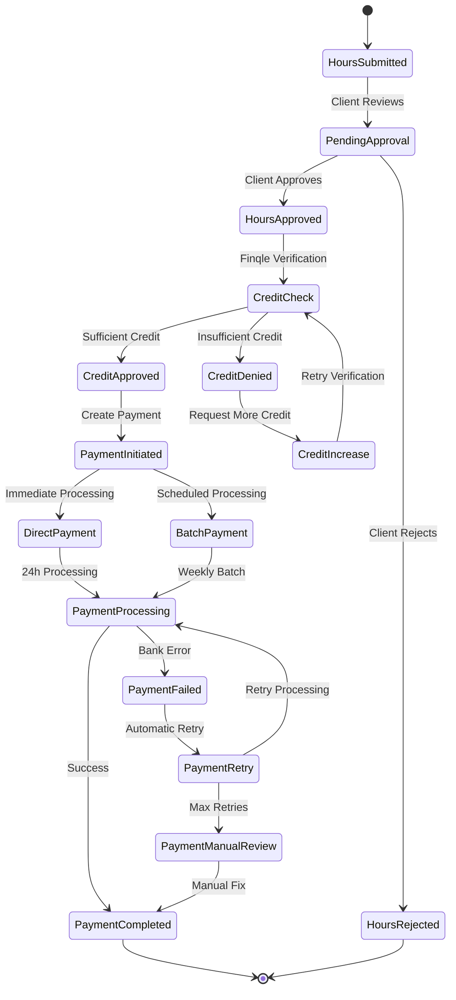

## 🔄 Cross-User Interaction Flows

### Application & Selection Process

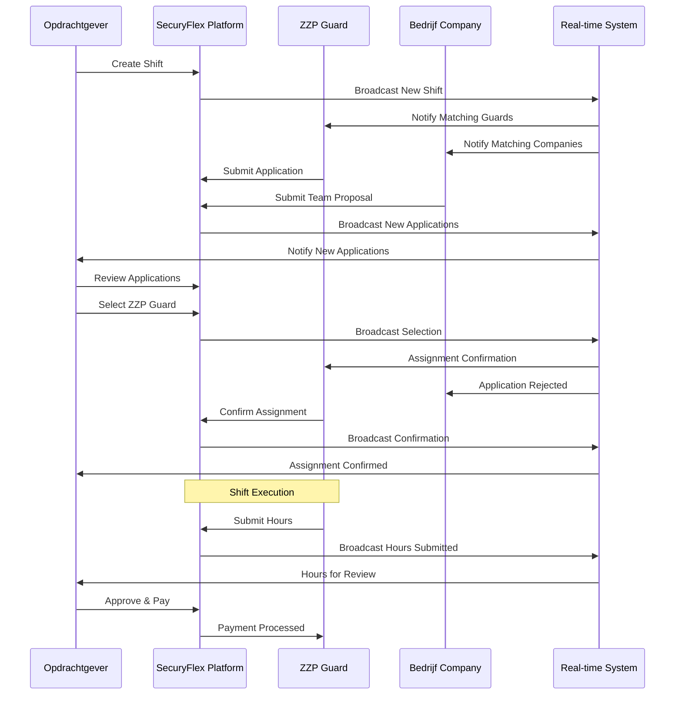

### Multi-Party Communication Flow

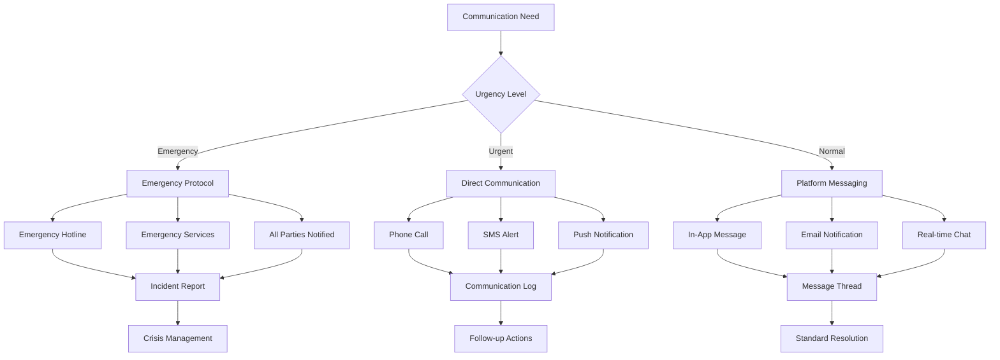

## 📊 Analytics & Reporting Flows

### Platform Analytics Dashboard

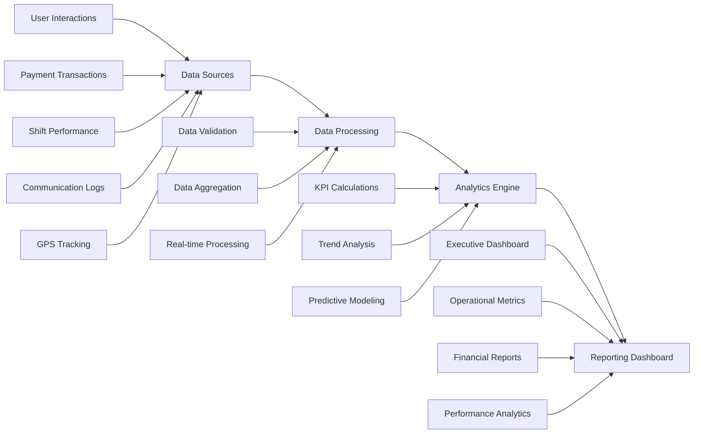

### Quality Assurance Flow

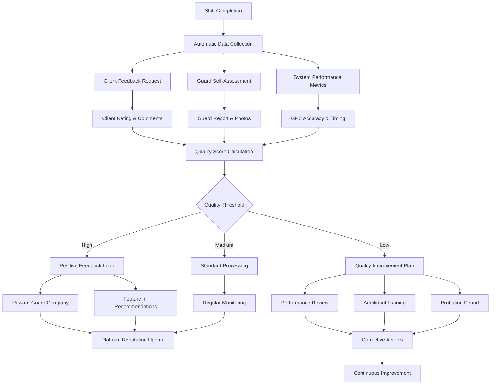

---

*These Mermaid diagrams provide comprehensive visual representations of all major workflows in the SecuryFlex platform, enabling better understanding, optimization, and communication of complex user journeys.*