# ZZP (Freelancer) Workflow - Complete Journey

## 🎯 Overview

ZZP'ers (independent security guards) are the core workforce of the SecuryFlex platform. Their journey involves discovering work opportunities, applying for assignments, executing security services, and getting paid through an integrated workflow that spans mobile and desktop experiences.

## 📱 User Interface Architecture

### Mobile-First Design
- **Bottom Navigation**: Dashboard 🏠 | Jobs 💼 | Profile 👤 | More ⋯
- **Context-Sensitive Actions**: Progressive disclosure, swipe interactions
- **Push Notifications**: Real-time updates on application status

### Desktop Enhanced Features
- **Persistent Sidebar Navigation** with dedicated "Jobs & Sollicitaties" section
- **Advanced Filtering** with side-by-side job comparison
- **Bulk Operations** for managing multiple applications
- **Detailed Analytics** for earnings and performance tracking

## 🔄 Complete ZZP Journey

### Phase 1: Job Discovery & Search

#### 1.1 Access Points

```mermaid
graph TD
    A[Open SecuryFlex App] --> B{Platform}
    B -->|Mobile| C[Bottom Nav: Jobs 💼]
    B -->|Desktop| D[Sidebar: Jobs & Sollicitaties]
    C --> E[Jobs Page]
    D --> E
    E --> F[Browse Available Opdrachten]
```


#### 1.2 Job Browsing Interface

**Main Features:**
- **Dual Tab System**:
  - "Beschikbaar" - Browse available jobs
  - "Mijn Sollicitaties" - Track applications
- **Advanced Search**: Location, company, job type
- **Smart Filtering**:
  - Evenement (Events)
  - Object (Building/Property)
  - Winkel (Retail)
  - Horeca (Hospitality)
- **Favorites System**: Heart icon to save interesting jobs

**API Integration:**
```typescript
// Job browsing API call
GET /api/jobs?search={query}&type={filter}&limit=20

// Response structure
{
  success: true,
  data: {
    jobs: [
      {
        id: string,
        title: string,
        company: string,
        location: string,
        hourlyRate: number,
        startDate: Date,
        endDate: Date,
        description: string,
        requirements: string[],
        spotsRemaining: number,
        applicantCount: number,
        isUrgent: boolean,
        applicationStatus?: "PENDING" | "ACCEPTED" | "REJECTED"
      }
    ]
  }
}
```

#### 1.3 Job Card Interface

**Visual Design:**
- **Hero Image**: Job location or company branding
- **Overlay Information**:
  - Hourly rate (prominent with € icon)
  - Location (MapPin icon)
  - Time schedule (Clock icon)
  - Urgent badge (if applicable)
- **Content Section**:
  - Job title and company
  - Job description
  - Requirements badges
  - Statistics (spots remaining, applicant count)
  - Application status badge

**Interactive Elements:**
- **Favorite Toggle**: Heart icon with optimistic updates
- **Primary Actions**:
  - "Solliciteren" (Apply) - if no application exists
  - "Bekijk Status" - if application pending
  - "Bekijk in Shifts" - if accepted
  - "Details" - view full job information

### Phase 2: Job Application Process

#### 2.1 Application Flow
```mermaid
graph TD
    A[Click 'Solliciteren'] --> B[Navigate to Job Details]
    B --> C[Review Full Requirements]
    C --> D{Meets Requirements?}
    D -->|No| E[Return to Job Search]
    D -->|Yes| F[Submit Application]
    F --> G[API Call: POST /api/jobs/{id}/apply]
    G --> H[Real-time Broadcast Event]
    H --> I[Application Submitted]
    I --> J[Notification Sent to Employer]
```

#### 2.2 Application States

**Status Progression:**
1. **No Application**: Show "Solliciteren" button
2. **PENDING**: Show "Bekijk Status" + option to withdraw
3. **ACCEPTED**: Show "Bekijk in Shifts" for assignment details
4. **REJECTED**: Show status badge, option to view feedback

**Real-time Updates:**
- WebSocket broadcasts for status changes
- Push notifications for mobile users
- Toast notifications for immediate feedback

### Phase 3: Assignment Management

#### 3.1 Accepted Jobs Workflow


#### 3.2 Shift Management
- **Shift Details**: Date, time, location, specific instructions
- **Contact Information**: Client contact, supervisor details
- **Special Requirements**: Uniform, equipment, certifications
- **GPS Integration**: Location verification for check-in

### Phase 4: Work Execution & Hour Tracking

#### 4.1 Clock-In/Clock-Out System

**Location-Based Verification:**
```typescript
// GPS-verified check-in
POST /api/hours/checkin
{
  opdrachtId: string,
  location: {
    latitude: number,
    longitude: number,
    accuracy: number
  },
  timestamp: Date
}
```

**Manual Hour Entry:**
```typescript
// Manual hour submission
POST /api/hours
{
  opdrachtId: string,
  startTime: Date,
  endTime: Date,
  breakMinutes: number,
  location?: string,
  notes?: string
}
```

#### 4.2 Hour Tracking Interface (`/dashboard/hours`)

**Week-Based Organization:**
- **Navigation**: Previous/Next week buttons
- **Week Summary Card**:
  - Total hours worked
  - Total earnings (all statuses)
  - Approved earnings (ready for payment)
- **Daily Entry Cards**:
  - Day name indicator
  - Project and company info
  - Time range with GPS verification badge
  - Hour breakdown (work/break/rate/total)
  - Status badges (Draft/Pending/Approved/Disputed)

**Status Flow:**


#### 4.3 Advanced Hour Tracking Features

**GPS Verification Benefits:**
- Automatic approval for GPS-verified hours
- Reduced review time
- Higher trust score
- Priority in future job assignments

**Manual Entry Handling:**
- Extra verification required
- Photo evidence support
- Supervisor confirmation
- Potential for dispute resolution

### Phase 5: Payment & Earnings

#### 5.1 Finqle Integration Workflow

**Payment Prerequisites:**


#### 5.2 Payment API Integration

**Credit Check Process:**
```typescript
// Check payment eligibility
POST /api/opdrachten/{id}/finqle
{
  action: "check"
}

// Response
{
  success: true,
  data: {
    eligibleForDirectPayment: boolean,
    creditAvailable: number,
    creditLimit: number,
    requestedAmount: number,
    unpaidWerkuren: number
  }
}
```

**Payment Approval:**
```typescript
// Process payment for approved hours
POST /api/opdrachten/{id}/finqle
{
  action: "approve",
  werkuurIds: string[],
  requestDirectPayment: boolean
}
```

#### 5.3 Payment Status Tracking

**Payment States:**
- **PENDING**: Billing request created in Finqle
- **APPROVED**: Payment approved by client
- **PAID**: Funds transferred to ZZP bank account
- **FAILED**: Payment failed (insufficient credit, technical issue)

**Real-time Payment Updates:**
- Broadcast events for payment status changes
- Push notifications for payment completion
- Email confirmations for payment receipts

## 🔍 API Interactions Summary

### Core ZZP APIs

```typescript
// Job Discovery
GET /api/jobs?search={query}&type={filter}&limit={limit}
GET /api/jobs/{id}  // Detailed job information

// Application Management
POST /api/jobs/{id}/apply      // Submit application
DELETE /api/jobs/{id}/apply    // Withdraw application
GET /api/applications          // View all applications

// Favorites Management
POST /api/jobs/{id}/favorite   // Add to favorites
DELETE /api/jobs/{id}/favorite // Remove from favorites

// Hour Tracking
GET /api/hours?weekStart={date}&weekEnd={date}  // Weekly hours
POST /api/hours                                 // Submit hours
PUT /api/hours/{id}                            // Update hours
POST /api/hours/submit                         // Submit week for approval

// Payment Tracking
GET /api/opdrachten/{id}/finqle  // Payment status
POST /api/finqle/merchant/status // Merchant onboarding status
```

### Legacy API Endpoints (Being Phased Out)

```typescript
// Legacy endpoints still in use
GET /api/jobs/*           → Migrating to /api/opdrachten/*
POST /api/jobs/{id}/apply → Migrating to /api/opdrachten/{id}/solliciteer
```

## 📊 Real-time Features

### Broadcast Events (Supabase WebSockets)

**Subscription Channels:**
- `user:{userId}:notifications` - Personal notifications
- `opdracht:{opdrachtId}` - Job-specific updates
- `zzp:{zzpId}:applications` - Application status changes

**Event Types:**
```typescript
enum BroadcastEvent {
  // Application events
  SOLLICITATIE_CREATED = "sollicitatie:created",
  SOLLICITATIE_ACCEPTED = "sollicitatie:accepted",
  SOLLICITATIE_REJECTED = "sollicitatie:rejected",

  // Work events
  WERKUUR_CLOCKIN = "werkuur:clockin",
  WERKUUR_CLOCKOUT = "werkuur:clockout",
  WERKUUR_APPROVED = "werkuur:approved",

  // Payment events
  PAYMENT_INITIATED = "payment:initiated",
  PAYMENT_COMPLETED = "payment:completed",
  PAYMENT_FAILED = "payment:failed"
}
```

## 🚀 UX Optimizations

### Mobile-Specific Features

**Quick Actions:**
- Swipe to favorite/unfavorite jobs
- Pull-to-refresh on job lists
- One-tap application for pre-qualified jobs
- Location-based job sorting

**Offline Capability:**
- Cache job listings for offline browsing
- Queue applications for submission when online
- Store draft hour entries locally

### Desktop Enhancements

**Power User Features:**
- Keyboard shortcuts for common actions
- Bulk application management
- Advanced filtering and sorting
- Split-screen job comparison

**Analytics Dashboard:**
- Weekly/monthly earnings charts
- Application success rate tracking
- Popular job type analysis
- Geographic work distribution

## 📈 Performance Considerations

### Optimization Strategies

**API Performance:**
- Server-side filtering to reduce payload size
- Pagination for large job lists
- Response caching for frequently accessed data
- Optimistic updates for immediate user feedback

**Mobile Performance:**
- Lazy loading of job images
- Virtual scrolling for long job lists
- Progressive image loading
- Background sync for applications

**Real-time Efficiency:**
- Selective WebSocket subscriptions
- Debounced event handling
- Connection state management
- Automatic reconnection logic

## 🔮 Future Enhancements

### Short-term Improvements (1-3 months)

**Smart Matching:**
- AI-powered job recommendations based on:
  - Previous application history
  - Skills and certifications
  - Geographic preferences
  - Availability patterns

**Enhanced Application Flow:**
- Quick-apply for frequent clients
- Application templates for different job types
- Bulk application withdrawal
- Application scheduling for future jobs

### Medium-term Features (3-6 months)

**Advanced Analytics:**
- Predictive earnings forecasting
- Optimal work schedule suggestions
- Market rate analysis
- Performance benchmarking

**Social Features:**
- ZZP community forums
- Peer rating system
- Knowledge sharing platform
- Mentorship programs

### Long-term Vision (6+ months)

**Platform Expansion:**
- Multi-language support for international ZZP'ers
- Integration with external calendars
- Tax preparation assistance
- Insurance and benefits marketplace
- Skills certification programs

## 💡 Key Success Metrics

### User Engagement
- **Job View Rate**: Jobs viewed per session
- **Application Conversion**: Views to applications ratio
- **Repeat Usage**: Weekly active users
- **Feature Adoption**: Usage of advanced features

### Workflow Efficiency
- **Time to Apply**: Average time from job view to application
- **Hour Submission Rate**: Percentage of worked hours submitted
- **Payment Processing Time**: Hours approval to payment completion
- **Error Rates**: Failed API calls and user errors

### Business Impact
- **Assignment Completion Rate**: Percentage of accepted jobs completed
- **Client Satisfaction**: Ratings from job clients
- **Revenue per ZZP**: Average monthly earnings
- **Platform Growth**: New ZZP onboarding rate

---

*This detailed workflow analysis provides the foundation for optimizing the ZZP experience on SecuryFlex, ensuring seamless job discovery, efficient work execution, and reliable payment processing.*